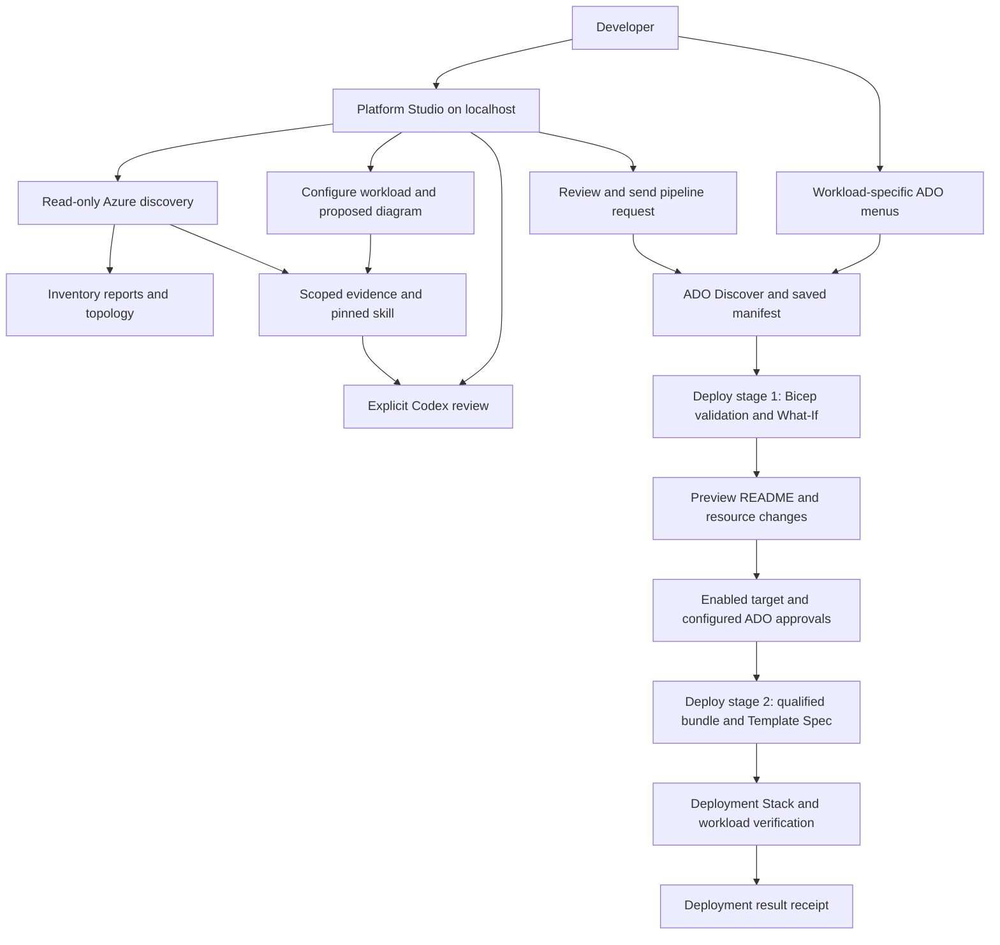
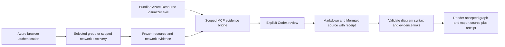
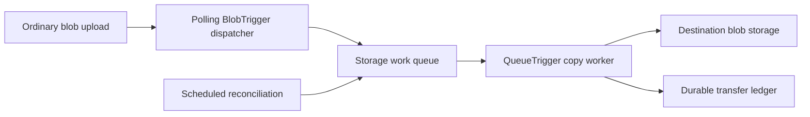

# Platform Studio — Azure developer self-service

**Pipeline setup:** the portal now has **ADO setup** to inventory and register all 18 pipeline entry points in one reviewed batch. Existing definitions are preserved, exact GitHub main YAML is checked, and no runs, source edits or permission changes are requested. See [registration and public-repo safety](docs/ado-pipeline-registration.md).

A local Windows portal and governed Azure DevOps delivery platform for discovering Azure resources, designing workload stacks, reviewing changes and deploying approved infrastructure. Reusable Bicep modules, versioned Template Specs and Deployment Stacks connect the developer experience to the same reviewed delivery flow.

**Seven workload offerings · 14 dedicated pipeline menus · 42 bundled Microsoft skill definitions · Five project skills · Four Codex agent reviews · Windows ARM64 and x64**

**Current status — 27 September 2026:** the suite is implemented in source with recorded local verification. All **28 environment targets remain disabled for deployment** pending platform onboarding and acceptance. Successful discovery or a local test does not establish a successful Azure deployment. See [current status](docs/completion-status.md) and [dated verification evidence](docs/validation.md).

[Start locally](#start-platform-studio-locally) · [Workloads](#workload-catalog) · [Discovery and diagrams](#discovery-analysis-and-diagrams) · [Agent workflows](#codex-agent-workflows) · [ADO delivery](#discover-preview-and-deploy) · [Documentation](#documentation-and-expansion)

## The capability suite

| Area | Available capability | Scope |
|---|---|---|
| **Platform Studio** | Workload configuration, resource/dependency/cost descriptions, skills library, connection status, pipeline request review and run tracking. | Single-user localhost website; Azure provisioning runs in ADO. |
| **Workload delivery** | Dedicated Discover and Deploy menus for seven products and dev/QA/UAT/prod profiles. | Preview is the default; deployment requires an enabled, onboarded target. |
| **Resource discovery** | Read-only service inventory plus registered, selected, management-group and accessible-tenant network scans. | Browser identity and configured-tenant filtering; explicit partial coverage, with bounded scan limits. |
| **Analysis and diagrams** | Saved-inventory coverage reports, existing topology, proposed workload components and saved Preview resource changes. | Deterministic reports remain usable without a model; observed, proposed and planned changes are labeled separately. |
| **Skills library** | Pinned Microsoft Azure instructions and supporting references, plus project-specific review and documentation skills. | Microsoft cards say **No pipeline associated yet**; inventory collection does not execute every upstream skill. |
| **Codex agents** | Resource visualization, private-network review, workload advice and saved Preview review. | Four explicit, read-only workflows using GPT-6 Astra / High / Standard and a scoped MCP evidence bridge. |
| **Delivery governance** | Discovery provenance, frozen bundles, hashes, drift checks, scoped ownership, Template Spec publication and Deployment Stack application. | ADO permissions, approvals, private agents and Azure acceptance require platform setup. |
| **Local development** | Real Blob copy Functions/Azurite runtime; portal lifecycle, tests and portable Windows packages. | Local emulation does not reproduce Azure identity, networking or hosted Event flow execution. |



The diagram shows the implemented delivery path. It does not imply that deployment targets are enabled or that an agent review authorizes changes.

## Start Platform Studio locally

Use **Windows 11 ARM64 or x64**, PowerShell **7.4+**, Git, a .NET SDK compatible with [global.json](global.json) (currently **10.0.300**) and **Node.js 22+**. The source setup script checks both .NET and Node; Node powers saved-discovery analysis. Portal browsing does not require local Azure CLI, Bicep, Docker or Functions tools.

From the repository root containing this README:

```powershell
# First setup; checks prerequisites, restores locked packages and builds Release.
./scripts/Setup-Portal.ps1

# Start the real application and open its browser UI.
./scripts/Start-Portal.ps1
```

Open [Platform Studio](http://localhost:5087/). Browse the workload catalog and skills, configure proposed workload diagrams, or analyze a downloaded discovery artifact without signing in.

If setup reports missing tools, run the following, reopen PowerShell when prompted, and rerun setup until it succeeds. PowerShell and Windows App Installer/winget must already be available.

```powershell
./scripts/Setup-Portal.ps1 -InstallMissing
```

To stop the portal:

```powershell
./scripts/Stop-Portal.ps1
```

Stop it before setup, rebuilding or packaging. The lifecycle scripts verify process ownership; stopping retains reports. Portal lifecycle is separate from the Blob copy Functions/Azurite lifecycle.

### Connect the services you need

| Connection | Enables | Required setup |
|---|---|---|
| **Azure** | Visible-resource discovery, inventory diagrams and Azure evidence for agent reviews. | Separate portal Entra public-client registration and user read access to the selected subscription. |
| **Azure DevOps** | Discovery-run selection, reviewed pipeline submission, status and saved Preview reading. | Portal Entra registration with delegated ADO access, project membership and authorized pipeline definitions. |
| **Codex** | The four model-assisted review actions. | Compatible native Codex executable and the portal's separate ChatGPT browser sign-in; account access to the fixed model settings. |

Follow [Microsoft browser sign-in setup](docs/local-portal.md#configure-microsoft-browser-sign-in) to create the portal registration. Its client ID is **not** the deployment service connection's application ID. After registration, configure both identifiers together:

```powershell
./scripts/Stop-Portal.ps1
./scripts/Setup-Portal.ps1 -TenantId '<portal-tenant-guid>' -ClientId '<portal-client-guid>'
./scripts/Start-Portal.ps1
```

Use the portal's connection controls to complete browser consent/MFA and login. Azure, ADO and Codex have separate readiness checks. Codex desktop sign-in is not automatically reused by the portal. Authentication makes eligible actions available; it neither starts inference nor queues a pipeline by itself. See [agent authentication and lifecycle](docs/agent-workflows.md).

## Workload catalog

Each offering has a Bicep composition, stack wrapper, environment parameters, request contract, dedicated pipeline pair and portal configuration. Shared dependencies and deployment readiness vary by product.

| Offering | Resources and behavior | Delivery boundary |
|---|---|---|
| [**Blob copy**](workloads/blob-transfer/README.md) | Function App with polling dispatcher and queue worker; host and solution storage; transfer ledger, identity, private access, monitoring and recovery. Copies to an existing destination data lake. | Full transfer application with recorded real local Functions/Azurite evidence; Azure acceptance outstanding. |
| [**Event flow**](workloads/logic-app-event-grid/README.md) | Logic App Standard, Event Grid, two storage accounts, private endpoints, identities and monitoring. Supports owned prerequisite creation or approved shared-resource reuse. | Packaged stateful workflow; hosted delivery and private-network acceptance outstanding. |
| [**Private Storage Workspace**](workloads/private-storage/README.md) | Identity-only StorageV2 account, workspace container, work queue, two private endpoints, consumer RBAC and diagnostics. | Infrastructure only; reuses approved network, DNS and monitoring. |
| [**Key Vault**](workloads/key-vault/README.md) | RBAC vault with soft delete and purge protection, private endpoint, scoped reader grant and audit diagnostics. | Infrastructure only; creates no secret values. |
| [**Observability**](workloads/observability/README.md) | Azure Monitor workbook and missing-heartbeat query alert. References an existing Log Analytics workspace and action groups. | Infrastructure only; does not create notification destinations or reconfigure shared networking. |
| [**HTTP Functions API**](workloads/http-functions/README.md) | Private .NET 10 Function App on Linux B1, identity, host/package storage, four private endpoints, diagnostics and Entra-protected health endpoint. | Deployable health API starter; application-specific endpoints remain developer work. |
| [**Service Bus worker**](workloads/service-bus-worker/README.md) | Premium Service Bus namespace/queue, DLQ and duplicate detection, Linux B1 Functions worker, identity, receipt storage, five private endpoints and diagnostics. | Idempotent receipt-processing starter; business processing remains developer work. |

There are **seven registered products and 28 disabled environment targets**. The [onboarding guide](docs/workload-onboarding.md) lists required identities, shared resources, provider registrations, permissions and per-product acceptance tests. Event flow can plan missing owned networking/DNS prerequisites; the five newer offerings require their declared shared dependencies to exist. Failed or incomplete discovery never means those dependencies are absent and safe to create.

**Costs:** these are not all free-tier resources. Dedicated hosting, Premium Service Bus, private endpoints, storage operations and monitoring can incur charges. Menus expose product-specific cost drivers and available dated estimates. The five newer products explicitly show **estimate unavailable**, not zero. See [cost assumptions and exclusions](docs/self-service-costs.md).

## Discover, Preview and Deploy

Developers can use Platform Studio or native ADO menus. Register the workload-specific YAML files below; the portal resolves the matching definition names documented in the [ADO setup guide](docs/self-service.md) and [seven-product onboarding guide](docs/workload-onboarding.md).

| Workload | Discover YAML | Deploy YAML |
|---|---|---|
| Blob copy | [blobcopy-discover](azure-pipelines-blobcopy-discover.yml) | [blobcopy-deploy](azure-pipelines-blobcopy-deploy.yml) |
| Event flow | [eventflow-discover](azure-pipelines-eventflow-discover.yml) | [eventflow-deploy](azure-pipelines-eventflow-deploy.yml) |
| Private Storage Workspace | [storage-discover](azure-pipelines-storage-discover.yml) | [storage-deploy](azure-pipelines-storage-deploy.yml) |
| Key Vault | [keyvault-discover](azure-pipelines-keyvault-discover.yml) | [keyvault-deploy](azure-pipelines-keyvault-deploy.yml) |
| Observability | [observe-discover](azure-pipelines-observe-discover.yml) | [observe-deploy](azure-pipelines-observe-deploy.yml) |
| HTTP Functions API | [httpapi-discover](azure-pipelines-httpapi-discover.yml) | [httpapi-deploy](azure-pipelines-httpapi-deploy.yml) |
| Service Bus worker | [busworker-discover](azure-pipelines-busworker-discover.yml) | [busworker-deploy](azure-pipelines-busworker-deploy.yml) |

All entrypoints are manual. Push, PR and discovery-completion triggers are disabled. [azure-pipelines.yml](azure-pipelines.yml) is the build/test/package entry, **not the workload deployment menu**. The generic self-service pair remains a compatibility route with its older stage structure.

1. **Discover:** select the workload, environment and approved subscription/network profile. The pipeline performs read-only collection and publishes `subscription-discovery` with inventory, manifest and provenance.
2. **Select evidence:** open that workload's Deploy menu on `main`. Under **Resources → discovery**, select a successful matching discovery run no older than seven days. Platform Studio supplies a reviewed picker for the same handoff.
3. **Preview only:** leave this default selected. Stage **Preview** verifies evidence and inputs, compiles Bicep, and performs Azure validation/What-If. Read **Summary / Extensions** or `deployment-preview/README.md` for resource and property changes, blockers and costs. Native stack What-If uses temporary metadata with cleanup; it does not apply workload resources.
4. **Preview and deploy:** after platform enablement, queue a new run with this mode. A fresh Preview precedes stage **Deploy**, which qualifies the release bundle, publishes a versioned Template Spec, rechecks drift and applies the Deployment Stack through the relevant adapter. Application workloads use Foundation/package/Release sequencing; infrastructure-only products have no application ZIP.
5. **Verify the result:** inspect `deployment-result/receipt.json` and product smoke/configuration evidence. `InfrastructureReady` covers infrastructure checks; runtime `Ready` requires its smoke checks. Neither replaces the broader product acceptance checklist. Failures can leave resources; automatic rollback is not implemented.

ADO dropdowns are generated from reviewed catalog configuration; a discovery artifact does not add new queue-time fields midway through a run. Separate workload menus show only the selected product's resource/dependency descriptions. Pipeline approval checks, locks, service connections and private agent connectivity must be configured externally. Contributor permissions alone do not grant permission to create RBAC assignments.

See [pipeline methods and artifact flow](docs/pipeline-flow.md), [Preview runbook](docs/deployment-preview.md), [Create / Reuse / Manage / Blocked decisions](docs/prerequisite-resolution.md) and [Template Spec/Deployment Stack lifecycle](docs/deployment-stacks-upgrade.md). Local Bicep modules are embedded during compilation; a separate module registry is not required.

## Discovery, analysis and diagrams

The suite offers distinct evidence views:

| View | How to use it | Result |
|---|---|---|
| **Visible Azure resources** | Connect Azure, open a Microsoft skill, choose **Discover in Azure**, then a registered subscription. | Resource metadata and supported service/network collections, explicit coverage status, downloadable JSON and observed topology. |
| **Saved discovery analysis** | Upload a matching saved inventory/manifest pair in the portal or use the [analysis script](docs/self-service-analysis.md). | Offline coverage/findings, Markdown, Mermaid, static SVG and output hashes; no Azure connection or model needed. |
| **Workload proposal** | Configure any of the seven offerings. | Proposed component diagram and comparison with current same-subscription discovery. This is not Azure What-If. |
| **Saved deployment Preview** | Connect ADO and select a matching saved Preview. | Resource-action diagram from the guarded `deployment-preview` artifact reader. Failed/blocked Preview remains visibly incomplete. |

Connected diagrams support search, pagination, full resource names and SVG export. They use deterministic application rendering. Agent-generated Mermaid passes a separate evidence/grammar validator before its graph is rendered; the original advisory text stays downloadable. Read [connected diagram behavior](docs/portal-diagrams.md).

Network inventory includes VNets, configured subnets/peerings, NSG rules, route tables, private endpoints and private DNS zones. It does **not** prove effective reachability, free IP capacity, authoritative IPAM availability or visibility across remote subscriptions. Denied/partial reads remain unknown coverage. Portal inventory reports are supporting evidence, **not deployment manifests**. See [discovery scope and methods](docs/azure-skill-discovery.md).

### Azure Resource Visualizer: the network discovery skill

Microsoft's [Azure Resource Visualizer](https://learn.microsoft.com/en-us/azure/developer/azure-skills/skills/azure-resource-visualizer) is the foundational diagramming skill for our agent-assisted network discovery experience. Its purpose is to explain resource topology and relationships through Mermaid architecture diagrams. The exact [bundled skill](vendor/azure-skills/skills/azure-resource-visualizer/SKILL.md) is registered as `azure--azure-resource-visualizer` and is wired into both **Azure resource visualizer** and **Private network evidence review**. It is more than a library card, but our adapter intentionally implements a narrower scope than the complete upstream workflow.

**Discovery supplies facts; the skill guides interpretation.** The portal's Azure reader collects the inventory using the signed-in user's permissions. The skill does not grant access, perform discovery on its own or prove connectivity. Our MCP bridge gives the agent a frozen evidence snapshot and the selected skill instructions; it does not expose a general-purpose Azure MCP server or Azure CLI to the model.

#### How the connected workflow works today

1. Connect **Azure** and **Codex** in the portal. Azure authorizes resource reads; Codex provides model execution. Neither connection starts a review automatically.
2. Open **Agent workflows**, select **Azure resource visualizer** or **Private network evidence review**, and choose a registered subscription and visible resource group. Alternatively, scan a broader scope on **Network discovery** and select **Review this evidence with Codex**. No subnet ID or IP range is needed to start this analysis.
3. Select **Run**. For a resource-group selection the application verifies visibility and collects resource/network metadata. For a saved network selection it reuses this browser's snapshot, at most 15 minutes old. Supported configuration includes VNets, subnets, peerings, NSGs, routes, private DNS zones/links and endpoints; uncollected dependencies remain coverage limits.
4. The application freezes that evidence and supplies `platform_evidence` and `platform_skill` through the scoped MCP bridge. The agent must read both. The visualizer instructions guide grouping, labels and relationships; adapter rules require evidenced connections and explicit unknowns.
5. Codex returns an advisory Markdown review. The visualization workflow requests a fenced Mermaid diagram; network review explains the available network evidence and missing checks. The application saves `evidence.json`, completed `review.md` and `receipt.json` under `artifacts/portal-agents/<id>/`, including evidence/skill hashes and tool-call records.
6. Read the review and its **Agent interpretation** visual. The server validates a restricted Mermaid flowchart grammar and requires every node/relationship to match the collected evidence. Accepted graphs render through escaped, image-only SVG; rejected output remains untrusted text with a visible explanation. Download the original review, validated Mermaid, receipt and diagram SVG. Observed configuration and proposed-workload diagrams remain separately labeled.



#### Network discovery and AVNM IPAM delivery

The **Network discovery** page now supports registered/selected subscriptions, management-group descendants and all accessible subscriptions in the configured tenant. It shows observed topology, per-collection coverage and deterministic prefix/containment/overlap, delegation, DNS-link, route and endpoint findings. Its recent browser-owned snapshot can be passed to the visualizer without silently rescanning or expanding scope. Tenant visibility is bounded by the caller; inaccessible or undisclosed scopes remain unknown.

The **AVNM IPAM pipeline** menu reviews and queues [azure-pipelines-network.yml](azure-pipelines-network.yml), registered as **Network - AVNM allocation**. Plan/Reconcile are read-only. Approved reservation obtains a stable provider-assigned prefix; a separate exact-prefix What-If and approval precede creation of a connectivity-owned spoke stack. Configure the existing pool and protected ADO environment in [network-allocation.json](config/network-allocation.json) before use; the profile ships disabled. Reservation never occurs during discovery or model review.

This is a bounded first delivery: the network creation profile supplies a retained /24 reservation, /26 Web integration subnet and /27 endpoint subnet. Effective DNS/routing, IP occupancy, external-address reconciliation, hub integration and automated workload binding still require platform qualification. Inventory is not free-capacity or allocation authority; a NetworkCreated receipt is not WorkloadReady. No allocation is automatically released after failure.

Start with the [implementation and manual test runbook](docs/network-discovery-and-diagrams.md) and [delivery plan](docs/plans/network-diagram-delivery.md). The [wider private networking design](docs/plans/private-networking-self-service.md) retains the unimplemented production extensions.

**Acceptance boundary:** diagram validation/rendering, broader discovery, deterministic findings and the guarded AVNM pipeline are implemented in source and locally qualified. Live Azure/Codex/ADO/IPAM end-to-end acceptance remains for manual testing. No cloud resources were created or deployment targets enabled by this implementation.

## Codex agent workflows

The **Agent workflows** menu runs four bounded advisory workflows. The provider policy is fixed to **GPT-6 Astra**, **High** reasoning and **Standard** speed (`gpt-6-astra` / `high` / `default`). Unsupported settings block execution; there is no alternative-model or API-key fallback.

| Workflow | Evidence | Required connections |
|---|---|---|
| Azure resource visualizer | Selected resource-group metadata and configured relationships. | Codex + Azure |
| Private network evidence review | Selected resource-group network inventory and coverage limits. | Codex + Azure |
| Workload configuration advisor | Registered product, environment, approved region and proposed topology. | Codex |
| Saved Preview change review | Matching workload/environment/region and bounded saved Preview resource actions. | Codex + ADO |

On **Run**, the application collects evidence, freezes the snapshot and exposes only `platform_evidence` and `platform_skill` through the in-process MCP bridge. Codex receives the selected metadata and pinned skill, then returns an advisory review. Evidence, completed review and terminal receipt are saved under ignored `artifacts/portal-agents/<id>/`.

The implementation uses native Codex app-server for inference and an experimental **AHP coordination-only profile** for session/readiness communication. It is not a general Azure MCP server or fully conformant AHP host. Agents cannot allocate networks, deploy resources or queue pipelines. Authentication does not execute skills automatically, and Azure/ADO tokens are not sent to the model.

The [agent guide](docs/agent-workflows.md) documents methods, limits, cancellation, identity separation and remaining live acceptance. Local protocol/MCP tests are recorded; completed portal login and live inference acceptance are not established by the checked-in evidence.

### Bundled skills

The [pinned Microsoft Azure Skills bundle](vendor/azure-skills/bundle.json) contains **42 skill definitions across 944 vendored source files**, with licenses and hashes. Browse/read these offline in **Skills library**. Each Microsoft card explicitly states **No pipeline associated yet**; its discovery action supplies supporting inventory rather than the full upstream automation.

Five project skills live under [.agents/skills](.agents/skills): discovery audit, topology reporting, request design, change review and documentation maintenance. Only the four typed agent workflows above are wired to model execution. The documentation skill maintains capability/status guides when development changes; it is not a background watcher. See [skill discovery guide](docs/azure-skill-discovery.md) and [documentation maintenance](docs/README.md#maintaining-these-guides-with-codex).

## Run Blob copy locally without Azure

The original workload remains a complete local transfer path: an external uploader writes an ordinary blob; the polling BlobTrigger dispatches queue work; the worker hashes and copies content; durable ledger records and reconciliation handle retries and recovery. Uploaders do not need custom metadata or queue access. Safe repeat processing is not a guarantee of a single invocation.



From the repository root, run these in order:

```powershell
./scripts/Run-Local.ps1
./scripts/Test-Local.ps1
./scripts/Stop-Local.ps1
```

The launcher checks/installs missing tools into ignored project folders and starts the real Functions host and Azurite on loopback. Stop preserves data. This path needs no Azure subscription, Docker, Azure CLI or Bicep. It does not emulate Event flow, Service Bus, Entra or private Azure networking.

Read [local prerequisites, logs and reset](docs/local-development.md), [dispatcher methods and dependencies](docs/dispatcher/README.md), [exact local workflow](docs/local-workflow.md) and [recovery/operations](docs/operations.md). Blob copy's application runtime uses Storage triggers, not Event Grid or MCP. The portal's agent integration is a separate component.

## Source layout and ownership

```text
src/
  SelfService.Portal/          Real web host, UI, identity, ADO, diagrams, MCP/Codex
  BlobTransfer/               Dispatcher, queue worker, ledger and recovery
  TransferTool/               Operator status and reviewed recovery commands
  LogicAppEventFlow/          Packaged Logic App workflow content
  ProductFunctions/          HTTP health and Service Bus receipt starter functions
workloads/<product>/          main.bicep, stack.bicep, request schema, environment parameters
modules/                     Shared Bicep resource contracts and module documentation
platform/                    Independently operated shared platform templates
config/                      Product registry, topology, naming, costs and delivery policy
self-service/targets/        Reviewed environment/region/protected-resource bindings
pipelines/                   Shared Discover, Preview, Deploy and adapter templates
azure-pipelines-*.yml        Generated workload-specific entrypoints and compatibility routes
scripts/                    Lifecycle, analysis, build, discovery, deployment and verification
.agents/skills/              Five project skill definitions
vendor/azure-skills/         Pinned Microsoft instructions, references, licenses and hashes
tests/                      Unit/integration/contract tests and explicit synthetic fixtures
docs/                       Setup, methods, operations, evidence and expansion plans
```

Application code and the first-party analyzer are authoritative source; test fixture servers do not power normal portal startup. Generated runtime skill copies are not source. `.local/`, `artifacts/`, build outputs, private settings and credential caches are excluded by [.gitignore](.gitignore). Configuration examples and skill definitions remain tracked. Git exclusions are not a substitute for reviewing credentials before publication.

See [repository structure and source boundaries](docs/repository-structure.md#source-runtime-state-and-test-boundaries). Keep shared modules reusable, product ownership in workload compositions and environment bindings in reviewed configuration. Do not use legacy manual incremental deployment scripts to modify stack-managed resources.

## Verify and package

For repository metadata checks that do not restart services:

```powershell
./scripts/Test-RepositoryHygiene.ps1
./scripts/Update-ServiceCatalog.ps1 -Check
./scripts/Update-Manifest.ps1 -Check
```

For portal verification and portable Windows packages:

```powershell
./scripts/Stop-Portal.ps1
./scripts/Test-Portal.ps1
./scripts/Publish-Portal.ps1
./scripts/Start-Portal.ps1
```

Publishing produces self-contained `win-arm64.zip` and `win-x64.zip` under `artifacts/portal-packages/<timestamp>/`. Extract the matching architecture package, configure its local settings and run `SelfService.Portal.exe`. These are unsigned portable packages, not installers. Node.js remains required for analysis; native Codex is a separate prerequisite for agent reviews. See [package configuration and requirements](docs/local-portal.md#arm64-and-x64-packages).

The wider infrastructure/runtime regression entry is `./scripts/Test-Project.ps1`; use the [validation guide](docs/validation.md) and [workload onboarding checks](docs/workload-onboarding.md) for tooling and integration prerequisites. After intentional source/documentation edits, regenerate `MANIFEST.sha256` with `./scripts/Update-Manifest.ps1`, then run its `-Check` mode. Do not regenerate it merely to conceal unexpected drift.

**Recorded evidence, not tests rerun by this README update:** the 27 September agent increment records 85 backend tests, six diagram tests, 944 vendored file hashes, and 24 HTTP plus five AHP checks for each Windows package. ARM64 ran natively; x64 ran under ARM emulation. Earlier product verification compiled all seven workload compositions/wrappers and environment files and checked the pipeline contracts. Native x64 hardware, live model/provider acceptance and full Azure deployment/private-network acceptance remain outstanding. See [validation history](docs/validation.md) and [machine-readable evidence](docs/validation-results.json).

## Documentation and expansion

| Goal | Start here |
|---|---|
| Install/connect the portal | [Platform Studio setup](docs/local-portal.md) |
| Understand current delivery status | [Completion matrix](docs/completion-status.md), [verification log](docs/validation.md) |
| Operate or onboard a workload | [Seven-product onboarding](docs/workload-onboarding.md), [catalog and method map](docs/self-service-catalog.md) |
| Configure ADO and Preview | [Self-service setup](docs/self-service.md), [pipeline flow](docs/pipeline-flow.md), [Preview](docs/deployment-preview.md) |
| Review permissions and governance | [Security/RBAC](docs/security-and-rbac.md), [Deployment Stacks](docs/deployment-stacks-upgrade.md) |
| Understand diagrams and agents | [Portal diagrams](docs/portal-diagrams.md), [agent workflows](docs/agent-workflows.md), [offline analysis](docs/self-service-analysis.md) |
| Extend products and reusable modules | [Repository conventions](docs/repository-structure.md), [module catalog](modules/README.md), [expansion plan](docs/self-service-expansion-plan.md) |
| Find all current and historical guides | [Documentation index](docs/README.md) |

The five additional Storage, Key Vault, Observability, HTTP API and Service Bus offerings are **implemented in source**, with acceptance work remaining. Further expansion includes qualified private-connectivity profiles, automated workload binding/admission, more scoped MCP review adapters, immutable cross-environment promotion and additional application/database/container offerings.

Those extensions remain planned. Follow the [implementation progress](docs/plans/implementation-progress.md), [private networking design](docs/plans/private-networking-self-service.md), [tenant discovery assessment](docs/plans/tenant-network-discovery.md) and [platform MCP/skills plan](docs/plans/platform-mcp-skills.md) for their contracts and acceptance gates.
