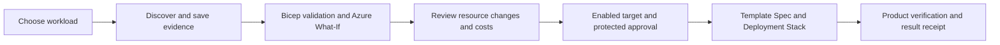

# Platform Studio

### Azure developer self-service with Bicep, Azure DevOps and evidence-based AI

Platform Studio is a local Windows web application for discovering Azure resources, configuring workload stacks, reviewing infrastructure changes and requesting governed Azure DevOps deployments. Reusable Bicep modules, versioned Template Specs and Deployment Stacks provide the delivery foundation. Optional Codex workflows explain evidence and prepare reviewable source drafts.

[**Documentation wiki**](docs/README.md) · [Get started](docs/getting-started.md) · [Workload catalog](docs/workload-catalog.md) · [Implementation status](docs/completion-status.md) · [Roadmap](docs/self-service-expansion-plan.md)

> [!IMPORTANT]
> Source implementation and local verification are documented. All 28 workload targets, tag Apply and the AVNM allocation profile remain disabled pending platform onboarding and live acceptance. A successful local check or discovery run does not establish Azure deployment readiness.

## What you can do

| Capability | Experience |
|---|---|
| **Configure workloads** | Seven offerings with dedicated resource, dependency and cost descriptions; separate Discover and Deploy menus. |
| **Discover and visualize** | Resource and network inventory, explicit collection coverage, observed topology, proposed components and saved Azure What-If diagrams. |
| **Review with AI** | Six Codex review/draft workflows using scoped evidence and pinned skills; deterministic checks remain usable without a model. |
| **Design Bicep** | Compose reviewable source drafts from local module contracts, with explicit required settings and qualification before deployment. |
| **Govern tags** | Subscription resource/tag views, deterministic findings, editable drafts and a protected ADO change path. |
| **Deliver through ADO** | Reviewed pipeline registration, saved discovery, Preview summaries, immutable bundle checks, Template Spec publication and stack deployment. |
| **Assess recovery rules** | Fourteen workflow policies, portal explanations and an offline assessor. Restore execution is not implemented. |

Explore the [platform overview](docs/platform-overview.md) for architecture, identity boundaries, skills and current limitations.

## Start Platform Studio locally

Use Windows 11 ARM64 or x64, PowerShell 7.4+, Git, the .NET SDK selected by [global.json](global.json), and Node.js 22+. From this repository root:

```powershell
./scripts/Setup-Portal.ps1
./scripts/Start-Portal.ps1
```

Open [localhost:5087](http://localhost:5087/). You can browse workloads, skills and recovery policies before connecting cloud accounts. If prerequisites are missing, follow [the installation and upgrade steps](docs/getting-started.md). Stop the owned portal before rebuilding:

```powershell
./scripts/Stop-Portal.ps1
```

Azure, Azure DevOps and Codex use separate connections. See [browser authentication](docs/local-portal.md#configure-microsoft-browser-sign-in) and [agent setup](docs/agent-workflows.md). The portal requires its own Entra application registration; the pipeline service connection is a separate identity.

## Workload catalog

**Blob copy · Event flow · Private Storage Workspace · Key Vault · Observability · HTTP Functions API · Service Bus worker**

The [workload catalog](docs/workload-catalog.md) lists each offering's resources, dependencies, readiness boundary and exact Discover/Deploy YAML files. Hosting, private endpoints, storage, messaging and monitoring may incur charges; unavailable estimates are not zero-cost estimates. See [cost assumptions](docs/self-service-costs.md).

## Discover, Preview and Deploy



Dedicated Deploy pipelines default to **Preview only**. Deployment uses a fresh Preview, a qualified bundle and configured ADO controls. The default [azure-pipelines.yml](azure-pipelines.yml) builds/tests/packages the project; use the [workload-specific YAML files](docs/workload-catalog.md#pipeline-entry-points) for deployment.

Read [ADO onboarding](docs/self-service.md), [pipeline registration](docs/ado-pipeline-registration.md), [Preview](docs/deployment-preview.md) and [artifact flow](docs/pipeline-flow.md).

## Discovery, analysis and diagrams

Microsoft's bundled **Azure Resource Visualizer** is fundamental to the agent-assisted network discovery experience. The portal collects evidence; the scoped MCP bridge supplies that evidence and the pinned skill to Codex. Generated Mermaid must pass grammar and resource-reference validation before rendering. Observed configuration, agent interpretation, proposed components and Azure What-If remain distinct views.

The portal's factual diagrams also work without AI. A completed deployment currently reloads its Preview; a run-bound verified after-state diagram and recovery executor remain planned. See [the visualizer workflow](docs/platform-overview.md#azure-resource-visualizer-and-network-evidence), [diagram behavior](docs/portal-diagrams.md) and [recovery rules](docs/recovery-rules.md).

## Documentation and expansion

The [repository wiki](docs/README.md) is the documentation home, versioned and reviewed with the code.

| Start here | Purpose |
|---|---|
| [Getting started](docs/getting-started.md) | Install, connect, update and package the portal; run Blob copy locally. |
| [Platform overview](docs/platform-overview.md) | Architecture, capabilities, identity, agents and evidence boundaries. |
| [Workload catalog](docs/workload-catalog.md) | Product resources, pipeline files and onboarding requirements. |
| [Current status](docs/completion-status.md) | Implemented capabilities, verified evidence and outstanding acceptance. |
| [Contributor guide](docs/repository-structure.md) | Source placement, reusable modules and runtime/test boundaries. |
| [Expansion plan](docs/self-service-expansion-plan.md) | Planned products, networking, recovery and qualification work. |

Historical test counts and run details belong in the [validation log](docs/validation.md), with [machine-readable evidence](docs/validation-results.json). New capabilities follow the [workflow standard](docs/agent-workflow-standard.md), [blueprint](docs/templates/agent-workflow-blueprint.md) and [documentation-maintenance skill](.agents/skills/self-service-docs/SKILL.md).
