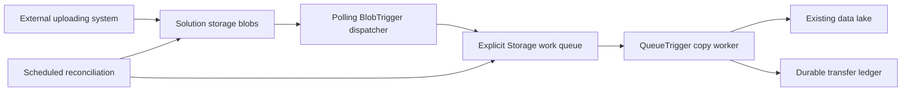

# Azure workload self-service: Blob Transfer and Event Flow

Two independently owned workload patterns share Discover, Deploy, local modules, versioned Template Specs and Deployment Stack governance. See the [Event Flow requirements and method guide](workloads/logic-app-event-grid/README.md) for Logic App Standard + Event Grid. All eight profiles remain disabled pending platform onboarding and Azure acceptance.

The blob-transfer workload below provides production-minded Azure Bicep for Dev, QA, UAT and Prod, with .NET 10 Functions, deduplication and recovery. **The uploading system is outside our control. It only needs to place a file in the solution storage container. No custom metadata, request ID, filename convention or queue message is required from it.**



The Function App contains both the lightweight BlobTrigger dispatcher and the QueueTrigger copy worker. **The blob-transfer workload uses no Event Grid or MCP.** Blob Storage itself does not automatically populate a custom queue: our dispatcher does that after detecting a blob. Azure Storage Actions is not a queue-message publisher. The work queue is in the solution/upload account, while Functions runtime receipts and packages use the dedicated host account.

## Included behavior

- Stable processing ID derived server-side from configured source container, blob name, and ETag.
- Actual source SHA-256 calculation; identical bytes within a configured scope converge on one destination.
- Versioned source references when available, with scheduled source-version scanning to recover missed revisions.
- A dedicated `transfer-ledger` container in the private solution storage account with request/content records, conditional creation and renewable leases for concurrent workers.
- Conditional destination creation; actual destination hash verification before success.
- Queue retries, a bounded lifetime attempt budget, persisted reconciliation cursors, missing-destination repair, and conflict quarantine.
- Monitoring for both dispatcher and worker poison queues, quarantined requests, missing sources, and absent reconciliation heartbeats.
- A C# operator tool for status and explicitly reviewed recovery. No automatic source deletion.

**We cannot prevent an external system uploading a duplicate or overwriting its own file.** We can detect repeated arrivals/revisions and avoid duplicate downstream copies. This is safe repeat processing, not guaranteed single invocation.

Read [architecture](docs/architecture.md), [operations](docs/operations.md), [security/RBAC](docs/security-and-rbac.md), and [validation evidence](docs/validation.md). The [Mermaid guide](docs/diagram-guide.md) and [offline visual edition](docs/diagram-guide.html) explain both the runtime and Bicep organization.

For the dispatcher's full requirements, exact method calls, message/configuration contracts, package inventory, and less-visible runtime dependencies, start with the [Dispatcher README](docs/dispatcher/README.md). The [local workflow reference](docs/local-workflow.md) follows the worker, timers, and lifecycle scripts through each action.

## Run Blob copy locally without Azure

From this checkout in PowerShell:

```powershell
./scripts/Run-Local.ps1
./scripts/Test-Local.ps1
./scripts/Stop-Local.ps1
```

The launcher checks prerequisites and installs missing tools into ignored project folders, starts Azurite and the real Functions host on loopback, and retains data on stop. No Azure account, Docker, Azure CLI, or Bicep is needed for this local workflow. See [local development](docs/local-development.md) for PowerShell bootstrap, tool versions, logs, explicit reset, and Azure-only validation limits. Stop local mode before `Test-Recovery.ps1`, which uses the same emulator ports.

## Developer self-service: what is available

| Offering | What it does and creates | Current evidence |
|---|---|---|
| **Blob copy** (`blob-transfer` / `blobcopy`) | Copies uploaded blobs to an existing data lake using a Function App, two storage accounts, queues/ledger, identity, private access, monitoring and recovery. | Real local Functions/Azurite smoke recorded; Azure deployment acceptance outstanding. |
| **Event flow** (`logic-app-event-grid` / `eventflow`) | Processes document events using Logic App Standard, Event Grid, two storage accounts, eight private endpoints, identities and monitoring. Discovery can plan missing owned VNet/subnets, DNS zones/links and workspace. | Package, Bicep and contract tests pass locally; hosted workflow and Azure deployment acceptance outstanding. |

Each offering has dev, QA, UAT and prod targets. **All eight remain disabled for deployment.** Event flow dev now has operator-authorized tags, identity and two exception decisions; it still needs matching discovery and successful live Azure validation. Higher environments require independent onboarding. The [current status matrix](docs/completion-status.md) separates implemented code, local verification, observed ADO steps and remaining work.

### Choose the workload menu

| ADO pipeline | YAML to register |
|---|---|
| Discover - Blob copy | [azure-pipelines-blobcopy-discover.yml](azure-pipelines-blobcopy-discover.yml) |
| Deploy - Blob copy | [azure-pipelines-blobcopy-deploy.yml](azure-pipelines-blobcopy-deploy.yml) |
| Discover - Event flow | [azure-pipelines-eventflow-discover.yml](azure-pipelines-eventflow-discover.yml) |
| Deploy - Event flow | [azure-pipelines-eventflow-deploy.yml](azure-pipelines-eventflow-deploy.yml) |

All entrypoints are manual; push, PR and discovery-completion triggers are disabled. `azure-pipelines.yml` is the build/test/package entry, not the developer deployment menu. The generic self-service pair remains a compatibility route with its older setup/six-stage behavior.

### How a request works

1. Run the chosen **Discover** pipeline on `main`: select instance, environment, approved subscription and network profile. It reads inventory and publishes `subscription-discovery`; it creates no Azure resources.
2. Open the matching **Deploy** pipeline on `main`: select instance, environment and approved region. Under **Resources > discovery**, choose a successful matching run no older than seven days. Subscription, identity, topology and protected resources come from reviewed platform configuration.
3. Leave **Run stages = Preview only**. Stage **Preview** verifies the manifest/provenance, resolves inputs, compiles Bicep and performs Azure validation/What-If. Read **Summary / Extensions** or `deployment-preview/README.md`. Failed/incomplete previews show blockers, not zero changes. Native stack What-If uses temporary metadata with cleanup; it does not apply workload resources.
4. After onboarding and enablement, queue a fresh **Preview and deploy** run. Stage **Deploy** qualifies/freezes the app and infrastructure, publishes a versioned Template Spec, rechecks the plan for drift, then applies the Deployment Stack through Foundation and Release. ADO approvals/locks/private agents must be configured externally.
5. Inspect `deployment-result/receipt.json`. Only `status: Ready` and `ready: true`, backed by workload smoke evidence, establish a successful release. Failures can leave resources; automatic rollback is not implemented.

For Event flow, discovery decisions mean **Create** missing standard resources, **Reuse** approved external resources, **Manage** resources already owned by this stack, or **Blocked** when evidence/configuration is unsafe or unknown. Failed listings never mean resources are absent. Blob copy follows its approved network profile and keeps destination storage externally owned.

The form shows only the chosen workload's resources, dependencies and dated cost references. These are not free-resource claims or live billing quotes. Dropdowns come from generated, reviewed YAML and cannot refresh from an artifact midway through a run. Local modules are embedded in the Template Spec; the separate application ZIP is installed by the workload adapter. Cross-environment application artifact promotion is not yet implemented.

Read the [catalog, exact methods and artifact map](docs/self-service-catalog.md), [ADO registration/onboarding guide](docs/self-service.md), [Preview runbook](docs/deployment-preview.md), [prerequisite resolution](docs/prerequisite-resolution.md) and [cost guide](docs/self-service-costs.md). The [documentation index](docs/README.md) identifies current guides and historical assessments.

### Expansion roadmap

The [self-service expansion and enhancement plan](docs/self-service-expansion-plan.md) proposes a reusable product/adapter contract, private storage, Key Vault, observability, APIs, workers, web apps, databases and later integration/container/AI foundations. It also plans immutable release promotion and reviewed operating actions. These are future offerings with explicit acceptance gates, not additional items currently available in the Run menu. Module registry work is not required.

The proposed [private networking workstream](docs/plans/private-networking-self-service.md) adds a network/subnet analyzer, authoritative IPAM allocation, private connectivity profiles and optional AI-assisted intent/explanations. Its goal is self-service without developer-entered network IDs or IP ranges, backed by deterministic capacity, DNS, routing, ownership and concurrency checks. It is not implemented yet.

## Files and local validation

```text
workloads/blob-transfer/   main.bicep, stack.bicep, request contract
  environments/            main.{dev,qa,uat,prod}.bicepparam
  modules/                 workload-specific Function, monitoring, network and RBAC
workloads/logic-app-event-grid/  Logic App/Event Grid composition, stack and environments
modules/                   reusable storage, network, monitoring, Logic App and Event Grid
platform/                  separately operated Policy and registry templates
config/                    reviewed topology and stack/publication policy
src/BlobTransfer/          dispatcher, queue worker, ledger, timers, recovery
src/TransferTool/          status / reviewed resume CLI
src/LogicAppEventFlow/     packaged stateful workflow content
tests/BlobTransfer.Tests/  policy and Azurite integration tests
tests/infrastructure/      locked YAML parser and pipeline/Bicep contract checks
scripts/                   validation, local recovery tests, deployment, smoke, packaging
docs/                      design, operations, diagrams, evidence
azure-pipelines.yml        test/package CI; no automatic deployment
azure-pipelines-self-service.yml  manual discovery and saved manifest
azure-pipelines-self-service-deploy.yml  deployment from a selected discovery run
pipelines/                 protected-resource bindings and plan/apply templates
self-service/targets/      disabled catalog examples for platform onboarding
```

See [Bicep repository conventions](docs/repository-structure.md) for Microsoft source references, module placement, environment/stack configuration, and the migration from the old root template paths. Use the dedicated workload YAML files listed above; the original generic files remain for compatibility.

Install PowerShell 7, .NET 10 SDK, Azure CLI and Node 22+. SDK 10.0.300 is pinned with stable feature-band roll-forward. Run the following commands from the Git checkout root; the original archive is a historical snapshot.

For this GitHub repository, clone `https://github.com/Enetact/Bicep.git` and enter its checkout instead. The Azure DevOps pipeline can connect to this GitHub repository; GitHub hosting does not require changing the deployment system to GitHub Actions. `.gitattributes` keeps source line endings consistent for manifest verification.

```powershell
az bicep install --version v0.47.16
./scripts/Update-Manifest.ps1 -Check
./scripts/Test-Project.ps1
./scripts/Test-Recovery.ps1
./scripts/Build-Package.ps1 -ReleaseId 'queue-recovery-001'
```

Ordinary unit-test runs skip emulator integration tests explicitly. `Test-Recovery.ps1` starts its own loopback-only Azurite, runs the integration tests, and stops only that process. It refuses already-occupied emulator ports and retains test data/evidence under `artifacts`. Azure is not required for local tests.

The project check also exercises tooling contracts, parses pipeline YAML and checks template bindings/stage artifacts using the locked test-only YAML parser under `tests/infrastructure`. It requires Node.js 22+ and npm, restores that dependency with install scripts disabled, and writes unit-test/advisory/pipeline evidence to `artifacts/test-results`. Unavailable advisory data (`NU1900`) fails validation. Packaging checks the exact five Function names/triggers and writes the ZIP, SHA-256, generated metadata, compiled environment templates, and `release.json` to `artifacts/releases/<release-id>`. The receipt records the Git commit and whether local edits were present; it is provenance, not a signature or proof of approval. CI publishes this curated release folder and test results, rather than emulator tooling/data.

After intentional source changes, regenerate `MANIFEST.sha256` with `./scripts/Update-Manifest.ps1` and review the diff. Do not regenerate it automatically in CI. Use the [current self-service guide](docs/self-service.md) for implementation/setup and the [historical assessment](docs/self-service-azure-devops-assessment.md) for original proposals and deferred architecture.

## Configure Blob copy environments

Edit owner, cost center, destination subscription/RG/account/container, source scope mapping, CIDRs, optional existing group IDs, and alert action groups in each `.bicepparam`. The destination container must already exist. Confirm actual regional SKU, zone, runtime and quota availability.

The default scope mapping `{ '': 'default' }` covers every source filename in the container. A server-controlled longest-prefix map can separate opaque customer/claim/document-purpose scopes, for example `{ 'customer-a/': 'scope-a', 'customer-b/': 'scope-b' }`. This uses existing source paths, not uploader metadata. If no reliable business scope can be inferred, use container-wide deduplication or establish an authoritative mapping first.

| Environment | Plan | Instances | Storage | Logs |
|---|---|---:|---|---|
| Dev | B1 | 1 | LRS | 30 days |
| QA | S1 | 1 | LRS | 30 days |
| UAT | P1v3 | 2 | ZRS | 90 days |
| Prod | P1v3, zonal subject to support | 3 | ZRS | 90 days |

By default each environment gets one workspace shared by this workload's components and one workspace-based Application Insights component. Set `existingLogAnalyticsWorkspaceId` through reviewed configuration to reuse an existing workspace; its configuration and access remain the monitoring team's responsibility. Prod requires action groups through the deployment script.

## Manual Blob copy deployment sequence

The commands below are the manual Blob copy path. For governed self-service, use the Discover/Deploy menus above. No successful Azure workload deployment is established in the reviewed evidence. Replace placeholders, review settings, and use a runner/workstation with approved private connectivity.

```powershell
az login
$subscription = '<application-subscription-id>'
$rg = 'rg-blobcopy-dev'
az account set --subscription $subscription
az group create --subscription $subscription --name $rg --location eastus2

./scripts/Deploy.ps1 -EnvironmentName dev -SubscriptionId $subscription -ResourceGroup $rg -Phase Bootstrap -Mode WhatIf
./scripts/Deploy.ps1 -EnvironmentName dev -SubscriptionId $subscription -ResourceGroup $rg -Phase Bootstrap -Mode Deploy

# Establish private routing/DNS, approve private endpoints, and allow RBAC propagation.
$release = 'queue-recovery-001'
./scripts/Build-Package.ps1 -ReleaseId $release
$zip = "./artifacts/releases/$release/$release.zip"
./scripts/Deploy.ps1 -EnvironmentName dev -SubscriptionId $subscription -ResourceGroup $rg -Phase Release -ReleaseId $release -Mode WhatIf
./scripts/Deploy.ps1 -EnvironmentName dev -SubscriptionId $subscription -ResourceGroup $rg -Phase Release -ReleaseId $release -PackagePath $zip -Mode Deploy

$o = (az deployment group show --subscription $subscription --resource-group $rg --name blobcopy-dev --query properties.outputs -o json | ConvertFrom-Json)
./scripts/Smoke-Test.ps1 -SubscriptionId $subscription -UploadAccount $o.uploadStorageAccountName.value -DestinationSubscriptionId '<destination-subscription-id>' -DestinationAccount '<actual-datalake-account>' -DestinationContainer 'blobcopy-dev'
```

The live smoke script performs ordinary blob uploads without queue sends or custom metadata, including two names with identical bytes and a repeated overwrite. It checks all three revision records and one shared destination. The tester needs source write, ledger read and destination read permissions. Synthetic data remains for audit.

Bootstrap is for first provisioning. The script rejects Bootstrap when that workload/environment already has a Function App, preserving runtime alerts; use Release for subsequent updates. `-ParameterPath` accepts a workload-specific `.bicepparam` and checks that its environment matches `-EnvironmentName`. Deployment history is named `<workload>-<environment>`; compilation/effective parameters use a unique local folder for each invocation. Manual scripts require operators to serialize deployments. The self-service pipeline uses sequential apply stages, but platform owners must configure the environment's exclusive lock check and prevent concurrent out-of-band changes.

For a custom scope map, give the smoke test the same mapping used by the Function and an authorized prefix, for example `-SourcePrefix 'claims/smoke/' -ScopePrefixesJson '{"claims/":"claims"}'`. Pass custom upload/ledger container names too. The test derives the scope before writing any blob; an optional `-ScopeId` is checked against that mapping.

## Boundaries

- Source is non-HNS StorageV2 with versioning enabled; ordinary committed block blobs are supported. Destination may be ADLS Gen2 through Blob APIs.
- Polling is not immediate push or a real-time SLA. Two dispatcher and two copy invocations per host instance are configured; ordering is not guaranteed.
- Only two storage accounts are created: host and solution. The solution account holds incoming blobs, work/poison queues and the separate ledger container. Both accounts remain private with shared keys disabled; no trusted-service firewall exception is added. The existing destination is referenced separately.
- The template does not provision the external uploading system, VPN, peering, DNS resolver, runner, egress firewall, or malware scanner.
- Network mode can create a dedicated VNet or reuse approved existing subnet/private DNS IDs. Existing mode does not redeploy the shared network; private endpoint creation and DNS records still require platform permissions.
- Monitor endpoints remain public, authenticated TLS. Existing destination settings remain owner-managed.
- Destination names now use `v1/<scope>/<content-sha256>/payload`; original names map through ledger records. Earlier destination files/receipts are not migrated automatically. If upgrading from a separate ledger account, follow the ledger migration procedure in [operations](docs/operations.md) before switching endpoints.
- Full hash verification and scanning retained versions add IO/cost. Review retention, backup, load, poison handling, and operational ownership.
- Local tests do not prove real Azure triggers, identity, private networking, version listing, or alert delivery. Complete the live acceptance checks before production.
