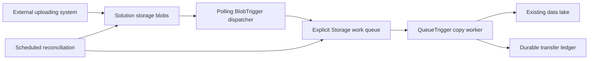

# External blob arrival to queue-triggered copy

Production-minded Azure Bicep for Dev, QA, UAT and Prod, with .NET 10 Functions, deduplication and recovery. **The uploading system is outside our control. It only needs to place a file in the solution storage container. No custom metadata, request ID, filename convention or queue message is required from it.**



The Function App contains both the lightweight BlobTrigger dispatcher and the QueueTrigger copy worker. **No Event Grid and no MCP.** Blob Storage itself does not automatically populate a custom queue: our dispatcher does that after detecting a blob. Azure Storage Actions is not a queue-message publisher. The work queue is in the solution/upload account, while Functions runtime receipts and packages use the dedicated host account.

## Included behavior

- Stable processing ID derived server-side from configured source container, blob name, and ETag.
- Actual source SHA-256 calculation; identical bytes within a configured scope converge on one destination.
- Versioned source references when available, with scheduled source-version scanning to recover missed revisions.
- A dedicated `transfer-ledger` container in the private solution storage account with request/content records, conditional creation and renewable leases for concurrent workers.
- Conditional destination creation; actual destination hash verification before success.
- Queue retries, a bounded lifetime attempt budget, persisted reconciliation cursors, missing-destination repair, and conflict quarantine.
- Monitoring for both dispatcher and worker poison queues, quarantined requests, missing sources, and absent reconciliation heartbeats.
- A C# operator tool for status and explicitly reviewed recovery. No automatic source deletion.

**We cannot prevent an external system uploading a duplicate or overwriting its own file.** We can detect repeated arrivals/revisions and avoid duplicate downstream copies. This is safe repeat processing, not guaranteed single invocation.

Read [architecture](docs/architecture.md), [operations](docs/operations.md), [security/RBAC](docs/security-and-rbac.md), and [validation evidence](docs/validation.md). The [Mermaid guide](docs/diagram-guide.md) and [offline visual edition](docs/diagram-guide.html) explain both the runtime and Bicep organization.

## Files and local validation

```text
main.bicep
environments/{dev,qa,uat,prod}.bicepparam
modules/                   storage, network, RBAC, Function, monitoring
src/BlobTransfer/          dispatcher, queue worker, ledger, timers, recovery
src/TransferTool/          status / reviewed resume CLI
tests/BlobTransfer.Tests/  policy and Azurite integration tests
scripts/                   validation, local recovery tests, deployment, smoke, packaging
docs/                      design, operations, diagrams, evidence
azure-pipelines.yml        test/package CI; no automatic deployment
```

Extract `blob-transfer-project.tar` with `tar -xf blob-transfer-project.tar`, then enter `blob-transfer`. Install PowerShell 7, .NET 10 SDK, Azure CLI and Node 22+. SDK 10.0.300 is pinned with stable feature-band roll-forward.

```powershell
az bicep install --version v0.47.16
./scripts/Test-Project.ps1
./scripts/Test-Recovery.ps1
./scripts/Build-Package.ps1 -ReleaseId 'queue-recovery-001'
```

Ordinary unit-test runs skip emulator integration tests explicitly. `Test-Recovery.ps1` starts its own loopback-only Azurite, runs the integration tests, and stops only that process. It refuses already-occupied emulator ports and retains test data/evidence under `artifacts`. Azure is not required for local tests.

## Configure environments

Edit owner, cost center, destination subscription/RG/account/container, source scope mapping, CIDRs, optional existing group IDs, and alert action groups in each `.bicepparam`. The destination container must already exist. Confirm actual regional SKU, zone, runtime and quota availability.

The default scope mapping `{ '': 'default' }` covers every source filename in the container. A server-controlled longest-prefix map can separate opaque customer/claim/document-purpose scopes, for example `{ 'customer-a/': 'scope-a', 'customer-b/': 'scope-b' }`. This uses existing source paths, not uploader metadata. If no reliable business scope can be inferred, use container-wide deduplication or establish an authoritative mapping first.

| Environment | Plan | Instances | Storage | Logs |
|---|---|---:|---|---|
| Dev | B1 | 1 | LRS | 30 days |
| QA | S1 | 1 | LRS | 30 days |
| UAT | P1v3 | 2 | ZRS | 90 days |
| Prod | P1v3, zonal subject to support | 3 | ZRS | 90 days |

Each environment gets one workspace shared by this workload's components and one workspace-based Application Insights component. Existing organization-workspace reuse is not implemented. Prod requires action groups through the deployment script.

## Exact deployment sequence

Nothing has been deployed while preparing this project. Replace placeholders, review settings, and use a runner/workstation with approved private connectivity.

```powershell
az login
$subscription = '<application-subscription-id>'
$rg = 'rg-blobcopy-dev'
az account set --subscription $subscription
az group create --subscription $subscription --name $rg --location eastus2

./scripts/Deploy.ps1 -EnvironmentName dev -SubscriptionId $subscription -ResourceGroup $rg -Phase Bootstrap -Mode WhatIf
./scripts/Deploy.ps1 -EnvironmentName dev -SubscriptionId $subscription -ResourceGroup $rg -Phase Bootstrap -Mode Deploy

# Establish private routing/DNS, approve private endpoints, and allow RBAC propagation.
$release = 'queue-recovery-001'
./scripts/Build-Package.ps1 -ReleaseId $release
$zip = "./artifacts/releases/$release/$release.zip"
./scripts/Deploy.ps1 -EnvironmentName dev -SubscriptionId $subscription -ResourceGroup $rg -Phase Release -ReleaseId $release -Mode WhatIf
./scripts/Deploy.ps1 -EnvironmentName dev -SubscriptionId $subscription -ResourceGroup $rg -Phase Release -ReleaseId $release -PackagePath $zip -Mode Deploy

$o = (az deployment group show --subscription $subscription --resource-group $rg --name blobcopy-dev --query properties.outputs -o json | ConvertFrom-Json)
./scripts/Smoke-Test.ps1 -SubscriptionId $subscription -UploadAccount $o.uploadStorageAccountName.value -DestinationSubscriptionId '<destination-subscription-id>' -DestinationAccount '<actual-datalake-account>' -DestinationContainer 'blobcopy-dev'
```

The live smoke script performs ordinary blob uploads without queue sends or custom metadata, including two names with identical bytes and a repeated overwrite. It checks all three revision records and one shared destination. The tester needs source write, ledger read and destination read permissions. Synthetic data remains for audit.

## Boundaries

- Source is non-HNS StorageV2 with versioning enabled; ordinary committed block blobs are supported. Destination may be ADLS Gen2 through Blob APIs.
- Polling is not immediate push or a real-time SLA. Two dispatcher and two copy invocations per host instance are configured; ordering is not guaranteed.
- Only two storage accounts are created: host and solution. The solution account holds incoming blobs, work/poison queues and the separate ledger container. Both accounts remain private with shared keys disabled; no trusted-service firewall exception is added. The existing destination is referenced separately.
- The template does not provision the external uploading system, VPN, peering, DNS resolver, runner, egress firewall, or malware scanner.
- Monitor endpoints remain public, authenticated TLS. Existing destination settings remain owner-managed.
- Destination names now use `v1/<scope>/<content-sha256>/payload`; original names map through ledger records. Earlier destination files/receipts are not migrated automatically. If upgrading from a separate ledger account, follow the ledger migration procedure in [operations](docs/operations.md) before switching endpoints.
- Full hash verification and scanning retained versions add IO/cost. Review retention, backup, load, poison handling, and operational ownership.
- Local tests do not prove real Azure triggers, identity, private networking, version listing, or alert delivery. Complete the live acceptance checks before production.
