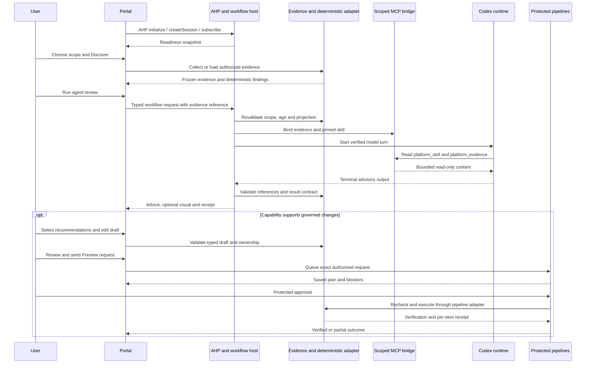

# Standard for evidence-based self-service agent workflows

**Version 1 design standard — 27 September 2026.** This documents the repeated pattern in the current source and sets the contract for new capabilities. The four existing agent reviews are implemented; the shared descriptor, structured recommendation contract and recommendation-to-draft handoff described below still require implementation. The [tagging plan](plans/tagging-self-service.md) is the first planned consumer. Use the [copyable workflow blueprint](templates/agent-workflow-blueprint.md) for subsequent skills.

## The common experience

**Choose capability → authenticate → choose scope → discover/load evidence → deterministic analysis → optional agent review → inspect findings/visuals → select recommendations into a draft → Preview → approve/apply → verify.**

Every capability uses the same stages and labels. A read-only capability ends after the review; an action-capable capability adds the governed change path. A visualization is optional: networks benefit from topology, tags from a resource/tag matrix, and a Preview from an action table. Do not force a diagram onto a dataset that is clearer as a table.

Authentication makes an action available; it never starts discovery, model inference or a deployment. Deterministic discovery and analysis remain usable without Codex. The agent explains evidence, considers alternatives and proposes changes. Deterministic code validates proposals; the user chooses the draft; the approved execution adapter performs changes.

## What AHP, Codex, MCP and ADO each do

| Layer | Current implementation | Standard responsibility |
|---|---|---|
| Portal session | Browser cookie, origin/CSRF validation and session-owned state | Bind scope, evidence, agent run and draft to the authorized browser. Prevent cross-session evidence access. |
| AHP | `AgentHostChannel.Handle` at `/api/agent/ahp`; coordination-only profile `0.9.0`; initialize/createSession/subscribe snapshots | Coordinate the browser-owned agent session and readiness. Do not call it the inference engine or a fully conformant general-purpose AHP host. |
| Workflow API | `POST /api/agent/run` → `AgentWorkflows.Run` | Validate workflow/scope, collect or select evidence, freeze the projection, enforce budgets and invoke the provider. |
| Codex runtime | `CodexAgentRuntime.Review`; native app-server thread/turn calls | Run the skill using **GPT-6 Astra / High / Standard** as pinned by `AgentPolicy`; verify accepted settings and terminal completion. No silent fallback. |
| MCP evidence bridge | `AgentMcpBridge.Create/Call`; `platform_evidence` and `platform_skill` | Serve only the frozen evidence and selected skill, with no arbitrary parameters or write tools. Require both reads and record tool calls. |
| Deterministic domain adapter | Network assessment, evidence/diagram validators and workload/request adapters | Own factual checks, schema/resource-reference validation, scope, eligibility and exact change planning. |
| ADO adapter | Reviewed typed requests, separate queue operation, pipeline artifacts and protected stages | Run independently authorized Discover/Preview/Apply/Verify operations. An AI recommendation is never an approval. |

The existing UI requests AHP status snapshots and falls back to `/api/agent/status` if the AHP connection is unavailable. Model turns still use the typed HTTP endpoint in either case. AHP is therefore part of the shared experience, not a prerequisite that causes the portal to gain new write authority. Push progress, durable AHP replay and arbitrary chat dispatch are not current features.

Azure browser sign-in authorizes Azure reads; ADO browser sign-in authorizes ADO API access; an ADO service connection supplies the pipeline's Azure principal; Codex sign-in authorizes the model. These identities are separate. Never pass Azure/ADO credentials to the model or assume their permissions are interchangeable.

## Source audit: which workflows already follow this pattern?

| Workflow | Evidence and skill | Current result and handoff | Reuse or gap |
|---|---|---|---|
| Resource visualization (`visualize`) | Verified resource-group inventory or selected network snapshot; pinned `azure--azure-resource-visualizer` | Advisory Markdown, diagram validation result, restricted visual if accepted, receipt | Common AHP/Codex/MCP path exists. No editable recommendation contract. |
| Private network review (`network`) | Same reader/skill with network-specific scope and limitations | Advisory findings and optional diagram | Common agent execution exists. The Network discovery button currently selects `visualize`, not `network`; both accept the saved snapshot. |
| Workload advisor (`workload`) | Catalog product, target, region and proposed topology; `platform-request-design` | Advisory configuration guidance | Uses proposed configuration, not observed Azure facts. It does not resolve or queue a request from model output. |
| Saved Preview review (`preview`) | Bounded ADO Preview projection matching product/environment/region; `platform-change-review` | Advisory change explanation | Not a full bundle/ownership/approval audit. No model-driven Apply. |
| Network discovery and AVNM operations | `NetworkDiscovery`, `NetworkAssessment`, `NetworkPipeline`; separate network YAML | Deterministic inventory/assessment; explicit agent handoff; separately reviewed allocation request | Good overall pattern, but the allocation request is independently entered. It is not generated from, or authorized by, the agent's findings. |
| Workload delivery | Dedicated Discover and Deploy roots, typed request/bundle and shared templates | Saved discovery, What-If Preview, governed deployment | Reuse delivery boundaries. AI is not required by these pipelines. |
| Tagging (`tagging`, proposed) | Saved subscription tag inventory + deterministic analysis; planned `platform-tagging-review` | Matrix, validated suggestions, custom-tag draft, ADO tag Preview/Apply or source-owned workload route | New domain adapter and structured draft handoff required. No tagging workflow is registered yet. |

Bulk ADO registration is an administrative setup operation, not an AI remediation workflow. The 42 Microsoft skill cards also do not represent 42 executable agents. A `SKILL.md` appearing in the library is distinct from registering an evidence adapter, agent workflow and pipeline action.

## Standard lifecycle and visible states

| Step | Explicit user action | Required output/gate |
|---|---|---|
| 1. Select | Open a capability | Descriptor names scope, evidence sources, required connections, supported outputs and actions. Show Implemented/Planned/Not configured clearly. |
| 2. Connect | Complete the required browser logins | Independent evidence, model and execution readiness. “Connected” alone does not mean a target is deployable. |
| 3. Scope | Select subscription/group, workload or saved run | Validated IDs plus human-readable names; principal and coverage disclosure. Never infer inaccessible resources from an empty result. |
| 4. Collect | Discover or open a specific saved artifact | Immutable evidence version, collector outcomes, timestamps, source identity/run and digest. A refresh creates a new version. |
| 5. Assess | Run deterministic checks (may follow collection automatically as disclosed) | Findings with rule IDs, evidence references and unknowns. Read-only analysis can explain partial evidence; eligibility for change remains separate. |
| 6. Review with AI | Read the data-transfer scope and click Run | Frozen sanitized projection, pinned skill, verified model policy and budget. No scope expansion through model tools. |
| 7. Validate/display | Inspect returned advice | Separate observed facts, deterministic findings, agent interpretation and proposed changes. Invalid structured output cannot become selectable suggestions. |
| 8. Draft | Select recommendations or enter values | New typed draft bound to evidence. No preselected changes; domain validation, protected fields and source ownership checked. Editing invalidates previous review tickets. |
| 9. Preview | Review/send the exact pipeline request | Qualified producer/run/artifact; exact changes and blockers. Label tag diffs, network plans and actual ARM What-If accurately. |
| 10. Approve/apply | Approve the protected ADO stage | Fresh matching plan, authorization and profile-specific locks/checks. Source-owned resources use their established source/deployment route. |
| 11. Verify | Inspect execution receipt and refreshed view | Direct read-back/domain checks, per-item results and preserved-state verification. A successful agent run or queued pipeline is not a verified change. |

Use separate state dimensions rather than one optimistic green badge:

- **Evidence:** Not collected / Collecting / Complete-visible / Partial / Failed / Stale.
- **Agent:** Unavailable / Ready / Running / Completed / Failed / Cancelled; additionally **output validation:** Accepted / Rejected / Not applicable.
- **Change:** None / Draft / Blocked / Previewed / Awaiting approval / Applying / Verified / Partially applied / Outcome unknown.

These are the target UI vocabulary; current controls expose a smaller state set. Keep previous results labeled with their original scope/time during another run. Cancellation is not rollback. Reading a saved result is not rerunning its model or replaying its writes.

## Standard sequence

This is the target reusable sequence. Existing agent reviews use the same model/MCP core, but may collect evidence inside Run; their structured recommendation/draft arrows are not implemented.

## Reusable contracts to implement

Use a code-allowlisted descriptor with versioned data, not arbitrary executable handlers or API URLs supplied by a skill. The blueprint defines the fields. A descriptor alone cannot enable a workflow; its registered adapter and validation must exist.

| Contract | Required content |
|---|---|
| Workflow definition | Stable ID/version, skill ID/hash, supported scope, evidence adapter, connection requirements per step, output kinds, limits, optional action adapter, implementation/readiness status. |
| Evidence envelope | Evidence ID/schema, tenant/scope, observed start/end, collector/principal/source-run provenance, coverage/exclusions, immutable digest and domain payload. Proposed workload components must have a distinct evidence kind. |
| Deterministic assessment | Assessment/rule versions, input digest, resource and evidence IDs, severity, finding state, required missing evidence and explicit action eligibility. |
| Agent input projection | Envelope reference/digest, selected fields/resources, sanitization policy, excluded data, skill/rule versions, actual byte budget and scope disclosure. A projection digest differs from a full inventory digest. |
| Agent review | `platform.agent-review/v1`; workflow/evidence/assessment references, summary, findings, uncertainty, recommendations and optional domain visual. Every recommendation has a stable ID, evidence references, rationale, required inputs and a domain-typed proposed operation. Host sets `advisoryOnly: true`; a model cannot set authorization. |
| Draft | New request ID; selected recommendation IDs and user edits; domain schema; source evidence and semantic decision hashes; exact targets; source ownership; validation/blockers. No inferred targets from free text. |
| Review receipt | Host-assigned run ID, workflow/skill versions, input/projection digests, requested and accepted provider settings, tool-call audit, times, terminal state and output validation. Capture actual usage only when available; unknown usage stays unknown. |
| Execution receipt | Independent ADO producer/definition/run/stage and plan digests, actor/approval references where available, per-item outcomes and verification evidence. Never reuse an agent receipt as execution proof. |

The shared review contract is a planned addition. Current `review.md` is prose, not schema-validated `platform.agent-review/v1`. Mermaid has a separate evidence/grammar validator. A Completed receipt can therefore coexist with a Rejected diagram; it does not prove every assertion in the prose.

Common validators check structure, allowed resource IDs, reference existence, scope, maximum sizes and allowed operations. Domain validators check meaning: tag key/value rules, network constraints, cost-evidence dates or deployment ownership. Model-supplied confidence is explanatory only; it cannot bypass missing evidence, protected fields or approvals. Rejected JSON is retained safely as advisory text or rejected outright; it never silently becomes an executable draft.

## What is shared versus capability-specific

**Keep shared:** browser identity/session checks; AHP coordination; Codex lifecycle and model policy; MCP evidence tools; evidence version/projection/receipt contracts; cancellation; safe rendering/export; readiness UI; review/queue ticket behavior; artifact provenance; failure vocabulary and acceptance tests.

**Implement per capability:** scope selectors, fixed collectors, deterministic rules, skill instructions, typed recommendation payload, domain visual, draft editor, ownership policy, Preview semantics, execution adapter and verification. A skill file describes reasoning; an adapter provides the callable capability. Do not create a new AHP server, Codex installation or Azure credential cache for each skill.

Initial extraction targets inside `src/SelfService.Portal/` are a shared workflow registry, evidence-reference resolver, review validator and readiness model. Retain domain folders for tagging/networking. Move shared deterministic domain code into a library only where portal and pipeline both use it, as the tagging plan specifies. Avoid a plugin loader or a universal mutable dictionary that bypasses compile-time domain contracts.

## Safeguards and budgets

Preserve the current defaults until tested changes are explicitly introduced: one active agent operation per browser, five-minute operation timeout, 256 KiB model evidence projection, at most 12 MCP calls, both evidence tools read, and 15-minute maximum age for a saved network snapshot. Other evidence/plan lifetimes belong to their domain profiles; do not apply the network lifetime blindly to every capability.

Evidence may contain confidential metadata or injected instructions. Use field allowlists/redaction, scope disclosure, text-safe rendering and validated exports. The model never receives credentials, source-control write tools, arbitrary ARM requests, shell access or pipeline approval tools. Codex authentication does not implicitly launch Microsoft `azmcp`; the current server is the platform's own in-process MCP evidence bridge.

Expired/revoked identity stops further reads. Missing, denied, partial and stale evidence remain visible. Oversized projections are rejected or split into explicitly disclosed independently attributed reviews; never silently truncate. Caching is proposed, keyed by scope, evidence/projection, rule/skill versions and model settings, and must recheck authorization on every read. Cache hits do not reset observation time or plan freshness.

Queue/write timeouts can have unknown outcomes. Reconcile against the original request/run before retrying; an AI call retry is also a new attributable attempt with potential cost. No automatic model retries are introduced by this standard. A failed provider or validator must not trigger a more privileged fallback.

## Extension procedure and acceptance

1. Copy [the blueprint](templates/agent-workflow-blueprint.md) into the capability's design document. Fill scope, inputs, evidence limits, outputs, ownership and non-goals before adding registration.
2. Implement the deterministic evidence/assessment adapter and tests. Define separate discovery principal versus execution principal; preserve unknown coverage. Prove useful behavior with no model connected.
3. Add the project skill under `.agents/skills/<skill-id>/SKILL.md` using the skill-authoring workflow. Keep vendored Microsoft skills unchanged. Add focused references/examples only. A library card alone is not implementation.
4. Register the typed descriptor/adapter and workflow. Until extraction exists, modify `AgentWorkflows.Definitions`, `AgentRequest`, evidence dispatch and frontend scope handling explicitly; adding only a row is insufficient. Add `platform.agent-review/v1` validation before any suggestion becomes a draft.
5. Reuse `AgentHostChannel`, `CodexAgentRuntime`, `AgentPolicy` and `AgentMcpBridge`. Test AHP status and HTTP fallback. Do not add cloud writes or queue tools to the MCP bridge.
6. Build the appropriate visual/editor and an explicit **Use selected recommendations** action. Domain validation runs again after every user edit. Analysis-only capabilities omit change controls.
7. If changes are supported, implement protected Preview/Apply/Verify adapters and their saved-evidence validation. Add manual roots to `config/pipeline-registration.json`, generation/contract checks and packages together. ADO registration does not configure permission/check policies.
8. Update the catalog, method guide, readiness matrix, source placement, security notes and evidence record. Keep current versus proposed status explicit and regenerate the source manifest.

Required test groups for every new workflow:

| Area | Acceptance evidence |
|---|---|
| Scope/identity | Cross-browser, wrong tenant/subscription/run, sign-out, stale evidence and denied/partial collectors cannot become successful authorization. |
| Agent/provider | Exact configured model/effort/tier accepted; both MCP reads; unknown tools/arguments and inherited tools rejected; terminal completion/cancel/timeout; no inference on sign-in. |
| Review contract | Invalid JSON, invented IDs, unsupported operations, malicious resource names/tags and missing citations rejected before draft creation. Prose remains visibly advisory. |
| UI | Same step labels, separate evidence/AI/change states, keyboard accessibility, safe values/exports, clear limits, cancellation and no automatic selection/application. |
| Execution (if any) | Exact reviewed draft/plan; expired or changed inputs blocked; external approvals; partial/unknown outcomes; direct verification; preserved unrelated state; no automatic replay. |
| Packaging/evidence | Source and packaged assets include the skill/adapter; ARM64 and x64 checks; synthetic versus live results recorded separately; no secrets in source or receipts. |

Live Azure/Codex/ADO acceptance must be recorded per capability. Existing local networking checks cannot qualify tagging or another new skill.

## Adoption order

- **W0 — this delivery:** source audit, shared design standard and blueprint. No runtime registrations or behavior changes.
- **W1 — shared typed foundation:** descriptor/readiness model, reusable evidence reference/projection contracts and resolver. Preserve existing workflow IDs and behavior through compatibility tests; avoid requiring a full AHP redesign.
- **W2 — structured advice:** validated shared review envelope, domain recommendation schemas, safe result UI and explicit draft creation. Keep legacy Markdown reviews supported and accurately labeled while migrating them.
- **W3 — tagging pilot:** implement tagging T0–T3 against W1/W2, then its protected write/source-ownership and live acceptance phases. Discovery can proceed before draft handoff exists; never expose an unfinished Apply route.
- **W4 — migrate and extend:** qualify the existing network/workload/Preview adapters against the standard; add future cost, policy, identity or lifecycle skills through the same blueprint. Network resource creation remains governed by its AVNM profile and independent connectivity acceptance.

W1/W2 are proposed refactoring work, not prerequisites already satisfied by these documents. Track each workflow's migrated contracts and acceptance evidence rather than declaring the entire suite standardized in code.

## Source references reviewed

- [Agent execution and receipts](../src/SelfService.Portal/AgentWorkflows.cs)
- [AHP coordination profile](../src/SelfService.Portal/AgentHostChannel.cs)
- [MCP evidence tools](../src/SelfService.Portal/AgentMcpBridge.cs)
- [Provider policy](../src/SelfService.Portal/AgentPolicy.cs) and [runtime](../src/SelfService.Portal/CodexAgentRuntime.cs)
- [Agent UI](../src/SelfService.Portal/wwwroot/agents.mjs) and [network handoff](../src/SelfService.Portal/wwwroot/network.mjs)
- [Network pipeline adapter](../src/SelfService.Portal/NetworkPipeline.cs), [registered skills](../src/SelfService.Portal/Catalog.cs) and [API routes](../src/SelfService.Portal/Program.cs)
- [Current agent methods/limits](agent-workflows.md), [network implementation](network-discovery-and-diagrams.md) and [tagging design](plans/tagging-self-service.md)
