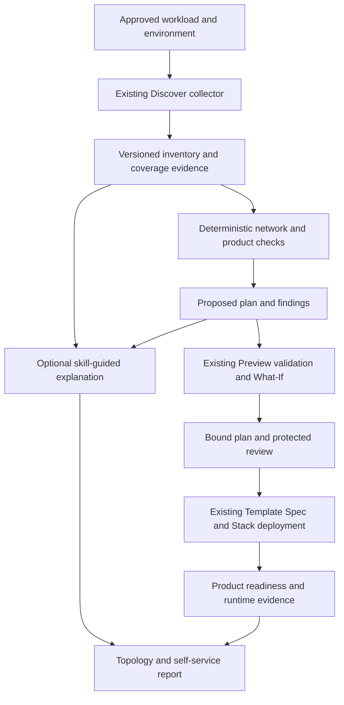

# Microsoft Azure skills assessment for self-service analysis

**Reviewed: 26 September 2026. Status: research and proposed adoption; no skills installed or pipeline behavior changed.** This assessment extends the [expansion roadmap](self-service-expansion-plan.md) and [private networking plan](plans/private-networking-self-service.md). It does not establish Azure acceptance, authorize remediation or enable targets.

The [implementation readiness and validation plan](plans/enhanced-self-service-validation.md) consolidates A0–A4 with the networking/product workstreams. Its V0–V6 sequence, shared evidence contracts and protected stage boundaries govern implementation. A0's local renderer acceptance and live ADO rendering acceptance are distinct gates.

The companion [platform skill pack design](plans/platform-mcp-skills.md) turns this assessment into twelve proposed project-specific workflows with typed tool contracts, task boundaries, acceptance cases and phased delivery. It distinguishes reusable upstream guidance from the authorization and evidence requirements our platform must enforce.

## Recommendation

Adopt a small, curated set of Microsoft Azure skills as guidance for an **analysis layer** around our existing discovery and Preview artifacts. Start with resource lookup, resource visualization and the enterprise infrastructure planner's research/checklist material. Add scoped compliance, quota and cost assessment after the evidence contracts are reliable.

Keep collection, network eligibility, address allocation, ownership, approval and deployment deterministic. Skills are instructions for an assistant, sometimes with scripts and MCP dependencies; they are not an Azure service, a permissions boundary or a ready-made ADO task. Do not connect a general-purpose deployment agent directly to the subscription and call that self-service.

The developer experience should become: select a product and approved environment, then receive an existing-topology diagram, proposed additions, reasons for reuse/create decisions, dependencies, estimated costs and explicit blockers. AI can explain this evidence and translate intent. The existing Preview/Deploy path remains responsible for reviewed changes through Template Specs and Deployment Stacks.

## Source scope and reproducibility

Reviewed the catalog at Microsoft repository commit [`117b038edfef5d7af09848b8ffcd355f28f19956`](https://github.com/microsoft/azure-skills/tree/117b038edfef5d7af09848b8ffcd355f28f19956), dated 24 September 2026, and the [Microsoft Learn visualizer guide](https://learn.microsoft.com/en-us/azure/developer/azure-skills/skills/azure-resource-visualizer). Links below pin upstream instructions to that revision because `main` changes.

Screened metadata and structure for **28 top-level skills**. Read the relevant instructions and selected references in depth for resource visualization/lookup, enterprise planning, validation, compliance, diagnostics, reliability, quotas, preparation, onboarding prerequisites and messaging. Also reviewed the four cost skills under the separate cost plugin. This is a source assessment, not execution testing or an audit of every nested script/reference and transitive dependency.

At this revision there is no `skills/azure-cost/SKILL.md`. The four cost skills are under [`.github/plugins/azure-cost/skills`](https://github.com/microsoft/azure-skills/tree/117b038edfef5d7af09848b8ffcd355f28f19956/.github/plugins/azure-cost/skills). Catalog names and tool availability must be verified against the actual revision before installation.

## Prioritized adoption

Priorities below describe proposed adoption, not capabilities already available in our pipeline.

| Priority / upstream skill | Useful analysis | Adaptation for this repository |
|---|---|---|
| First: [azure-resource-lookup](https://github.com/microsoft/azure-skills/blob/117b038edfef5d7af09848b8ffcd355f28f19956/skills/azure-resource-lookup/SKILL.md) | Resource discovery through service tools or Azure Resource Graph; relationship queries. | Extend the existing scoped collector. Require approved subscriptions, complete paging, query outcomes, freshness and live rechecks of selected resources. A missing permission is not an empty inventory. |
| First: [azure-resource-visualizer](https://github.com/microsoft/azure-skills/blob/117b038edfef5d7af09848b8ffcd355f28f19956/skills/azure-resource-visualizer/SKILL.md) | Mermaid diagrams, resource inventory and dependency explanations. | Render our saved, normalized evidence. Separate observed topology, proposed changes and runtime verification; show external/unknown boundaries. Publish sanitized run artifacts rather than tenant details in Git. |
| First: [azure-enterprise-infra-planner](https://github.com/microsoft/azure-skills/blob/117b038edfef5d7af09848b8ffcd355f28f19956/skills/azure-enterprise-infra-planner/SKILL.md) | Requirements, brownfield discovery, architecture research, service constraints and design decisions. | Borrow analysis patterns and verify individual rules. Its full workflow also generates and deploys infrastructure; retain our compositions, ownership semantics and protected stack pipeline. |
| Next: [azure-validate](https://github.com/microsoft/azure-skills/blob/117b038edfef5d7af09848b8ffcd355f28f19956/skills/azure-validate/SKILL.md) | Preflight, role checks, Bicep validation and What-If checklists. | Compare against our existing Preview coverage. Do not replace it with upstream preparation state, default file paths or generic group deployment commands. Validation does not prove private runtime reachability. |
| Next: [azure-compliance](https://github.com/microsoft/azure-skills/blob/117b038edfef5d7af09848b8ffcd355f28f19956/skills/azure-compliance/SKILL.md) | Configuration posture, Azure Quick Review and Key Vault expiry assessment. | Normalize scoped findings with evidence and assessment coverage. Inspect certificate/secret metadata only where needed; no secret-value retrieval. Report unavailable Policy/Defender/cost evidence as unknown. |
| Next: [azure-quotas](https://github.com/microsoft/azure-skills/blob/117b038edfef5d7af09848b8ffcd355f28f19956/skills/azure-quotas/SKILL.md) | Regional quota and usage checks. | Read-only preflight with service-specific quota mappings. Separate quota headroom, actual capacity and network address capacity. Extension installation, provider registration and quota-increase requests are separate setup/change actions. |
| Next: [cost-estimation](https://github.com/microsoft/azure-skills/blob/117b038edfef5d7af09848b8ffcd355f28f19956/.github/plugins/azure-cost/skills/cost-estimation/SKILL.md) | Planned cost estimates and existing-resource forecasts. | Extend our dated cost reports with region/SKU, price source, currency, period, usage assumptions and uncertainty. Retail estimates are not the customer's negotiated bill. |
| Later: [azure-diagnostics](https://github.com/microsoft/azure-skills/blob/117b038edfef5d7af09848b8ffcd355f28f19956/skills/azure-diagnostics/SKILL.md) | Logs, metrics, deployment failures and health investigation. | A bounded post-deployment support operation; read-only query allowlists and redacted evidence. Never execute suggested remediation automatically. |
| Later: [azure-reliability](https://github.com/microsoft/azure-skills/blob/117b038edfef5d7af09848b8ffcd355f28f19956/skills/azure-reliability/SKILL.md) | Availability design, redundancy and resilience recommendations. | Product/SLO-specific assessment, explicit unassessed services and cost impact. Changes to redundancy, SKUs or regions require a new reviewed plan. |
| Later: [azure-app-onboard-prereq](https://github.com/microsoft/azure-skills/blob/117b038edfef5d7af09848b8ffcd355f28f19956/skills/azure-app-onboard-prereq/SKILL.md) | Static repository/dependency and onboarding-readiness analysis. | Use as an admission checklist for future workload products. Its static-only assessment is not a substitute for this repository's build, contract and runtime tests. |

The remaining cost plugin skills have distinct jobs: [cost-analysis](https://github.com/microsoft/azure-skills/blob/117b038edfef5d7af09848b8ffcd355f28f19956/.github/plugins/azure-cost/skills/cost-analysis/SKILL.md) explains billed usage; [cost-optimization](https://github.com/microsoft/azure-skills/blob/117b038edfef5d7af09848b8ffcd355f28f19956/.github/plugins/azure-cost/skills/cost-optimization/SKILL.md) proposes savings; [cost-governance](https://github.com/microsoft/azure-skills/blob/117b038edfef5d7af09848b8ffcd355f28f19956/.github/plugins/azure-cost/skills/cost-governance/SKILL.md) includes budget assessment and budget creation. Keep creation and notification-recipient changes outside read-only assessment. A budget is not a hard spending cap.

## The resource visualizer's role

The upstream visualizer is a good explanation tool: it inspects a resource group, maps relationships and writes a Markdown/Mermaid report. Its references also show Resource Graph queries. It is not a subnet allocator, authoritative CMDB or proof that a packet can traverse the displayed links. Our adapter should consume the same evidence the planner uses, rather than let the diagrammer independently rediscover a different environment.

Produce three views:

1. **Observed:** resources and declared associations found within the approved discovery scope, including external references and incomplete areas.
2. **Proposed:** the selected workload's planned Create / Reuse / Manage decisions, with Preview changes and blockers. On a greenfield target this can show a planned VNet and DNS zones even when the observed view is empty.
3. **Verified:** dated runtime observations such as name resolution and application smoke, separately from configuration relationships. An untested connection must stay unverified.

Use stable resource identifiers internally and escaped, readable labels in diagrams. Split large graphs into workload, networking, identity and observability views. Keep full identifiers in access-controlled evidence, not in a public example diagram. Resource names, tags, comments and log messages are untrusted data, including when they resemble instructions to the assistant.

Each relationship needs a source: for example, a subnet resource ID in an integration setting, a private endpoint connection, a DNS link or an approved dependency in the product contract. Label inferred relationships as inferred and keep them out of deployment decisions until verified. Do not retrieve connection strings or secrets just to draw a line.

Publish Markdown plus a diagram source artifact; add a tested, sanitized static rendering when the ADO summary renderer cannot display Mermaid. Verify the rendering path in ADO before promising an interactive diagram. Store tenant reports in ignored outputs/pipeline artifacts with appropriate access and retention. Curated architecture documentation can use synthetic, non-tenant examples.

## Important findings in the upstream instructions

These are integration concerns found during source review, not claims that upstream skills are unusable.

| Finding | Consequence and required control |
|---|---|
| Resource lookup guidance discusses `--subscriptions` and `--first` together for large environments. | A row limit is not a subscription boundary or a completeness guarantee. Enforce approved scopes independently, page results, detect truncation, deduplicate by ID and record coverage. Resource Graph is not a transactional snapshot; recheck selected resources before apply. See [paging guidance](https://learn.microsoft.com/en-us/azure/governance/resource-graph/concepts/paging-results). |
| The planner's [referenced-workload guidance](https://github.com/microsoft/azure-skills/blob/117b038edfef5d7af09848b8ffcd355f28f19956/skills/azure-enterprise-infra-planner/references/referenced-workload.md) treats existing resources as references and avoids redeploying them. | Appropriate for externally owned dependencies, but not a blanket rule for our stack-owned resources. Preserve managed declarations for **Manage**. Converting them all to Bicep `existing` would change the managed inventory and can trigger stack unmanage behavior. Maintain separate external reuse and owned management. See our [stack runbook](deployment-stacks-upgrade.md). |
| The planner's [networking constraints](https://github.com/microsoft/azure-skills/blob/117b038edfef5d7af09848b8ffcd355f28f19956/skills/azure-enterprise-infra-planner/references/constraints/networking-core.md) describe NIC NSG evaluation after subnet NSGs without qualifying traffic direction. | Direction matters: inbound evaluates subnet then NIC; outbound evaluates NIC then subnet. Translate reviewed rules into tested deterministic logic, not executable prose. See [Microsoft's NSG behavior](https://learn.microsoft.com/en-us/azure/virtual-network/network-security-group-how-it-works). |
| Quota guidance simplifies resource availability into quota checks. | Passing quota checks does not guarantee allocatable regional capacity. Neither quota nor regional capacity establishes usable subnet space. Report these as separate assessments. See [VM quota and capacity checks](https://learn.microsoft.com/en-us/azure/virtual-machines/quotas). |
| Diagnostics includes a generic resource-show example under health checks. | Reading resource configuration is not an availability probe. Use appropriate [Resource Health status](https://learn.microsoft.com/en-us/rest/api/resourcehealth/availability-statuses/get-by-resource?view=rest-resourcehealth-2025-05-01), service telemetry and workload-specific runtime tests. |
| Prepare/validate/deploy and enterprise-planner workflows have their own plans, file conventions and deployment commands. | Invoking the whole chain could bypass our Template Spec, Deployment Stack, input-binding and approval mechanisms. Adapt individual checks; retain the existing orchestration authority. |
| Compliance and diagnostics advertise tools that can access sensitive content; several skills also contain remediation paths. | A “read-only analysis” prompt is insufficient. Enforce tool, API, scope and returned-field restrictions in the integration and identity. No key/secret reads, arbitrary shell tools or write tools in the analysis session. |
| App onboarding prerequisites are static analysis; reliability guidance has differing statements about service coverage across sections. | Pin versions and maintain a tested capability matrix. Never translate an upstream PASS into “built,” “deployed,” or “reliable” without the relevant execution evidence. |

## Proposed integration with our system

This is the proposed analysis architecture, not a diagram of currently implemented steps. Address reservations and final-plan rebinding retain the separate authorization and concurrency lifecycle in the [networking design](plans/private-networking-self-service.md); this simplified diagram does not replace it.

Extend `scripts/Export-DeploymentInventory.ps1` through bounded collectors and a common evidence model. Add independently testable graph building, checks and report generation instead of placing model calls inside existing deployment scripts. Select the workload adapter's dependency rules before rendering, so Blob copy reports do not include Event flow-only resources or exceptions.

Introduce a project-specific analysis skill only after the contracts exist. Its role would be to select approved analysis operations, explain findings with evidence links and produce proposed intent changes. It should reference pinned Microsoft guidance, the product catalog and our evidence schema. It must not recursively invoke upstream deploy/prepare/remediation workflows. Keep the existing documentation-maintenance skill separate.

### Proposed artifact contracts

These names and fields are design proposals, not existing files or accepted pipeline inputs.

| Artifact | Required content |
|---|---|
| `analysis-context.json` | Schema version, workload/target, requested and accessible scopes, source discovery run, timestamps, input/policy hashes, collector/rule versions and optional upstream skill commit. |
| `resource-graph.json` | Stable nodes and typed edges; owned/external/unknown ownership; observed/proposed/inferred classification; evidence references, collection times and unknown boundaries. No credentials. |
| `analysis-findings.json` | Rule ID/version, severity, affected IDs, pass/fail/unknown/not-applicable outcome, evidence, coverage limitation, explanation and proposed next action. AI text cannot change deterministic outcome. |
| `self-service-analysis.md` | Workload-only resource summary, diagrams, create/reuse/manage reasons, blockers, costs and links to evidence. Explicitly distinguish estimates, configuration and runtime observations. |
| Existing Preview artifacts | Bind the selected deterministic plan and its evidence to existing provenance/hash checks. New fields require versioned compatibility checks; do not silently treat arbitrary discovery JSON as deployment parameters. |

An empty result is valid only when the relevant query succeeded within the required scope. A missing provider, denied query, stale result, unsupported API or truncated response must have its own status. If an unknown affects a deployment prerequisite, retain **Blocked**. A report may still explain the rest of the environment.

### Access and dependency model

- Keep the read identity and apply identity separate where practical. The existing service connection's single subscription is the initial boundary; it does not authorize enterprise-wide inventory. Platform onboarding must explicitly register connectivity scopes and data access.
- Start with Azure management-plane reads. Add policy, telemetry or billing access only for the specific report; these datasets can have different permissions and availability. Do not grant broad rights merely because a skill mentions a tool.
- Validate tool availability before presenting an operation. MCP tool names in a skill do not establish that the current client exposes them. Prefer typed, allowlisted queries with result projection to agent-generated shell commands.
- The cost plugin's pinned [MCP configuration](https://github.com/microsoft/azure-skills/blob/117b038edfef5d7af09848b8ffcd355f28f19956/.github/plugins/azure-cost/.mcp.json) uses the remote Azure management MCP endpoint with the CostManagement toolset. Confirm authentication, supported client, data handling and accessible scopes before enabling it; it is an additional integration, not bundled billing evidence.
- Pin skill sources and runtime dependencies; review scripts and permission requirements before updates. Maintain a tool/capability matrix and regression fixtures. Retain the upstream [MIT license](https://github.com/microsoft/azure-skills/blob/117b038edfef5d7af09848b8ffcd355f28f19956/LICENSE) when copying covered material.
- Cache bounded evidence per run and summarize once. Supply minimal sanitized facts to a model, record model/version and token cost, and provide a no-model report path. Model failure must not stop deterministic discovery or relax a blocker.

## Disposition of the other catalog skills

Together with the prioritized table, this accounts for all 28 top-level skills screened at the pinned revision. These are candidates for specific future products or supporting analysis, not a recommendation to install the entire catalog.

| Skills | Fit and boundary |
|---|---|
| `azure-storage` | Useful storage capability and diagnostic guidance for both workloads. Operations can include data changes; admit individual read operations only. |
| `azure-messaging` | Reviewed scope is Service Bus and Event Hubs SDK diagnostics. It does not cover our Event Grid-to-Storage Queue bridge; do not use it as evidence that Event flow is supported. |
| `appinsights-instrumentation`, `azure-kusto` | Useful instrumentation and query design for future support reports. Keep telemetry queries bounded and distinguish instrumenting code from observing a running service. |
| `azure-prepare`, `azure-deploy`, `azure-app-onboard` | End-to-end preparation/deployment workflows. Reference selectively; their orchestration does not replace this repository's ADO release model. |
| `azure-compute` | Potential future private-agent/VM product assessment. Provisioning remains a separate approved product operation. |
| `azure-kubernetes`, `airunway-aks-setup` | Relevant if AKS or GPU inference becomes a supported product; unnecessary for today's two workloads. |
| `azure-ai`, `microsoft-foundry`, `azure-aigateway` | Potential future assistant/model/gateway capability design. Model deployment, gateway changes, data handling and spending require their own product contracts. |
| `entra-app-registration`, `entra-agent-id` | Potential future authenticated request UI or agent identity work. Identity creation/grants are not resource discovery and require distinct authorization. |
| `azure-cloud-migrate`, `azure-upgrade`, `python-appservice-deploy` | Specialized migration, upgrade and application deployment flows; outside the initial analysis pilot. |
| `discover-azure-skills` | Helps locate skill capabilities. It discovers guidance, not tenant resources; do not let catalog routing auto-install or authorize additional tools. |

## Delivery sequence and exit gates

| Increment | Concrete work | Exit evidence |
|---|---|---|
| A0: offline reporting | Build normalized graph and workload-specific Markdown/Mermaid renderer from saved discovery fixtures; adapt visualizer conventions. No model or Azure calls required. | Empty, partial, cross-scope and populated fixtures; stable IDs; no invented edges; escaped labels; sanitized outputs; readable ADO artifact rendering. |
| A1: trustworthy lookup | Expand approved collectors, paging, query status, ownership and evidence freshness; align with networking phase N0/N1. | Truncation/403/staleness tests; scoped read-only pilot; external-scope gaps shown; selected resources rechecked; failed discovery never becomes Create. |
| A2: deterministic assessment | Add versioned network/product constraints, quota checks, metadata-only posture and cost estimation; use planner guidance as research input. | Independent NSG direction, capacity, DNS and ownership fixtures; source-linked rules; unknown outcome handling; costs with consistent units/currency and explicit exclusions. |
| A3: optional AI explanations | Add a restricted project analysis skill and intent-to-schema assistance. Preserve deterministic reports. | Prompt-injection and fabricated-evidence tests; no-model equivalence of decisions; no arbitrary commands or write tools; token limits and redaction evidence. |
| A4: support and governance | Add authorized telemetry, actual-cost analysis and reliability reports after real workload deployments exist. | Bounded queries, product-specific runtime evidence, coverage declarations and remediation proposals routed through a new reviewed change. |

Do not make A0 dependent on deploying an AI runtime. A diagram from saved evidence is already useful. Do not make safe address allocation dependent on adopting the enterprise-planner skill: authoritative IPAM and deterministic eligibility remain separate engineering deliverables.

Minimum regression cases before admitting this layer to Preview:

- A successful empty DNS query proposes creation only when the product's ownership and policy allow it; a denied query blocks that decision.
- A truncated inventory or inaccessible connectivity subscription cannot establish “no overlapping networks.”
- A stack-owned existing resource remains **Manage**; an external dependency remains **Reuse** and is not accidentally added to stack ownership.
- A configured private endpoint is not labeled reachable until the appropriate DNS and runtime evidence exists.
- Tags or logs containing instructions, Mermaid markup or secret-looking values cannot change tool scope or leak into the rendered report.
- Quota success does not imply physical capacity; cost estimates with missing usage or mixed currency remain qualified rather than presented as exact totals.
- Both workloads receive only their own resource/dependency summaries. Model-disabled runs produce the same deterministic decisions and blockers.
- Missing MCP tools or upstream changes produce an explicit unsupported/degraded report, not fabricated results or an alternative deployment path.

## What this review changes

This review adds a source-backed adoption plan and roadmap links. It installs no upstream skills, runs no subscription scans, grants no permissions and changes no pipeline menus or deployments. The [completion matrix](completion-status.md) remains the authority for implemented and verified behavior. The first recommended implementation is **A0: workload-specific topology and analysis reports from saved discovery evidence**.
