# How external blob arrivals become reliable transfers

Source layout updated on 19 September 2026: the composition and environment files now live under `workloads/blob-transfer/`, with reusable resource modules under `modules/<category>/<resource>/`. The rendered HTML/SVG diagrams are historical illustrations and can show old paths; use the [current repository map](repository-structure.md) for source navigation.

This is the current implementation: an external system uploads normally, a polling BlobTrigger dispatcher sends a pointer to an explicit Storage Queue, and a QueueTrigger worker copies with deduplication and recovery. No Event Grid, MCP, custom uploader, or uploader metadata is required.

Start with diagrams 1, 4, 9 and 10 for the workflow. Engineers can continue through the Bicep, identity, and configuration diagrams. These diagrams describe code/templates; they are not evidence of a live Azure deployment.

## 1. What happens when a file lands

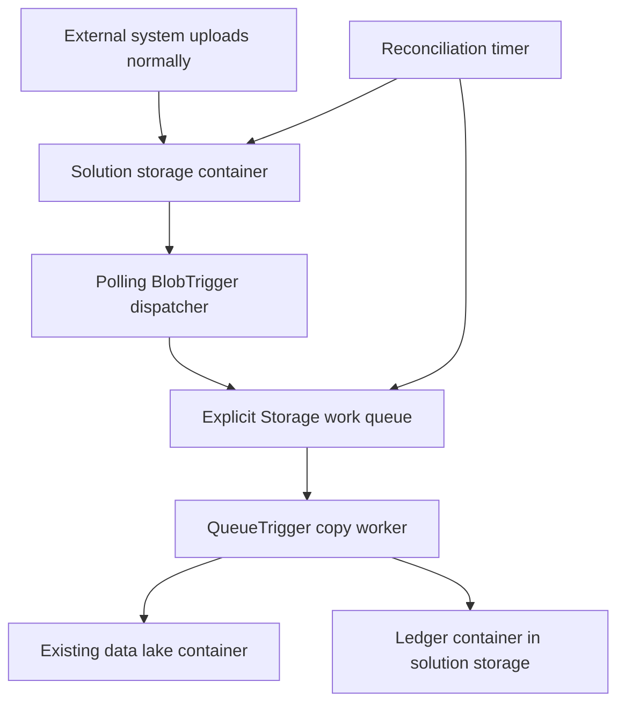

The dispatcher is Function code. There is no storage setting that silently creates our queue message without a producer. The timer recovers missed dispatches.

## 2. From Bicep files to Azure resources

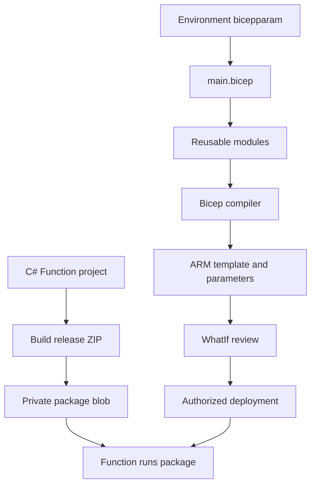

Bicep provisions resources and settings. Compiled C# provides trigger/worker behavior. Provisioning a Function App alone does not implement a copy job.

## 3. Symbolic name versus deployed name

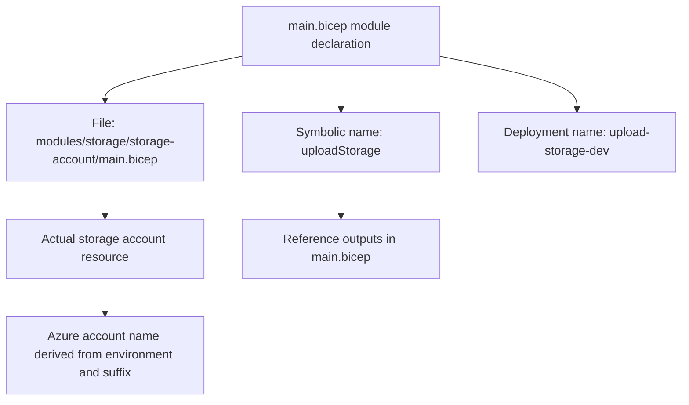

The symbolic name is a local Bicep identifier. The module path selects code; the module `name` identifies its ARM nested deployment; the storage resource has a separate Azure name.

## 4. One blueprint with four isolated environments

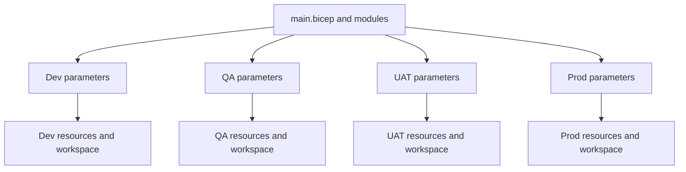

Every environment has its own host account, solution account, identity and Function. Its ledger is a separate container inside that environment's solution account. Components share the workspace inside their own environment. Existing enterprise workspace reuse is not implemented.

## 5. Module responsibilities

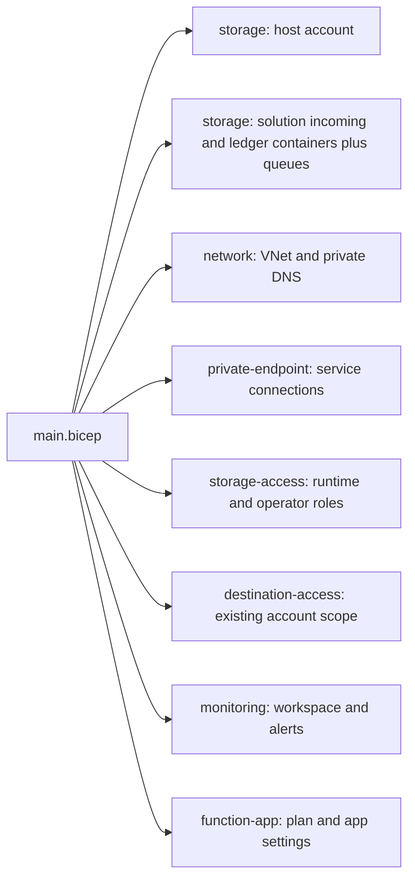

The storage module is reused twice: host and solution. No separate ledger account is created. The existing destination remains owned by its current team.

## 6. Where environment settings come from

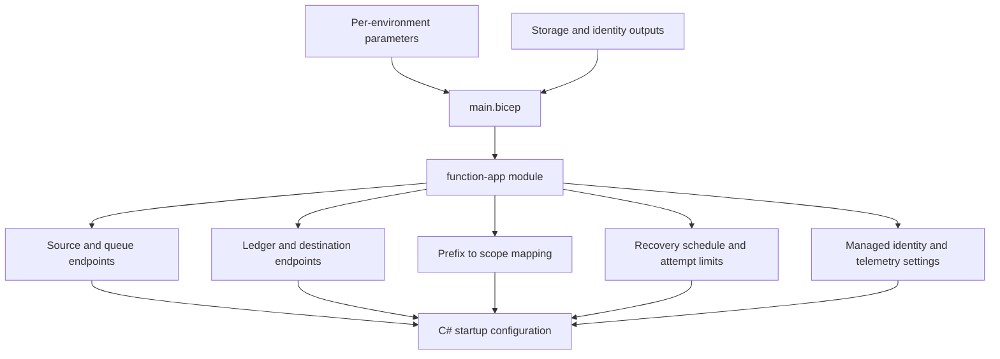

Ledger and upload Blob settings share the same solution endpoint; their container names must differ. Prefix mappings come from trusted configuration, not blob metadata. Queue/dispatcher concurrency remains in `host.json`; schedules, scan limits, verification frequency and retry budgets are parameterized.

## 7. Deployment dependencies

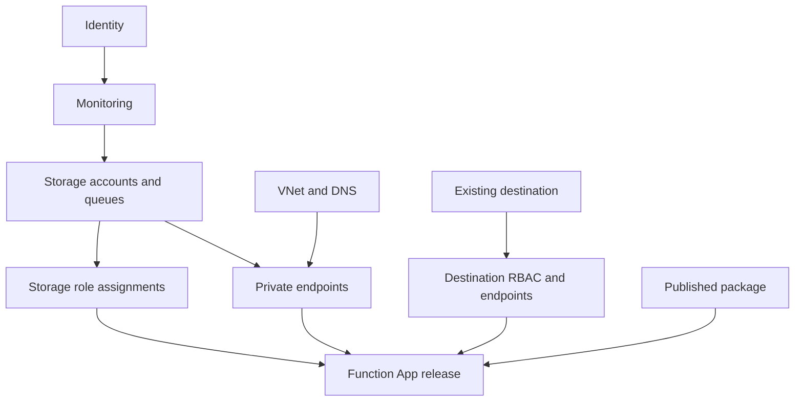

This groups important dependencies, rather than drawing every ARM edge. Identity/RBAC propagation may outlast deployment completion.

## 8. Bootstrap and release

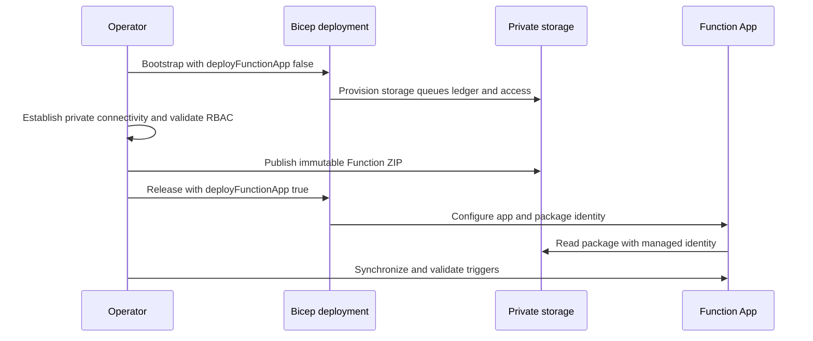

Incremental bootstrap is not an app shutdown/deletion switch. CI validates/builds; deployments require the deliberate release commands.

## 9. Source arrival and content deduplication

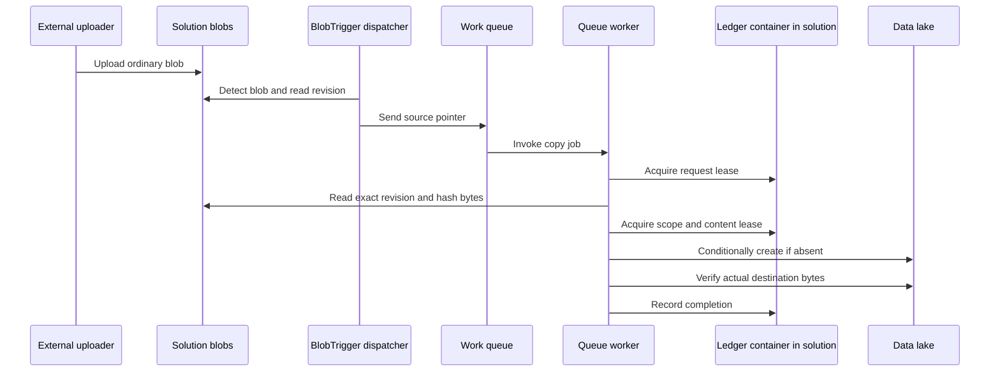

Different filenames or source revisions with identical bytes share the same destination within a scope. Existing destination content is never silently overwritten.

## 10. Recovery and review decisions

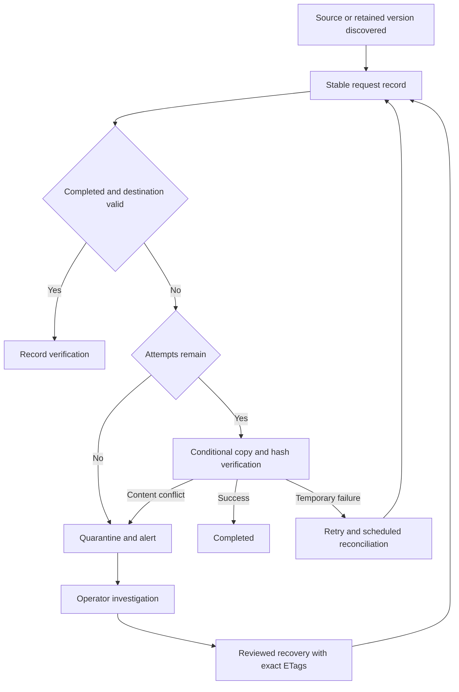

A missing destination can be rebuilt from retained source. A corrupt existing destination requires review. The tool cannot recreate a permanently deleted source revision.

## 11. Identity and permission boundaries

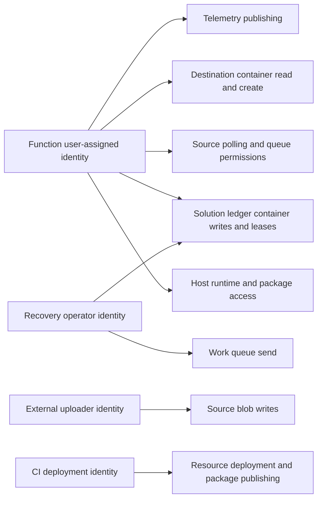

Polling BlobTrigger requires broader host/source roles than a pure queue reader. Dispatcher and worker share one identity/app. Deployment privileges are separate. A recovery operator is privileged; the CLI is not a dual-approval system.

## 12. Private paths and external prerequisites

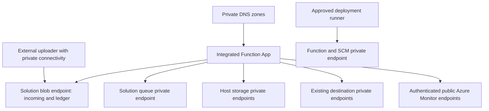

No Event Grid or trusted-service firewall exception is configured. The project does not provision the uploader network path, VPN, peering, DNS resolver or runner. Private account access still requires those prerequisites.

## Glossary

| Term | Plain meaning |
|---|---|
| Blob | Stored file/object |
| ETag | Storage revision identifier, not a content checksum |
| Version ID | Address of a retained source revision |
| QueueTrigger | Function runs because a queue message is available |
| BlobTrigger | Function detects a blob through its configured listener |
| Ledger | Durable records of discovered work, attempts and outcomes |
| Idempotent processing | Repeating work converges on the same intended result |
| Scope | Business boundary inside which matching content is treated as duplicate |
| Quarantine | Processing stopped for investigation; no source movement implied |
| Managed identity | Azure-issued application identity used without stored passwords |

See [architecture](architecture.md), [security](security-and-rbac.md), [operations](operations.md), and [validation](validation.md) for limits and evidence.
