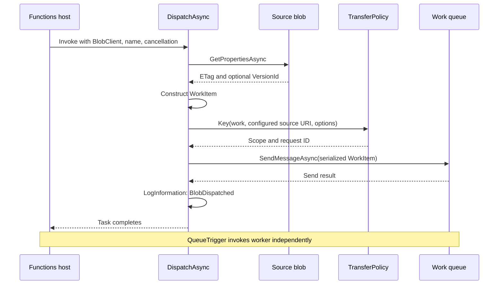

# Dispatcher requirements, method reference, and dependency audit

This README documents the dispatcher shipped in this repository: `DispatchUploadedBlob`, implemented by `QueueFunctions.DispatchAsync()` in [QueueFunctions.cs](../../src/BlobTransfer/QueueFunctions.cs). Reviewed against source, configuration, Bicep, the committed NuGet lockfile, and existing local build output on **17 September 2026**.

The dispatcher turns a discovered source blob into a small Storage Queue work message. The worker later copies and verifies the bytes. The dispatcher is one Function inside the same application as the worker and three timers; it is not a separate executable or separately deployable service.

## Contents

- [Requirements](#requirements)
- [Exact dispatcher method](#exact-dispatcher-method)
- [Work message and key contract](#work-message-and-key-contract)
- [Methods called by the dispatcher](#methods-called-by-the-dispatcher)
- [What calls the dispatcher](#what-calls-the-dispatcher)
- [What happens after dispatch](#what-happens-after-dispatch)
- [Configuration contract](#configuration-contract)
- [Dependencies and package inventory](#dependencies-and-package-inventory)
- [Less-visible dependencies and limitations](#less-visible-dependencies-and-limitations)
- [Verification and troubleshooting](#verification-and-troubleshooting)

For every worker storage operation, lease, timer, and lifecycle script, use the companion [exact local workflow](../local-workflow.md). For deployment commands, use the [root README](../../README.md).

## Requirements

### Input and behavior

| Requirement | Contract |
|---|---|
| Uploader | Any authorized client that can commit a blob in the configured source container. No custom metadata, request ID, precomputed hash, or work-queue write is required. |
| Source storage | Azure deployment uses non-HNS StorageV2 with versioning enabled. Local mode uses Azurite with version enumeration disabled. This polling implementation is not the HNS/Event Grid variant. |
| Source data | End-to-end transfer supports committed block blobs, including empty blobs, through the configured size limit (default 1 GiB). The dispatcher reads properties but leaves blob-type and size checks to the worker. |
| Source name | Nonempty, at most 1,024 characters, no control characters, and covered by a configured prefix-to-scope mapping. Default empty prefix covers all names. |
| Source revision | A nonblank ETag <=128 characters; optional version ID <=128 characters. Later copying must match the requested revision. |
| Queue | `TransferQueue` must exist and be reachable. The dispatcher does not create it. Local seed and Azure Bicep create it. |
| Delivery | Repeated dispatch is possible. A successful dispatch means the work message was accepted, not that copying completed. No global ordering or immediate-discovery SLA is promised. |
| Retention | Source data/versions must remain available until processed or reviewed. The application never deletes source files. Source retention and ledger retention require operational ownership. |
| Scope stability | Prefix mapping is server-controlled, case-sensitive, and longest-prefix first. Review account/container/scope changes as data migrations; do not casually change them with pending work. |

Microsoft documents the polling trigger's HNS restriction and discovery model in the [BlobTrigger guide](https://learn.microsoft.com/en-us/azure/azure-functions/functions-bindings-storage-blob-trigger).

### Local workstation

| Dependency | Requirement / behavior |
|---|---|
| OS | Current lifecycle scripts support Windows x64/ARM64; Windows 11 is the documented development environment. |
| PowerShell | 7.4+; setup can bootstrap from Windows PowerShell 5.1 using installed PowerShell 7 or portable 7.6.2. |
| .NET | SDK 10.0.300 pinned in `global.json`, with stable feature-band roll-forward; application targets `net10.0`. |
| Functions Core Tools | v4, at least 4.14.0; setup installs the 4.14 minimal distribution when needed. Core Tools 4.12 failed the real host test with an Options 10 assembly mismatch. |
| Node / npm | Node 22 or 24 with npm; portable fallback 24.16.0. Used for Azurite, not for application business logic. |
| Azurite | Project-local 3.37.0; one development account supplies Blob, Queue, and Table endpoints. |
| Ports | Available loopback TCP ports 7071, 10000, 10001, and 10002. Internal host/worker communication is runtime-managed. |
| Filesystem | Write access to build outputs, `.local`, `.tools`, and normal package caches. Services run under the invoking user's permissions. |
| Network during setup/build | Tool downloads, npm, NuGet restore, and NuGet advisory feeds. Once running, the local transfer data path uses loopback storage. Cached packages alone do not guarantee a fully offline rebuild. |
| Git | Needed for checkout, source-manifest verification, and release provenance. The local run script itself does not invoke Git. |
| Not needed locally | Azure subscription/login, Azure CLI, Bicep, Docker, SQL, Service Bus, Event Grid, Data Factory, an LLM, or a separate dispatcher service. |

From the repository root, run these in PowerShell:

```powershell
./scripts/Setup-Local.ps1 -CheckOnly # Report missing tools; installs nothing
./scripts/Run-Local.ps1             # Checks/installs tools, builds, seeds, starts
./scripts/Test-Local.ps1            # Real-host upload-to-destination smoke
./scripts/Stop-Local.ps1            # Stop owned processes; retain data/logs
```

`-CheckOnly` intentionally fails when prerequisites are missing; proceed to `Run-Local.ps1` to install them. If PowerShell 7 is not installed, start with `powershell.exe -NoProfile -ExecutionPolicy Bypass -File ./scripts/Run-Local.ps1`. See [local setup](../local-development.md) for follow-up commands using the portable PowerShell path, explicit reset, logs, and clean-machine installation limits.

### Azure deployment and operational dependencies

The Bicep implementation requires a subscription/resource-group target, supported regional dedicated Linux App Service capacity with Always On, Functions v4/.NET isolated 10 support, and an existing destination container in the same Entra tenant. Current Bicep creates two private storage accounts (host and solution), a user-assigned identity, networking, a Function App during Release, and monitoring resources. It does not create the external uploader, enterprise routing, deployment runner, destination container, Entra groups, or action-group receivers.

| Dependency | Required access / owner |
|---|---|
| Dedicated host storage | Function identity has the template's Blob Data Owner, Queue Data Contributor, and Storage Account Contributor grants. Supports host state and package access. |
| Solution/source account | Function identity has Blob Data Owner and Queue Data Contributor at account scope. Contains source, ledger, custom work queue, and dispatcher/worker poison queues. |
| Existing destination container | Template grants Function identity Storage Blob Data Contributor. Destination existence, policy, and cross-subscription authorization remain owner responsibilities. |
| App identity | Explicit user-assigned identity for binding connections, application SDK clients, and private package download. Role propagation must complete. |
| Network and DNS | App/runner/uploader/operator must reach their permitted private endpoints. Queue access is needed even though the initial trigger is a blob. Monitor traffic uses the configured authenticated public endpoints. |
| Deployment principal | Separate management-plane deployment/role-assignment permissions and approved destination-scope access. A package-upload role alone is insufficient. |
| Package | Immutable ZIP with `host.json`, `functions.metadata`, `worker.config.json`, assemblies, and generated `.azurefunctions` contents. Blob package URL and identity must work before host startup. |
| Monitoring | Workspace/Application Insights, appropriate metrics-publisher grant, configured action groups, and owners for poison/quarantine/missing-heartbeat alerts. |
| Build/release tooling | Git, PowerShell, .NET SDK, Bicep 0.47.16 (standalone or Azure CLI adapter), and Azure CLI for deployment. CI and the manual self-service release pipeline are implemented. [Platform onboarding and live qualification](../self-service.md) remain required. |

These are the repository's implemented grants, not a claim that every individual handler needs every permission. Source: [function app](../../modules/function-app.bicep), [storage access](../../modules/storage-access.bicep), [destination access](../../modules/destination-access.bicep), [main template](../../main.bicep), and [security/RBAC](../security-and-rbac.md). The binding-specific queue endpoint and identity requirements are confirmed in [Microsoft's connection guide](https://learn.microsoft.com/en-us/azure/azure-functions/manage-connections?tabs=identity).

## Exact dispatcher method

```csharp
[Function("DispatchUploadedBlob")]
public async Task DispatchAsync(
    [BlobTrigger("%UploadContainer%/{name}", Connection = "UploadStorage",
        Source = BlobTriggerSource.LogsAndContainerScan)] BlobClient source,
    string name, CancellationToken ct)
```

| Parameter / return | Meaning |
|---|---|
| `source` | SDK client supplied by the BlobTrigger binding for the discovered blob. |
| `name` | Blob name captured by `{name}` beneath the configured container. It is not supplied by a queue sender. |
| `ct` | Host-provided cancellation token, passed to property retrieval and queue send. |
| `Task` | Completes after queue acceptance and the log call, or faults/cancels. No copy result or durable dispatch receipt is returned by this method. |

The method body performs these operations in order:

1. `await source.GetPropertiesAsync(cancellationToken: ct)`; take `.Value` to obtain ETag and optional VersionId.
2. Construct `new WorkItem(1, name, properties.ETag.ToString(), properties.VersionId)`.
3. Call `TransferPolicy.Key(work, storage.Source.Uri, options)` to validate the work item, resolve scope, and derive a stable request ID for logging.
4. Serialize the work item with `BinaryData.FromObjectAsJson(work)`.
5. `await queues.Work.SendMessageAsync(..., timeToLive: TimeSpan.FromSeconds(-1), cancellationToken: ct)`; negative-one-second TTL requests a non-expiring queue message. No explicit visibility delay is supplied.
6. `log.LogInformation("BlobDispatched request={Request}", key.RequestId)` after the send returns.

There is no application-level loop, retry catch, ledger write, source-byte hash, destination access, or call to `CopyAsync()` inside `DispatchAsync()`. Copy work crosses the queue/host boundary.



## Work message and key contract

The application emits schema 1 with these PascalCase JSON property names. The example is illustrative; a real ETag comes from Storage:

```json
{
  "SchemaVersion": 1,
  "SourceName": "claims/report.pdf",
  "SourceETag": "\"example-etag-from-storage\"",
  "SourceVersionId": null
}
```

There are no file bytes, destination credentials, content hash, request ID, or scope in the message. `QueueMessageEncoding.None` in the application matches `messageEncoding: none` in `host.json`. `ParseMessage()` uses the default `System.Text.Json` contract; external producers should not invent a different casing or payload shape. The normal uploader never needs to produce this message.

Request key derivation:

```text
scope = longest ordinal source-name prefix match in Copy:scopePrefixes
requestId = lowercase SHA256(UTF8(
    configuredSourceContainer.AbsoluteUri.TrimEnd('/') + "\n" +
    SourceName + "\n" + SourceETag.Trim('"')))
ledger path = requests/<scope>/<requestId>.json
destination path = v1/<scope>/<actual-content-SHA256>/payload
```

The content hash is calculated later by `TransferEngine`. `SourceVersionId` is carried for version-addressed reads but is not a separate field in the request-ID hash. Two filenames containing identical bytes normally have different request IDs and the same scoped destination. Repeat discovery of the same filename/ETag can enqueue the same request again.

## Methods called by the dispatcher

| Method | Called by | Inputs, output, and failure conditions |
|---|---|---|
| `BlobClient.GetPropertiesAsync()` | `DispatchAsync` | Reads the bound blob's properties. Missing blob, authorization/network errors, or cancellation escape the dispatcher. |
| `TransferPolicy.Key()` | Dispatcher and later worker/reconciler | Validates WorkItem, resolves scope, hashes canonical source identity, validates resulting TransferKey, and returns it. |
| `TransferPolicy.Validate(WorkItem)` | `Key`, `ParseMessage` | Requires schema 1, valid name, ETag, and optional version-ID length. Throws `PermanentTransferException("InvalidWorkItem")` for contract failure. |
| `TransferPolicy.ResolveScope()` | `Key` | Uses ordinal `StartsWith` and descending prefix length. Throws `UnmappedSourcePrefix` if no match. An empty prefix is the catch-all. |
| `TransferPolicy.NormalizeETag()` | `Key`, worker revision check | Removes surrounding double-quote characters. Does not lowercase or otherwise reinterpret the ETag. |
| `TransferPolicy.HashText()` | `Key`; also smoke/diagnostics | `Encoding.UTF8.GetBytes` -> `SHA256.HashData` -> lowercase hex. Here it hashes request identity, not blob contents. |
| `TransferKey.Validate()` -> `TransferPolicy.IsHash()` | `Key`; startup validates scopes too | Scope must match `^[a-z0-9][a-z0-9-]{0,62}$`; request ID must match `^[0-9a-f]{64}$`. Throws `InvalidTransferKey`. |
| `BinaryData.FromObjectAsJson()` | `DispatchAsync` | Serialize the WorkItem for the queue SDK. |
| `QueueClient.SendMessageAsync()` | `DispatchAsync` | Send to `QueueClients.Work`; no queue creation or ledger update. Storage/auth/network errors and cancellation escape. SDK-internal retry behavior is separate from repository logic. |
| `ILogger<QueueFunctions>.LogInformation()` | `DispatchAsync` | Emit request ID after accepted send. This log is not a transaction with queue storage and not proof of completed transfer. |

Source contracts: [TransferContracts.cs](../../src/BlobTransfer/TransferContracts.cs).

## What calls the dispatcher

The Functions host indexes generated metadata and starts the BlobTrigger binding. The polling implementation discovers new/changed blobs and invokes the isolated worker over runtime-managed communication. Host receipts/internal queues are different from the application's request ledger and explicit `transfer-work` queue. A valid assembly alone is insufficient: host storage, binding configuration, compatible extension assemblies, permissions, and network connectivity must also work.

The test harness in [RecoveryIntegrationTests.cs](../../tests/BlobTransfer.Tests/RecoveryIntegrationTests.cs) can call `DispatchAsync()` directly against Azurite. That tests method behavior but bypasses listener discovery. [Test-Local.ps1](../../scripts/Test-Local.ps1) instead uploads ordinary blobs and requires matching dispatcher events from the real running host.

The dispatcher has no catch block. A failure is returned to the host. The blob poison threshold is configured as 5; exhausted blob-trigger failures are associated with `webjobs-blobtrigger-poison`. A failure after queue acceptance but before host completion may lead to another dispatch. The worker must tolerate duplicates. See [Microsoft's trigger behavior](https://learn.microsoft.com/en-us/azure/azure-functions/functions-bindings-storage-blob-trigger).

## What happens after dispatch

| Function / method | Relationship to dispatch |
|---|---|
| `CopyUploadedBlob` / `QueueFunctions.CopyAsync()` | QueueTrigger on `%TransferQueue%` using `TransferQueueStorage`. Calls `TransferPolicy.ParseMessage()`, then `TransferEngine.ProcessAsync()`. |
| `TransferEngine.ProcessAsync()` | Recomputes key; leases request; checks source revision and prior state; hashes bytes; leases content record; conditionally creates destination; verifies actual destination length/hash; commits content then request Completed. Failures retry or quarantine according to code. |
| `BlobLedger.LockAsync()` / `LedgerLease` | Conditional record creation and 60-second leases renewed every 20 seconds. Lease loss cancels work. These are worker/reconciliation dependencies, not dispatcher-body calls. |
| `ReconcileTransfers` / `ReconcileAsync()` | Independent timer scans source/current-or-retained versions and enqueues due work. It does not call `DispatchAsync()`. It compensates for missed discovery and supports later verification/repair. |
| `AuditTransferLedger` / `AuditAsync()` | Independent timer scans requests, reports quarantine and absent source revisions. It does not copy or call the dispatcher. |
| `MonitorTransferPoison` / `MonitorAsync()` | Reads both poison queue counts and logs heartbeats/backlogs without draining them. |
| `TransferRecovery.ResumeAsync()` | Explicit reviewed operator recovery, not an automatic dispatcher dependency. Current CLI status/resume uses Azure identity and HTTPS endpoints; it is not wired as an emulator recovery command. |

Queue retry is configured for five dequeues and a one-minute failed-delivery visibility delay. The worker's recorded lifetime attempt budget defaults to 10; reconciliation's due time defaults to 15 minutes. These are different controls. `ProcessAsync()` does not use `NextAttemptUtc` as an invocation throttle. A quarantined request can return successfully and therefore need not appear in a poison queue. Details: [failure branches and timers](../local-workflow.md).

## Configuration contract

Environment keys use `__`; worker configuration reads those as `:`. Binding configuration is read by the host independently of application-created SDK clients. Do not treat one connection setting as configuring every layer.

| Setting / group | Consumer | Local emulator / Azure requirements |
|---|---|---|
| `FUNCTIONS_WORKER_RUNTIME` | Host | `dotnet-isolated` in both modes. |
| `FUNCTIONS_EXTENSION_VERSION` | Azure platform | `~4` in Bicep; local Core Tools supplies the host. |
| `LocalDevelopment__Enabled` | `LocalDevelopment.IsEnabled` | `true` locally. Missing/false selects Azure-client logic; invalid nonempty Boolean fails. |
| `AZURE_FUNCTIONS_ENVIRONMENT` | Local guard / host | `Development` required for emulator mode. |
| `WEBSITE_INSTANCE_ID`, `WEBSITE_SITE_NAME` | Local guard / credential selection | Local mode rejects nonempty Azure markers. In Azure, platform supplies these; do not fabricate them locally. |
| `AzureWebJobsStorage` | Host receipts/locks/runtime storage | Exact `UseDevelopmentStorage=true` locally. Azure uses host-account `__blobServiceUri`, `__queueServiceUri`, `__tableServiceUri`, `__credential=managedidentity`, and `__clientId`. |
| `UploadStorage` | BlobTrigger; application source URI | Exact emulator shorthand locally. Azure uses source-account `__blobServiceUri`, **`__queueServiceUri`**, `__credential`, and `__clientId`. Queue endpoint must be for the same account. |
| `UploadContainer` | Trigger path; source client | Required; local `incoming`. |
| `TransferQueueStorage` | QueueTrigger; application queue clients | Exact emulator shorthand locally. Azure uses solution `__queueServiceUri`, `__credential`, and `__clientId`. This is distinct from the BlobTrigger's `UploadStorage` group. |
| `TransferQueue` | QueueTrigger; dispatcher sender | Required; local `transfer-work`. Monitoring also opens `<name>-poison` and fixed `webjobs-blobtrigger-poison`. |
| `Copy__scopePrefixes` | Startup; `TransferPolicy.Key` | Required nonempty JSON dictionary; local `{"":"default"}`. Values must be valid opaque scope IDs. |
| `Ledger__container` | App startup/worker/timers | Required; local `transfer-ledger`, distinct from source. |
| `Ledger__blobServiceUri` | Azure app startup | Must equal `UploadStorage__blobServiceUri`. Local client uses fixed emulator connection instead. |
| `Destination__container` | App startup/worker | Required; local `local-destination`, distinct from source/ledger. Azure destination must already exist. |
| `Destination__blobServiceUri` | Azure app startup/worker | Required HTTPS endpoint without query/user info. Ignored by fixed local SDK construction. |
| `AZURE_CLIENT_ID` | App SDK credential | Required by the current Azure branch when `WEBSITE_INSTANCE_ID` is present. Without that marker and outside emulator mode, app SDKs use `AzureCliCredential`. |
| `RecoverySchedule` / `PoisonMonitorSchedule` | Timer bindings | Local every 15 seconds; default Azure every five minutes. Both schedule strings are needed for the bundled app. |
| `Recovery__includeSourceVersions` | Guard and reconciler | Local must explicitly be false. Application default and Bicep default are true outside local mode. |
| `Copy__maxBytes` | Worker | Default 1,073,741,824; allowed 1 through 1,073,741,824. |
| `Recovery__maxAttempts` | Worker | Default 10; allowed 1–100. |
| `Recovery__retryMinutes` | Worker/reconciliation | Default 15; allowed 1–1440. |
| `Recovery__scanPageSize` | Both scanners | Default 100; allowed 1–5000. |
| `Recovery__scanPagesPerRun` | Both scanners | Default 5; allowed 1–100. |
| `Recovery__verifyAfterHours` | Reconciliation | Default 24; allowed 1–8760. |
| `WEBSITE_RUN_FROM_PACKAGE`, `WEBSITE_RUN_FROM_PACKAGE_BLOB_MI_RESOURCE_ID` | Azure host deployment | Private package URL and identity resource ID supplied by Bicep. Not used by local launcher. |
| `APPLICATIONINSIGHTS_CONNECTION_STRING`, `APPLICATIONINSIGHTS_AUTHENTICATION_STRING` | Azure telemetry | Supplied by Bicep. Local smoke uses captured stdout/stderr and no configured Insights resource. |
| `AzureFunctionsJobHost__logging__logLevel__default`, `...__Azure` | Local host logging | Local example sets Information / Warning. Host logging can still contain source names and storage errors. |

Local `Host.LocalHttpPort` is 7071 and the launcher explicitly binds `127.0.0.1:7071`. `host.json` sets 30-minute timeout, disabled dynamic concurrency, blob parallelism 2/poison threshold 5, queue batch 2/new-batch threshold 0/max-dequeue 5/visibility one minute/max-poll ten seconds/encoding none. These are configured bounds, not throughput guarantees.

Sources: [Program.cs](../../src/BlobTransfer/Program.cs), [local guard](../../src/BlobTransfer/LocalDevelopment.cs), [host.json](../../src/BlobTransfer/host.json), [local emulator settings](../../src/BlobTransfer/local.settings.azurite.example.json), [Azure-connected developer example](../../src/BlobTransfer/local.settings.example.json), and [Azure app settings](../../modules/function-app.bicep).

## Dependencies and package inventory

`QueueFunctions` takes six constructor dependencies. Only four are used directly by dispatch:

| Injected dependency | Used directly by DispatchAsync? | Role |
|---|---|---|
| `TransferEngine engine` | No | Copy handler uses it; same class/app. |
| `StorageClients storage` | Yes | Supplies the configured source container URI for key calculation. Destination is bundled in this record for worker use. |
| `BlobLedger ledger` | No | Reconcile/audit handlers; engine has its own injected reference. |
| `QueueClients queues` | Yes | `Work.SendMessageAsync`; poison clients used by monitoring. |
| `PipelineOptions options` | Yes | Scope-prefix map; other options serve workers/timers. |
| `ILogger<QueueFunctions> log` | Yes | Dispatch event logging. |

All are wired in `Program.cs`. Invalid worker/destination/ledger configuration can prevent app startup before dispatch ever runs. Constructing a client is not a network health check; a destination outage may allow dispatch and fail only when the worker uses it.

### Direct NuGet references

| Package | Pinned version | Purpose |
|---|---|---|
| Microsoft.Azure.Functions.Worker | 2.52.0 | Isolated worker hosting |
| Microsoft.Azure.Functions.Worker.Sdk | 2.1.0 | Build-time metadata and extension generation |
| Microsoft.Azure.Functions.Worker.Extensions.Storage.Blobs | 6.8.2 | BlobTrigger and BlobClient binding |
| Microsoft.Azure.Functions.Worker.Extensions.Storage.Queues | 5.5.5 | QueueTrigger |
| Microsoft.Azure.Functions.Worker.Extensions.Timer | 4.3.1 | Three timer bindings |
| Azure.Storage.Blobs | 12.29.2 | Property/read/write/lease SDK calls |
| Azure.Identity | 1.21.0 | Azure CLI or managed-identity app credentials |
| Microsoft.Extensions.Hosting | 10.0.12 | Host/configuration/dependency injection infrastructure |

The committed application lockfile has **58 packages: 8 direct and 50 transitive**. [dependency-inventory.json](dependency-inventory.json) lists every resolved package and dependency edge with the source lockfile hash. The lockfile remains the authoritative restore input, not this derived inventory.

Notable transitive dependencies include `Azure.Storage.Queues` **12.21.0** (used directly by our code but supplied transitively), `Azure.Core` **1.55.0**, `Microsoft.Azure.Functions.Worker.Core` and `.Grpc` **2.52.0**, gRPC packages **2.65.0**, and `Microsoft.Extensions.Options` **10.0.12**. There is no separate handwritten queue client project.

### Generated host-side extensions

The Worker SDK generated a `net8.0` helper project at `src/BlobTransfer/obj/Release/net10.0/WorkerExtensions/WorkerExtensions.csproj` in the existing local build. Its direct references are:

- `Microsoft.NETCore.Targets` 3.0.0
- `Microsoft.NET.Sdk.Functions` 4.6.0
- `Microsoft.Azure.WebJobs.Extensions.Storage.Queues` 5.3.8
- `Microsoft.Azure.WebJobs.Extensions.Storage.Blobs` 5.3.8

This is host-extension build machinery, not a downgrade of the `net10.0` application. Its generated dependency graph is separate from the 58-package application lockfile. Generated `.azurefunctions` files must survive packaging. Do not edit `obj` to fix dependencies; change supported source package versions and regenerate. Generated-file evidence is a local build snapshot and can change on rebuild.

The inventory captures those generated direct references separately. It is **not** a complete SBOM for the Functions host, generated transitive graph, .NET runtime, Node/npm tools, or the operating system. Azurite's npm graph/lock is in ignored `.tools/npm`; it is not governed by NuGet lockfiles. `TransferTool` references the Function project and therefore builds its dependency closure too.

### Setup and supply-chain dependencies

`Setup-Local.ps1` uses GitHub/its release download infrastructure for PowerShell and Core Tools, Microsoft's .NET release metadata/download URLs, Node.js distribution/checksum URLs, and npm's configured registry. `dotnet` uses the effective NuGet configuration and package/advisory endpoints. Corporate proxies, TLS trust, inherited registry/feed settings, rate limits, and network policy can affect setup even though local runtime storage uses loopback.

Portable ZIPs are checked against published hashes. That is download-integrity verification, not a signed end-to-end release attestation. npm installs the pinned Azurite version with `--no-audit`; that step does not certify its transitive vulnerabilities. `Directory.Build.props` enables NuGet transitive auditing and treats NU1900–NU1904 as errors, so feed unavailability can fail a build. No fresh security/advisory scan was performed for this documentation change.

## Less-visible dependencies and limitations

These findings make previously dispersed or implicit requirements explicit; they are not all newly discovered defects.

| Finding | Consequence / current status |
|---|---|
| Blob-trigger internal queue and host receipts | Source blob read permission alone is insufficient. `UploadStorage__queueServiceUri`, host storage, internal runtime operations, and source queue access are needed. They are configured in Bicep and the Azure-connected example. |
| Shared app startup and identity | Dispatch, copy, and timers share configuration, process, deployment, capacity, and Azure identity. Dispatch is not isolated from bad worker configuration or worker resource pressure. |
| Azure.Storage.Queues is transitive | QueueClient compiles today through the locked graph; changing extension packages can change/remove that dependency. No package references were changed in this documentation task. |
| Generated extension graph and host compatibility | Package build success did not catch the Core Tools 4.12 runtime assembly mismatch. Local 4.14 passed; Azure host compatibility still needs live acceptance. |
| Queue acceptance is not atomic with host completion | A retry can enqueue another pointer. Dispatch has no ledger/outbox transaction or exactly-once guarantee. |
| Revision read occurs at dispatch time | The method calls GetProperties on the supplied client; it does not accept a separate event ETag argument. Do not claim it independently captures every rapid overwrite. Retained-version reconciliation is the Azure recovery mechanism; Azurite smoke does not qualify it. |
| Scope is not carried in WorkItem | Worker/reconciler resolve the current mapping again. Changing mappings while queued can move the ledger/content scope used for processing. |
| Configured source URI participates in request identity | Changing source endpoint/container changes request IDs. Source key derivation uses `storage.Source.Uri`, not an endpoint copied into the message. |
| Fixed local seed/smoke names | LocalCommands uses incoming/local-destination/transfer-ledger/transfer-work. Changing only the example settings can break seed/smoke consistency. The Azure path is more configurable. |
| No queue provisioning in dispatch | Missing queue causes send failure; local seed/Bicep must complete before listeners process uploads. |
| Three distinct records of progress | Host blob receipts, custom queue messages, and application ledger records serve different purposes. Clearing one is not a safe universal replay procedure. |
| Logged dispatcher success is not worker success | Diagnose with the request ledger and destination verification. Quarantine and poison are different failure signals. |
| Source filenames can appear in framework logs | Custom dispatch event uses a hashed ID, but host trigger details can include blob paths. Do not treat all logs as PII-free. |
| No automatic malware scanning or human recovery UI | They are not hidden services; neither is implemented. Reviewed recovery is an operator CLI path, currently Azure-connected. |
| Local evidence has bounded scope | Smoke checks three completed records and their shared destination, not all destination objects. Timer evidence searches the run log without enforcing a fresh timestamp for each later smoke. |
| Azure deployment dependencies remain external | Existing destination, private connectivity, approvals, RBAC propagation, version retention, regional capacity, action groups, and protected release pipeline must be supplied/qualified. |

No additional application-level external API, database, model service, or orchestration service was found in the inspected dispatcher/app code. That bounded finding does not assert absence of framework/SDK transitive dependencies or enterprise environment requirements.

## Verification and troubleshooting

Recorded baseline: **33 .NET tests passed**, plus six lifecycle checks and the actual-host smoke. This documentation audit did not rerun application tests, start services, or deploy Azure. See [validation evidence](../validation.md) for receipts and historical/current distinctions.

| Symptom | First checks |
|---|---|
| Upload remains with no dispatch event | Host running; correct incoming container/account; blob binding indexed; host/source Blob and Queue connectivity; required Azure roles; polling discovery delay. |
| UnmappedSourcePrefix / InvalidWorkItem | Actual source name/ETag contract and current `Copy__scopePrefixes`. The worker cannot fix a dispatcher contract failure. |
| Dispatch event exists but no completion | Work queue/client endpoints match; QueueTrigger indexed; inspect worker logs, ledger state, and worker poison queue. |
| QueueNotFound / 403 / connection error | Seed/provisioning status, queue endpoint, identity role scope/propagation, private DNS and routing. |
| SourceRevisionUnavailable | Source missing/overwritten, unavailable retained revision, or ETag mismatch. Never force stale work to mean newer bytes. |
| Options assembly load failure | Selected Core Tools/runtime and generated extension compatibility; use tested local setup rather than assuming compile success proves host startup. |
| No timer heartbeat | Schedule settings, timer binding/host storage, captured logs and actual timestamps. A previous smoke PASS is not ongoing health monitoring. |

To run the separate storage integration suite, stop local mode first because it uses the same emulator ports:

```powershell
./scripts/Stop-Local.ps1
./scripts/Test-Recovery.ps1
```

The dispatcher-relevant suite includes `PlainExternalUploadAndDuplicateDispatchNeedNoUploaderChanges` and `MissedDispatcherIsRecoveredWithPersistentPagination`, plus the five-binding metadata contract. Local smoke tests real listener discovery; direct-method integration tests cover additional failures. Full Azure acceptance remains necessary for identity, network boundaries, retained versions, alert delivery, runtime poison scenarios, load, and interrupted-processing recovery.

When changing dispatch behavior, review WorkItem compatibility, key/scope stability, queue encoding, permissions, source retention, duplicate delivery, generated Function metadata, integration coverage, and this README together. Regenerate the source manifest after source/document changes; refresh the derived dependency inventory when its referenced package inputs change.
