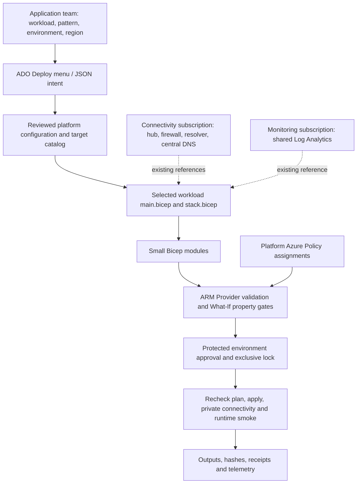

# Enterprise platform architecture and implementation review

Current scope reviewed 26 September 2026: two governed products, Blob copy and Event flow, with explicit typed adapters rather than arbitrary Azure application registration. All eight targets are disabled. Dedicated Deploy supports hosted Preview for configured inputs; hosted SetupOnly belongs to the generic compatibility route. Azure deployment acceptance remains unverified in the reviewed evidence. See the [catalog](self-service-catalog.md), [current status](completion-status.md) and [expansion plan](self-service-expansion-plan.md).

The ownership rule is: **application teams request a supported capability; platform engineers own its topology and lifecycle**.

Follow-up: the [Microsoft Learn assessment](microsoft-learn-platform-assessment.md) identified missing Deployment Stacks and Template Specs. The subsequent [upgrade](deployment-stacks-upgrade.md) implements publication, a subscription-scoped workload stack, native stack previews and lifecycle receipts. These additions are locally tested; no published Template Spec or deployed Azure stack is claimed yet.

## Architecture and ownership



| Owner | Owns | Must not do through a workload run |
|---|---|---|
| Application team | Registered workload name, supported pattern, environment, approved region; application source/configuration through review | Supply arbitrary subnet/DNS IDs, disable private access, choose deployment credentials, administer hubs or remove governance |
| Workload platform | Compositions/modules, naming, target mapping, resource options, scoped workload RBAC, release evidence | Adopt shared DNS/hub/firewall resources into the workload lifecycle |
| Connectivity team | Hub/spoke provisioning, peering, NSGs/UDRs/firewall, DNS resolver and zone links | Assume Private Endpoints establish routing or DNS by themselves |
| Governance team | Management-group/subscription Policy, exemptions, approved regions/SKUs, assignments and audit | Treat a Bicep compile or successful setup check as compliance certification |
| Monitoring team | Shared workspace configuration, retention/caps, query access, AMPLS/private-monitoring design | Give application operators unrestricted access to unrelated teams' logs |

Central private DNS is the normal enterprise design. Microsoft describes integrating endpoints with shared zones in [hub-and-spoke Private Link](https://learn.microsoft.com/en-us/azure/architecture/guide/networking/private-link-hub-spoke-network) and [DNS integration](https://learn.microsoft.com/en-us/azure/private-link/private-endpoint-dns-integration). The workload consumes platform IDs; it does not create the central hub or zones.

## Findings and changes

| Finding | Change / disposition |
|---|---|
| Developers selected network profiles, subscriptions and endpoint/alert implementation switches | Deploy now accepts workload type/name, environment and region. Platform configuration supplies all implementation bindings and booleans. Discover remains a platform/operator inventory menu. |
| New-network mode creates five DNS zones per workload | Enabled developer targets must use existing networking unless `config/platform.json` contains an exact, reviewed isolated-network exception with reason/reference. Current disabled POC targets can still be inspected. No existing DNS resources are renamed or deleted. |
| Private Endpoint module accepted only one group/zone and exposed no outputs | Generalized to arrays with target/subnet IDs and PE/NIC outputs. Existing endpoint and single-zone-group names are retained. |
| Monitoring always created a workspace | Added optional existing cross-subscription Log Analytics reference. Workload deployments leave shared workspace configuration and RBAC alone. Alert queries filter by this Function App resource ID. |
| DNS preflight assumed zones must link directly to the spoke | Added optional existing hub resolver/inbound endpoint references. Preflight checks spoke DNS servers against the approved inbound IPs and zones against the resolver VNet. |
| Any What-If `Modify` was allowed | Sensitive topology, identity, RBAC, location, SKU, network/public-access and TLS changes now fail before approval/apply. Missing property deltas fail closed. |
| No separate ARM provider-validation artifact | Each non-skipped preview runs provider validation before What-If and retains `arm-validation.json`. Failed validation stops before apply. |
| No platform Policy/registry assets | Added separate, compiled Policy-definition and private ACR templates. Neither is invoked by workload deployment; neither has been deployed. |
| Broad multi-pattern expectations exceed the application | Only `blob-transfer` and `logic-app-event-grid` are admitted. SQL, Key Vault, Cosmos DB, Container Apps and generic APIs remain rejected until real compositions, adapters, contracts and tests exist. No empty modules pretend to implement them. |
| Monitor ingestion/query endpoints remain public | Known exception: storage and app are private, but the monitoring module retains public ingestion/query. AMPLS and private monitoring require a separate platform design and live validation. |

## Developer request and configuration hierarchy

The concrete request is in `workloads/blob-transfer/request.example.json`; its schema forbids extra fields. Workload names are existing registered codes (3–10 lowercase alphanumeric characters), not free-form resource prefixes. `orders-api` is illustrative future intent and is not accepted by this deployed application's existing naming contract. Registration remains a platform review step.

Resolution order:

1. `config/platform.json`: supported composition, approved/default regions, required capabilities, endpoint/alert options and explicit isolated-network exceptions.
2. `self-service/targets/*.json`: one unambiguous workload/environment/region to subscription/RG, network, service connection, agent pool, environment and parameter file.
3. `workloads/blob-transfer/environments/main.*.bicepparam`: workload sizing, destination, ownership and application settings.
4. Target `parameterOverrides`: authoritative platform IDs and topology settings. Region must match the resolved intent during bundle creation.
5. The frozen bundle records exact target, compiled parameters, package, costs and discovery evidence. Review and hashes bind the configuration to the approved deployment.

No configuration merge accepts arbitrary developer infrastructure properties. Unknown capabilities or ambiguous target mappings fail. Storage and observability are required by blob transfer; neither is presented as optional. Dedicated menus fix the selected workload type and restrict instances to `blobcopy` or `eventflow`, four environments and `eastus2`; generic menus also expose workload type. Reference cost fields remain informational.

From the repository root, resolve a request locally without Azure:

```powershell
pwsh -NoProfile -File scripts/Resolve-WorkloadRequest.ps1 -RequestPath workloads/blob-transfer/request.example.json -OutputPath artifacts/request-review.json
pwsh -NoProfile -File scripts/Update-ServiceCatalog.ps1
pwsh -NoProfile -File scripts/Test-Project.ps1
pwsh -NoProfile -File scripts/Update-Manifest.ps1
pwsh -NoProfile -File scripts/Update-Manifest.ps1 -Check
```

Use a fresh request-output filename for each review. Push/merge reviewed source before opening the updated ADO form. On enabled targets, select a matching successful main discovery run through **Resources > discovery**. Disabled targets only check setup, preserving the temporary hosted `windows-latest` workflow.

## Enterprise topology contract

Set a target's `parameterOverrides.networkMode` to `existing`, supply `location`, then `existingNetwork.integrationSubnetId`, `privateEndpointSubnetId`, and `privateDnsZoneIds` with keys `blob`, `queue`, `table`, `dfs`, `web`. The five zone names are fixed service names; IDs can belong to the connectivity subscription. `existingLogAnalyticsWorkspaceId` can reference the monitoring subscription. There are no subscription IDs hardcoded inside resource modules.

The supported Function integration/PE subnets are separate subnets in the same workload VNet and application subscription. Function integration requires the matching region, `Microsoft.Web/serverFarms` delegation and at least `/26`. The PE subnet is undelegated with PE network policies disabled under this blueprint. Centralizing the **zones** does not require centralizing the endpoint subnet. Cross-subscription endpoint subnets, arbitrary cross-tenant topology and firewall-forced endpoint placement are not admitted by this composition.

Two DNS modes are implemented:

- **Direct Azure DNS:** omit `dnsResolver`; preflight requires successful zone links to the spoke.
- **Hub resolver:** set `existingNetwork.dnsResolver.id` and `inboundEndpointId` to an existing Azure DNS Private Resolver and its inbound endpoint, including another subscription. The spoke's configured DNS servers must all match that endpoint's private IPs, and the zones must link to the resolver VNet. The resolver and endpoint must report `Succeeded`.

Preflight reads these resources only. Peering, routes, UDP/TCP 53 paths, zone links and resolver provisioning belong to connectivity onboarding. A control-plane reference check does not prove packet delivery; deployment's private DNS/TCP checks and live smoke remain required. Custom DNS forwarder chains, multiple resolver inbound endpoints, conditional-forwarding ruleset-only designs and on-premises forwarding require additional acceptance logic; do not register them as this direct-inbound mode.

Cross-subscription rights are explicit: workload RG deployment; approved subnet join; reads of central topology; narrowly scoped central zone join/record integration permissions required by zone groups; destination RG nested deployment and container-scoped runtime roles; shared workspace linkage/read permissions; and separately approved data-plane smoke access. Contributor alone does not grant role-assignment creation. `SC-AZ-A-Bicep` was supplied as subscription-scoped; no claim is made that it can access central subscriptions. Grant only the necessary extra scopes through the owning teams.

Existing Key Vault, App Configuration, firewalls and route tables are owned by platform services. The current transfer application does not consume Key Vault/App Configuration, so adding unused IDs would not implement a capability. Future compositions must reference those resources through explicit `existing` scopes and add identity, diagnostics, private connectivity and tests together.

## Governance and lifecycle

The release stages are Qualify, PublishTemplate, PlanFoundation, ApplyFoundation, PlanRelease and ApplyRelease. They collectively validate selection, build/lint, run tests, freeze artifacts, publish/verify the Template Spec, validate ARM, analyze stack What-If, request protected environment approvals, recheck drift, deploy and smoke-test. Azure DevOps approvals, exclusive locks, Required Template and branch checks must be configured by the platform owner; YAML cannot create their protection implicitly.

`Get-ServiceChanges` now calls `Assert-ServiceChange`. Delete, replacement/unknown/unanalyzed resource changes fail. Changes to existing topology/PE/DNS/NSG/route/firewall/resolver, identity or role assignments require a separate platform migration workflow. Sensitive property modifications—including SKU changes in either direction—also fail. This intentionally requires review for upgrades as well as downgrades rather than guessing a safe SKU ordering. Ordinary application-setting updates still reach the usual approvals. Object replacement checks cover named sensitive fields; this is a deterministic guard, not a complete Azure semantic analyzer. Review the full payload and retain Azure Policy as an independent control.

Provider validation uses Azure CLI **2.76+** `--validation-level Provider`. Validation failures stop before What-If/package upload/deployment. Applicable policy enforcement and provider validation still have runtime limits; [What-If behavior and permissions](https://learn.microsoft.com/en-us/azure/azure-resource-manager/bicep/deploy-what-if) are not a substitute for assignment coverage or post-deployment compliance review.

`platform/policy/guardrails.bicep` supplies **definitions only**, defaulting to Audit: approved regions/ownership tags and private Storage with identity authorization, HTTPS and TLS 1.2. Platform owners must review/assign them at application scopes, inspect impact, then promote to Deny. Exempt shared/global resources appropriately. SQL/Key Vault access, diagnostic existence, approved SKUs, identity requirements and approved endpoint subnet placement need additional reviewed built-in/custom assignments; they are not claimed as implemented by these two definitions.

**Deployment stacks decision:** new self-service bundles use the subscription wrapper in `workloads/blob-transfer/stack.bicep`, pinned Template Specs and `detachAll` with reviewed deny settings. Detach/Delete previews are still rejected. Existing unowned RGs cannot be adopted implicitly; legacy incremental deployment remains only for separately managed instances. Shared resources stay outside workload ownership. Read the [upgrade runbook](deployment-stacks-upgrade.md) for phase safety, native preview evidence, cross-scope grants, required permissions and live qualification.

## Module registry and AVM decision

`platform/registry/main.bicep` models a separately owned private Premium ACR with admin/anonymous access disabled, no firewall bypass, ARM-audience authentication enabled, and a PE referencing an existing subnet/central `privatelink.azurecr.io` zone. It is a billable platform resource. No registry or zone is created by the workload composition.

Use separate publish and read identities, scoped registry permissions, protected publication and immutable version tags. Do not overwrite a released version. A private registry requires network/DNS access from module restore/build agents; the current hosted qualification agent would need to move to an approved connected build pool before switching imports. The hosted setup check does not restore private modules. See [Microsoft's registry workflow](https://learn.microsoft.com/en-us/azure/azure-resource-manager/bicep/private-module-registry).

AVM adoption is selective, not a blind module swap. Evaluate the official [AVM resource/pattern catalog](https://azure.github.io/Azure-Verified-Modules/) for new storage, identity, registry and endpoint modules. Pin a reviewed release and record inputs, outputs, resource names, role scopes and transitive dependencies. Compile and compare What-If against existing IDs before migration. No AVM version was guessed or unqualified registry dependency added in this change; existing source modules remain the tested runtime dependency. Registry publication, version protection and actual AVM migration remain platform work.

## Naming, idempotency and acceptance

`workloads/blob-transfer/main.bicep` is the canonical naming composition: existing `stem`/`suffix` rules are retained so a source refactor does not rename resources or change role GUIDs. Modules receive resource names or the canonical stem. Service-defined DNS zone names are not prefixed. Storage names remain lowercase/length-constrained through deterministic hashes. `Get-ServiceStem` is the corresponding script contract. Do not retrofit a new naming order onto an existing deployment without a migration plan. The [repository layout](repository-structure.md) distinguishes reusable resource modules from workload-specific helpers.

Resource references establish ARM dependencies. The new PE interface preserves single-zone config names; multi-zone configurations use a deterministic hash of each zone ID. Modules do not install software or imperatively create infrastructure. Existing bounded retries handle service propagation; no arbitrary sleeps were added. Compile tests and deterministic naming do not establish real idempotency: live acceptance must repeat a deployment and inspect that no material changes occur.

Before enabling the first enterprise target, qualify central read/join permissions, DNS/peering/firewall routes, shared monitoring and workload-isolated alerts, Policy assignment effects, agent access, approvals/locks, ARM validation and What-If, then deployment and runtime smoke. Record a second-run no-material-change result, negative public-access/policy tests, and a separately approved teardown rehearsal. Never interpret the hosted setup summary as any of those results.
