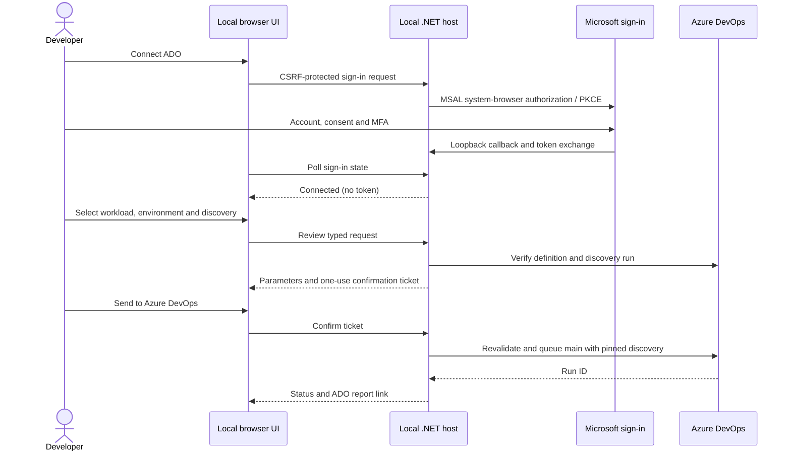

# Platform Studio: local Windows self-service portal

**New workload menus:** the portal now reads seven registered product definitions. The five additions require their ten ADO definitions to be registered using the exact names/files in [workload onboarding](workload-onboarding.md). All 28 targets remain disabled; missing onboarding settings block Preview with an explanatory report. Portable packages built at `artifacts/portal-packages/20260927-105645` include this catalog revision; both architectures passed 14 local HTTP checks. Older packages must be rebuilt.

The portal adds a browser workspace to the seven registered ADO workload routes. It adapts the palette, typography and card conventions of Microsoft's [Azure Skills landing page](https://github.com/microsoft/azure-skills/tree/117b038edfef5d7af09848b8ffcd355f28f19956/landing-page). That upstream Astro site is a skills/install website, not an authenticated deployment application. Our local ASP.NET Core host supplies the application, session, authentication and ADO integration. This deliberately uses a small static frontend rather than adding Astro, Tailwind, Blazor and a second application build chain. See [attribution](../src/SelfService.Portal/THIRD-PARTY-NOTICES.md).

## What is available

- Workload-specific resource, dependency and dated cost descriptions read from the generated YAML menus; targets and approved regions read from repository configuration.
- Discover, Preview, and Preview-and-deploy requests sent to the dedicated Discover/Deploy definitions for each offering. Disabled targets cannot deploy through the UI or API.
- Recent successful main discovery picker; review verifies the definition, YAML path, repository, age and selected instance/environment. Pipeline-side manifest/hash/provenance checks remain authoritative.
- Browser Microsoft sign-in for separate Azure and ADO audiences, consent/MFA on Microsoft pages, themed return page, waiting/completion/cancellation/error states, and local disconnect.
- Registered-subscription access check; it does not expand the deployment catalog based on everything a user can access.
- Five project-local skills read from `.agents/skills`, plus [42 Microsoft Azure skill definitions](azure-skill-discovery.md) and supporting files bundled under `vendor/azure-skills`. Guidance is displayed as text; arbitrary commands or an AI agent are not executed.
- Microsoft skill cards show **No pipeline associated yet**. A separate Azure browser-authenticated read-only inventory adapter collects approved subscription metadata, with service views and a networking profile. These are supporting facts, not full execution of each upstream workflow.
- Saved discovery analysis invoking the existing deterministic analyzer and displaying its Markdown-as-text and containment diagrams. No model or Azure connection is required.
- [Connected diagrams](portal-diagrams.md): inline visible-resource topology, proposed component diagrams for all seven workload configurations, same-subscription inventory comparison and a guarded reader for saved ADO Preview changes. Search, pagination, full-name details and SVG export are included.
- Run submission, status polling and ADO links for logs, approvals, Summary/Extensions and artifact downloads. Run history in the portal lasts for the current page session; ADO retains the actual history.

This is a **single-user desktop companion**, listening only on localhost. It is not a LAN/web-hosted multi-user identity service. AI/MCP execution, dynamic IPAM, automatic subnet allocation, runtime skill installation, general-purpose artifact browsing and in-portal environment approval are not implemented. The portal reads only the named `deployment-preview` artifact for the connected Preview diagram. Skills ship as a reviewed offline bundle. Resources are still provisioned in Azure by ADO, not on your computer.

## Run from source, in order

Requirements: Windows 11 ARM64 or x64, PowerShell 7.4+, Git checkout, .NET SDK compatible with `global.json` (currently 10.0.300), and Node.js 22+ for analysis. Normal portal browsing and ADO requests do not require Node, Azure CLI, Bicep, Docker or Functions locally. Internet is needed for package restore, Microsoft sign-in and ADO/Azure calls. The Azure pipelines retain their existing agent/tool/network requirements.

From the `Bicep` repository root:

```powershell
./scripts/Setup-Portal.ps1
./scripts/Start-Portal.ps1
```

If a prerequisite is absent, use `./scripts/Setup-Portal.ps1 -InstallMissing`. This uses native-architecture winget packages for .NET 10 SDK or Node LTS and reports when to reopen PowerShell to refresh PATH. Existing incompatible installations are reported for upgrade, not silently replaced. PowerShell and winget themselves must already be available.

The browser opens `http://localhost:5087`. Without an Entra registration you can already browse workloads/skills and analyze saved discovery. Connect buttons explain the missing setup and remain disabled.

```powershell
./scripts/Test-Portal.ps1
./scripts/Stop-Portal.ps1
```

Start writes an ownership receipt and logs under `.local/portal`. Stop verifies process path, creation time and command line before stopping only that portal process. Reports remain under `artifacts/portal-analysis`. Never commit those artifacts; inventories may contain private infrastructure details. Raw uploaded files are retained locally to preserve evidence. Delete specific unwanted evidence directories yourself after review. This app does not start or stop the Functions/Azurite stack.

## Configure Microsoft browser sign-in

A platform administrator must create a **separate, single-tenant Microsoft Entra app registration for this local desktop companion**. Do not reuse the ADO deployment service principal's client ID.

1. In the tenant connected to your ADO organization, register the app and record its Directory/tenant ID and Application/client ID.
2. Under Authentication, add **Mobile and desktop applications** and the redirect URI **`http://localhost`**. MSAL selects an ephemeral loopback port for the response. This is different from the portal's port 5087. Do not register the portal as a SPA or confidential web app; no client secret is used.
3. Add delegated **Azure DevOps → user_impersonation** permission. For optional Azure subscription checking, also add **Azure Service Management → user_impersonation**. Obtain administrator consent where tenant policy requires it. MSAL requests each resource separately with `.default`; it does not combine two token audiences.
4. Make sure the user has ADO project membership, View builds/View build pipeline and Queue builds on the intended definitions. Azure subscription Reader access is sufficient for the optional subscription check. The pipeline's `SC-AZ-A-Bicep` permissions remain a separate deployment concern.
5. Configure the local app with the actual registration IDs:

```powershell
./scripts/Setup-Portal.ps1 -TenantId '<portal-tenant-guid>' -ClientId '<portal-client-guid>'
./scripts/Start-Portal.ps1
```

If already running, stop the portal before setup/build, then restart. Setup saves only nonsecret identifiers in ignored `src/SelfService.Portal/portal.local.json`. You can copy `portal.example.json` to that name to configure Organization, Project, Port, RepositoryRoot or NodePath. Environment overrides use `STUDIO_Portal__ClientId`, `STUDIO_Portal__TenantId`, etc. Configuration is local and never editable through an HTTP endpoint.

In **Connections**, click Connect Azure DevOps. Microsoft opens in the system browser; the user selects their account, accepts requested consent and completes MFA. The portal waits up to five minutes and updates automatically. Cancellation or a denied/failed request can be retried. Azure connection is optional and must use the same account. Tenant Conditional Access may block browser public-client flows; this implementation does not bypass it or implement WAM fallback. Disconnect clears the app's in-memory cache, not Microsoft's browser cookies or tenant consent.

Sources: [MSAL interactive acquisition](https://learn.microsoft.com/en-us/entra/msal/dotnet/acquiring-tokens/desktop-mobile/acquiring-tokens-interactively), [system browser and loopback](https://learn.microsoft.com/en-us/entra/msal/dotnet/acquiring-tokens/using-web-browsers), [ADO Entra delegated authentication](https://learn.microsoft.com/en-us/azure/devops/integrate/get-started/authentication/entra-oauth?view=azure-devops).

## Register the existing pipelines

The default organization/project is `enetactgames / Enetact`. Register unique definitions with these exact names and files; deploy YAML already binds its matching discovery name:

| Definition | YAML |
|---|---|
| Discover - Blob copy | `azure-pipelines-blobcopy-discover.yml` |
| Deploy - Blob copy | `azure-pipelines-blobcopy-deploy.yml` |
| Discover - Event flow | `azure-pipelines-eventflow-discover.yml` |
| Deploy - Event flow | `azure-pipelines-eventflow-deploy.yml` |

The server resolves IDs by exact definition name, checks each YAML path and always queues `refs/heads/main`. Duplicate names, unavailable definitions and mismatched paths block the request. Keep pipeline definitions/repository main protected; the local portal is not a substitute for ADO permissions, branch protection, service-connection authorization or environment checks. Commit reviewed pipeline changes to the connected GitHub main before expecting them to execute. Catalog changes in your working tree do not change ADO's checked-in source.

1. Choose a workload and environment, then **Discover resources**.
2. Click **Review pipeline request**, inspect the exact parameters, then **Send to Azure DevOps**. Opening the page or reviewing does not queue a run.
3. In Pipeline activity follow the run. ADO contains the full summary and saved artifact.
4. Return to that workload/environment, select **Preview changes**, refresh discovery and choose a successful main run from the last seven days. The list contains recent candidates; Review rejects a different environment/instance or missing parameter evidence. It never silently substitutes latest.
5. Review and send. The JSON sets `resources.pipelines.discovery.version` to the selected run ID and `executionMode` to `Preview only`. ADO validates the actual artifact and generates the resource-change report.
6. Deploy is selectable only for platform-enabled targets. It queues **Preview and deploy**, including a fresh Preview followed by Deploy and configured ADO gates. It does not resume or reuse an earlier Preview-only run as implicit approval.

Queue reviews are session-bound, single-use and expire after five minutes. Confirm revalidates the catalog and ADO handoff. The app does not automatically retry a queue POST: if the connection fails after ADO accepts it, check ADO before submitting again. Preview writes temporary Azure What-If metadata, though it does not apply workload resources. Estimates are dated retail references, not a guarantee or cost cap. See [preview](deployment-preview.md) and [costs](self-service-costs.md).

ADO API contract: [Run Pipeline](https://learn.microsoft.com/en-us/rest/api/azure/devops/pipelines/runs/run-pipeline?view=azure-devops-rest-7.1).

## ARM64 and x64 packages

```powershell
./scripts/Publish-Portal.ps1
```

Produces timestamped **win-arm64** and **win-x64** ZIPs under `artifacts/portal-packages`, with self-contained .NET runtime, application files, a read-only catalog/skill/analyzer snapshot and documentation. Pick the package matching Windows **System type**. Packages need no installed .NET SDK/runtime; Node.js 22+ remains optional unless using analysis. The copied catalog snapshot is not a Bicep development checkout and does not update itself; rebuild packages after approved platform changes. No automatic upstream skill download occurs.

Extract to a user-writable directory. In that directory create `portal.local.json` using the shape below, then run `SelfService.Portal.exe` and open `http://localhost:5087`. The executable is a foreground server; Ctrl+C stops it. Microsoft Sign-in launches its own system-browser tab only when Connect is clicked. These packages are unsigned portable distributions, not MSIX installers.

```json
{"Portal":{"TenantId":"","ClientId":"","Organization":"enetactgames","Project":"Enetact","Port":5087}}
```

Leave IDs blank for offline use or enter your registration IDs. Never add a client secret, PAT or access token. Source-local `portal.local.json` is excluded from publishing. Packaged reports are saved below `repository/artifacts/portal-analysis`.

## Structure, methods and boundaries

| Source | Responsibility |
|---|---|
| `src/SelfService.Portal/Program.cs` | Loopback host, origin/CSRF/session checks, safe errors, API routes and one-use confirmation tickets. |
| `Catalog.cs` | Read generated menu descriptions, targets, regions and local skills; validate selection; build allowlisted ADO payload. |
| `BrowserIdentity.cs` | MSAL public-client browser flow, token acquisition/renewal, cancellation and per-session cache clearing. |
| `AdoGateway.cs` | Resolve definitions, verify handoff, submit once, read status and approved-subscription access. |
| `AzureDiscovery.cs` | Fixed ARM GET collections for the selected upstream skill profile; scoped pagination, projected fields, explicit partial coverage and local reports. |
| `AnalysisRunner.cs` | Size-bound file upload, isolated evidence directory, fixed analyzer command with bounded execution and safe error handling. |
| `wwwroot/` | Dependency-free UI, responsive/light-dark theme, explicit confirmation, safe text rendering and image-only SVG reports. |
| `scripts/*-Portal.ps1` | Setup, ownership-checked lifecycle, tests and architecture-specific publishing. |



MSAL 4.90.1, .NET 10, built-in System.Text.Json/HttpClient and xUnit tests are locked in package files. Self-contained packages pin runtime 10.0.12; source development uses the installed runtime associated with the compatible SDK (10.0.8 on the tested host). This app requires no Semantic Kernel, database or claims runtime. Authentication uses Microsoft's maintained OAuth library rather than application-written OAuth cryptography. Token caches are memory-only, separated by browser session and discarded on process exit. Sessions expire after eight hours. The HTTP-only, SameSite=Strict session cookie is used only on loopback HTTP; Host, Origin and CSRF checks reject cross-site mutations and DNS-rebinding hostnames. No CORS, remote bind, credential form, command console, arbitrary pipeline ID or arbitrary upstream URL is exposed. The local OS user and repository configuration remain trusted; another process with access to that user's account is outside this isolation boundary.

## Verification and remaining acceptance

See [current validation](validation.md) for executed checks. Mocked ADO tests exercise handoff rejection and payload submission without queueing cloud work. Local browser/runtime checks do not establish live tenant login, consent or Azure deployment. Before wider rollout, retain actual ARM64/x64 package launch evidence, then test registration, successful sign-in, denied consent, MFA/Conditional Access, cancellation, expiry/reconnect, successful Discover → Preview handoff and an explicitly approved deployment through ADO. Do not mark Azure acceptance complete based on a local report.

For the actual local HTTP boundary, start an unconfigured portal and run `node tests/portal/smoke.mjs`. It exercises origin/CSRF/Host rejection and synthetic inventory analysis without cloud calls. For a published folder, run `./scripts/Test-PortalPackage.ps1 -PackageDirectory '<published-folder>' -ExpectedArchitecture Arm64` (or `X64`). The package check starts and stops its own process, verifies the bundled catalog and uses port 5088 by default. x64 emulation on an ARM64 machine is not native x64 hardware acceptance.
