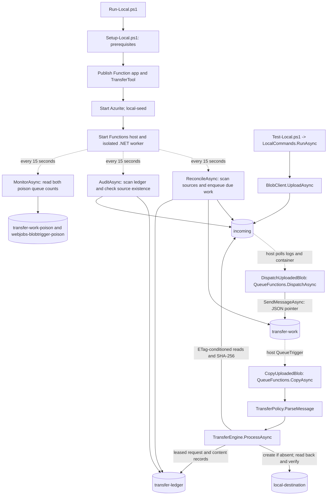
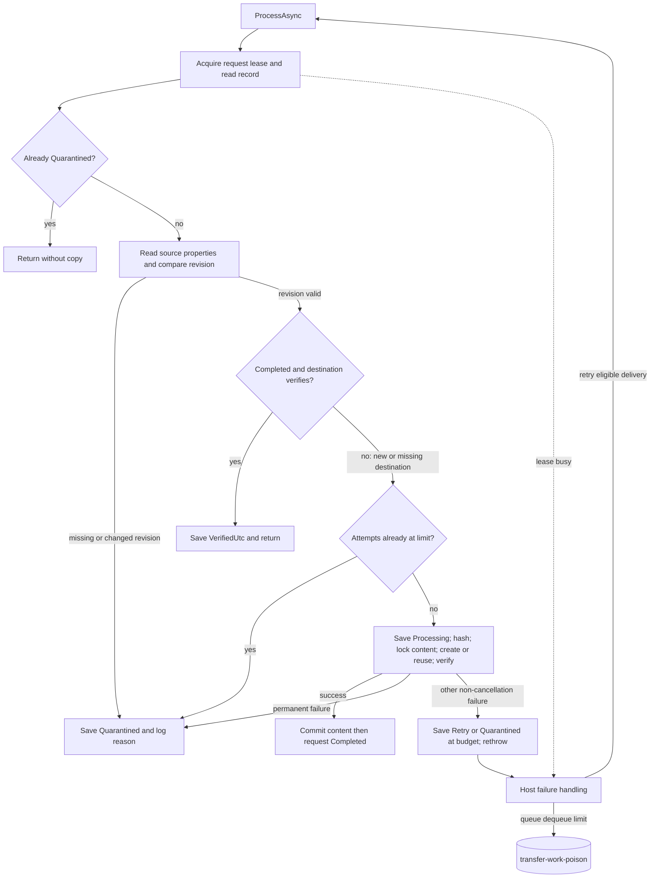
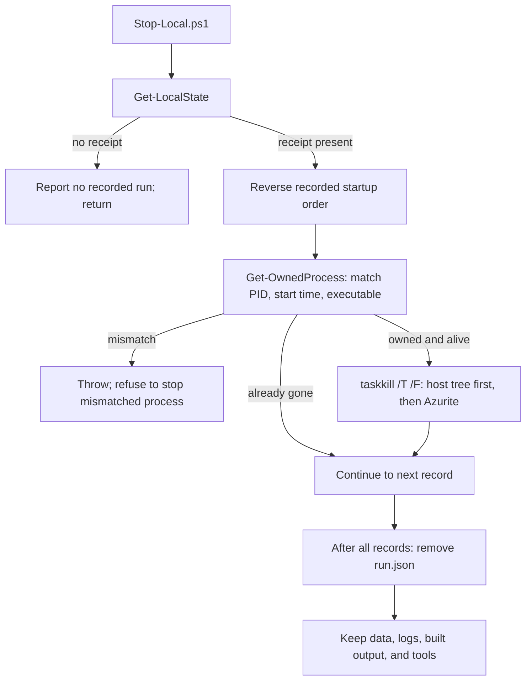

# Exact local workflow and method calls

Traced from the repository on 17 September 2026. This describes the existing local blob-transfer application and its scripts. Services were stopped after the recorded smoke run; reading this guide does not restart them.

The diagrams show repository-owned methods and storage SDK calls. Functions listener polling, internal receipt handling, SDK HTTP retries, and operating-system scheduling are framework internals, not methods implemented here. Their individual calls were not captured in a distributed trace. Independent triggers can overlap; there is no single global call order.

## 1. Components and trigger boundaries



All storage is the public Azurite development account on this machine. `incoming`, `local-destination`, and `transfer-ledger` are separate containers in that one account. Blob, Queue, and Table listeners use `127.0.0.1:10000`, `:10001`, and `:10002`; the Functions admin endpoint uses `127.0.0.1:7071`. The transfer application does not directly use Tables. There is no business HTTP API or web UI. Bicep does not execute in local mode.

## 2. Startup, in script order

Source: [Run-Local.ps1](../scripts/Run-Local.ps1), [Setup-Local.ps1](../scripts/Setup-Local.ps1), [local-common.ps1](../scripts/local-common.ps1).

| Step | Caller / method | Exact action |
|---|---|---|
| 1 | `Run-Local.ps1` | If PowerShell is below 7.4, call setup, read the chosen PowerShell path, and relaunch the launcher under it. |
| 2 | `Get-LocalState()` | Read `.local/run.json` if present; reject a receipt for another checkout. |
| 3 | `Get-OwnedProcess(record)` | Compare PID, process start ticks, and executable path. Reject reused/mismatched PIDs. If an owned process is still running, reject duplicate startup. |
| 4 | `Assert-LocalPortsFree()` | Refuse an existing listener on 7071, 10000, 10001, or 10002. No service is adopted or killed. |
| 5 | `Setup-Local.ps1` | Reuse compatible tools or install missing ones as described below; save `.local/tools.json`. |
| 6 | `Get-LocalTools()` | Load selected paths; update this process's PATH and DOTNET_ROOT; opt out of .NET/Core Tools telemetry. |
| 7 | `Assert-LocalPath()` | Canonicalize app/operator/data/log paths under `.local`; reject escaping paths and junctions/symlinks in the checked path chain. Create those directories. |
| 8 | `dotnet publish` | Publish `BlobTransfer.csproj` in Release with locked restore into `.local/app`. |
| 9 | `Test-FunctionMetadata()` | Require exactly five unique Functions with the expected one blob, one queue, and three timer bindings. |
| 10 | `dotnet publish` | Publish `TransferTool.csproj` in Release with locked restore into `.local/operator`. |
| 11 | `Copy-Item` | Copy `local.settings.azurite.example.json` to `.local/app/local.settings.json`. Source-folder developer settings are untouched. |
| 12 | `Start-Process` / `New-ProcessRecord()` | Launch hidden Node/Azurite with loopback bindings, telemetry disabled, skipped API-version enforcement, `.local/data`, and stdout/stderr files. Record PID/start/path immediately with `ready=false`. |
| 13 | Listener readiness loop | Wait up to 60 seconds, checking every 500 ms for all three storage listeners owned by that Azurite PID; fail if process exits. |
| 14 | `TransferTool local-seed` | Call `LocalCommands.RunAsync`; reject Azure site markers, validate arguments, create fixed emulator clients and a five-minute cancellation timeout. Call `CreateIfNotExistsAsync` for the three containers, then `transfer-work`, `transfer-work-poison`, and `webjobs-blobtrigger-poison`. |
| 15 | Child environment preparation | Clear inherited upload/queue/host-storage, ledger/destination, Azure site, and local-mode setting prefixes from the child environment; set Development, telemetry opt-out, and loopback URL. |
| 16 | `Start-Process` / `New-ProcessRecord()` | Launch hidden `func start --address 127.0.0.1 --port 7071 --no-build` in `.local/app`; capture logs and save the second process record. The host starts the isolated .NET worker. |
| 17 | Host readiness loop | Wait up to 120 seconds: call `/admin/host/status` and require `Running`, plus one loopback listener on 7071 owned by the recorded host PID. |
| 18 | Receipt update | Set `ready=true`, save `.local/run.json`, print the log path. Failure inside the service-start block calls `Stop-Local.ps1` and rethrows. |

Setup details, in order:

1. If needed, reuse installed PowerShell 7.4+ or download portable 7.6.2 for Windows x64/ARM64 and check its published SHA-256; rerun setup under it.
2. Require Windows x64/ARM64. Read `global.json`. `Find-Binary()` prefers the project-local executable, then PATH.
3. Ask the selected .NET executable for its version from the repository. If incompatible, resolve the pinned SDK 10.0.300 from Microsoft's release metadata, download the matching ZIP, verify SHA-512, and extract to `.tools/dotnet`.
4. Accept Node 22 or 24 with accompanying npm. Otherwise download Node 24.16.0, verify SHA-256, and extract under `.tools/node`.
5. Accept Core Tools v4 at least 4.14.0. Otherwise resolve the official 4.14.0 minimal archive and published SHA-256 digest, verify and extract to `.tools/functions`.
6. Set process PATH/DOTNET_ROOT, then install pinned Azurite 3.37.0 under `.tools/npm` if absent or mismatched.
7. Execute version checks for all selected tools. Save paths and check time to `.local/tools.json`. `-CheckOnly` does not install or update that receipt.

`Install-PortableZip()` handles the .NET/Node/Core Tools archive download, hash check, extraction, and archive removal. The Windows PowerShell bootstrap has its own download branch. These are setup actions, not per-file transfer operations.

## 3. Worker initialization

Source: [Program.cs](../src/BlobTransfer/Program.cs), [LocalDevelopment.cs](../src/BlobTransfer/LocalDevelopment.cs).

1. `HostBuilder.ConfigureFunctionsWorkerDefaults().ConfigureServices(...)` reads configuration.
2. `LocalDevelopment.IsEnabled(config)` validates the flag. Local mode requires Development, no Azure site/instance markers, exactly `UseDevelopmentStorage=true` for all three binding connections, no child identity/endpoint configuration under those connections, and `Recovery:includeSourceVersions=false`.
3. Require distinct upload and ledger containers; in local mode also require a distinct destination container.
4. Construct two `BlobServiceClient` instances and one `QueueServiceClient` using the fixed emulator connection. Queue message encoding is `None`.
5. Register `StorageClients`, `BlobLedger`, and `QueueClients` for the work queue and both poison queues.
6. Deserialize `Copy:scopePrefixes`; require a nonempty map and validate each scope via `TransferKey.Validate()`.
7. Build `PipelineOptions`, validating numeric limits. Register `TransferEngine`, build the host, and call `host.RunAsync()`.

Effective checked-in local values:

| Setting | Value |
|---|---|
| Source / destination / ledger | `incoming` / `local-destination` / `transfer-ledger` |
| Scope mapping | Empty prefix -> `default` for every name |
| Maximum source size | 1,073,741,824 bytes (1 GiB) |
| Lifetime recorded attempt budget | 10 |
| Reconciliation retry due time | 15 minutes |
| Scan page size / pages per invocation | 100 / 5 |
| Completed-record verification age | 24 hours |
| Source-version enumeration | Disabled |
| Each of three timer schedules | `*/15 * * * * *` |
| Blob parallelism / blob poison threshold | 2 / 5 |
| Queue batch / new-batch threshold | 2 / 0 |
| Queue max dequeues / failed-message visibility delay | 5 / 1 minute |
| Queue max polling interval | 10 seconds |
| Function timeout | 30 minutes |

These are configuration values, not guaranteed end-to-end timing or throughput. Source: [host.json](../src/BlobTransfer/host.json), [local settings](../src/BlobTransfer/local.settings.azurite.example.json), [PipelineOptions](../src/BlobTransfer/TransferContracts.cs), and the defaults selected in `Program.cs`.

## 4. One upload: ordered application calls

```mermaid
sequenceDiagram
    autonumber
    participant U as Uploader / smoke tool
    participant S as incoming
    participant F as QueueFunctions
    participant Q as transfer-work
    participant E as TransferEngine
    participant L as transfer-ledger
    participant D as local-destination
    U->>S: BlobClient.UploadAsync(bytes)
    Note over S,F: Host discovers blob and invokes DispatchAsync
    F->>S: GetPropertiesAsync()
    F->>F: WorkItem + TransferPolicy.Key()
    F->>Q: SendMessageAsync(JSON pointer, infinite TTL)
    Note over F,Q: Log BlobDispatched; host invokes CopyAsync
    Q-->>F: JSON message
    F->>F: TransferPolicy.ParseMessage()
    F->>E: ProcessAsync(work)
    E->>L: LockAsync(request key); ReadAsync()
    E->>S: GetPropertiesAsync(); compare ETag
    E->>L: SaveAsync(Processing, increment attempts)
    E->>S: HashAsync -> OpenReadAsync -> SHA256.HashDataAsync
    E->>L: SaveAsync(hash, length, destination name)
    E->>L: LockAsync(content key)
    E->>D: ExistsAsync()
    alt Destination absent
        E->>S: OpenReadAsync(IfMatch source ETag)
        E->>D: UploadAsync(IfNoneMatch wildcard)
    else Destination already present
        Note over E,D: Skip upload; still verify actual bytes
    end
    E->>D: VerifyAsync -> GetPropertiesAsync + HashAsync
    E->>L: SaveAsync(content Completed)
    E->>L: SaveAsync(request Completed)
    Note over E,L: Log TransferCompleted; dispose content and request leases
    E-->>F: Successful return
    Note over F,Q: Host completes successful queue delivery
```

This sequence is the fresh-request success path. The next section supplies the early returns and failure branches. Source: [QueueFunctions.cs](../src/BlobTransfer/QueueFunctions.cs), [TransferEngine.cs](../src/BlobTransfer/TransferEngine.cs), [TransferContracts.cs](../src/BlobTransfer/TransferContracts.cs).

Detailed operations:

1. The uploader writes only bytes to `incoming`. It does not invoke the Function, send the work message, or supply a request ID/hash.
2. The host's polling BlobTrigger invokes `QueueFunctions.DispatchAsync(source, name, ct)` for `DispatchUploadedBlob`. It reads properties, constructs `WorkItem(1, name, ETag, VersionId)`, and calls `TransferPolicy.Key()`.
3. `Key()` calls `Validate(WorkItem)`, `ResolveScope()` (ordinal longest matching prefix), `NormalizeETag()`, `HashText()`, then `TransferKey.Validate()`. Work validation checks schema 1, nonempty source name <=1024 characters, no control characters, a nonblank ETag <=128 characters, and optional version ID <=128 characters. Key validation checks scope syntax and a 64-character lowercase hexadecimal request ID.
4. The request ID is SHA-256 of `configured source container URI without trailing slash + newline + source name + newline + ETag without surrounding quotes`. It identifies a source revision; it is not the content hash.
5. `SendMessageAsync(BinaryData.FromObjectAsJson(work), timeToLive: -1 second)` sends schema/name/ETag/optional-version JSON to `transfer-work`; log `BlobDispatched request=...`. File bytes are not placed on the queue.
6. The host invokes `QueueFunctions.CopyAsync(message, ct)` for `CopyUploadedBlob`. `TransferPolicy.ParseMessage()` deserializes JSON and validates the work item, then `TransferEngine.ProcessAsync()` runs.
7. `ProcessAsync()` recomputes the key, leases `requests/default/<request-id>.json`, reads the record, gets the source `BlobClient`, and uses `WithVersion()` only if a version ID was supplied. Local smoke has no version ID.
8. Check existing quarantine, fetch source properties, compare requested and current normalized ETags, and check any already-recorded source ETag. See branches below.
9. For an already-completed request, `VerifyAsync()` rechecks the destination. If valid, update `VerifiedUtc`, save, and return. If absent, continue into repair. Integrity conflict quarantines.
10. Enforce the recorded attempt budget. Increment `Attempts`, set `Processing`, `UpdatedUtc`, and `NextAttemptUtc = now + 15 minutes`, and save the request.
11. Require a block blob and a size from 0 through 1 GiB. `HashAsync()` opens a non-modifying read with `IfMatch = source ETag`, 4 MiB buffering, and computes lowercase SHA-256 over actual bytes.
12. Store hash, length, and `v1/default/<content-hash>/payload`; save the request again.
13. Lease `content/default/<content-hash>.json`. Link request and content lease cancellation tokens so loss of either cancels copy work.
14. Check destination existence. If absent, open the source again with its ETag condition and upload a stream conditionally with `IfNoneMatch = *`. Set destination metadata `sha256` and `scopeid`, retain source content type, and configure 4 MiB initial/maximum transfer chunks with maximum concurrency 2. A 409/412 upload race proceeds to verification.
15. `VerifyAsync()` reads destination properties, checks length, and calls `HashAsync()` on destination bytes with the destination ETag. Metadata is not accepted as proof of contents.
16. Save the content record as `Completed` first. Then save the request as `Completed`, clear `ErrorCode` and `NextAttemptUtc`, and set verification/update times. This write order lets a later attempt repair a crash between the two commits.
17. Log `TransferCompleted request=... hash=... bytes=...`. Dispose the content lease then request lease on scope exit. A successful invocation lets the host finish the queue delivery. The source blob remains.

## 5. Every ledger lock and write

Source: [BlobLedger.cs](../src/BlobTransfer/BlobLedger.cs).

| Method | Actions |
|---|---|
| `BlobLedger.ReadAsync(name, ct)` | `GetBlobClient(name).DownloadContentAsync()`; deserialize `TransferRecord`; return null on storage 404. Used by smoke, reconciliation, and audit without acquiring a lease. |
| `BlobLedger.LockAsync(name, ct)` | Delegate to `LedgerLease.AcquireAsync()`. |
| `LedgerLease.AcquireAsync()` | Try to upload a default Pending `TransferRecord` with `IfNoneMatch=*`; tolerate 409/412 when it already exists. Acquire a 60-second blob lease. Convert acquisition 409/412 into `LeaseBusyException`. Construct the lease wrapper and start `RenewAsync()`. |
| `RenewAsync()` | Wait 20 seconds, renew, repeat. A renewal failure cancels the linked processing token. |
| `ReadAsync<T>()` | Download the record with the lease ID condition and deserialize it. A null deserialization produces `new T()`. Cursor locks initially deserialize the default record into an empty cursor. |
| `SaveAsync<T>()` | Check cancellation and upload JSON with the lease ID condition. |
| `DisposeAsync()` | Cancel renewal, await its task, then try to release with a separate 10-second timeout. Storage/timeout exceptions on release are swallowed; lease expiry is the fallback. |
| `CurrentETagAsync()` | Read properties under the lease; used by explicit reviewed recovery, not ordinary local uploads. |

No lock waits in application code until another worker finishes: lease contention throws and the host handles the failed invocation. Request locks serialize the same source revision. Content locks serialize different requests with the same scope and bytes.

## 6. Failure, duplicate, and repair branches



| Branch | Exact behavior |
|---|---|
| Invalid queue JSON/work/scope/key | Throws before the normal processing error handlers; host retry/poison behavior applies. There may be no request record. |
| Request lease busy | Throws before attempt accounting. No request attempt increment by that invocation. |
| Record already Quarantined | Return successfully without reading/copying source. Quarantine is ledger state, not necessarily a failed Function invocation or a poison message. |
| Source property read fails | Save source pointers; increment attempts; use `SourceRevisionUnavailable` for 404, otherwise storage/type error code. Set next due/update time. A missing source quarantines and returns; other errors set Retry or Quarantined at budget, save, and rethrow. |
| Requested ETag differs from source | Save `Quarantined / SourceRevisionUnavailable`; log and return. Never silently copy a newer revision. |
| Recorded ETag differs from source | Save `Quarantined / RequestIdReusedWithDifferentRevision` with update time; log and return. |
| Completed request with valid destination | Save a fresh `VerifiedUtc`; return without recopying or incrementing attempts. This early return does not emit another `TransferCompleted` event. |
| Completed request with missing destination | `VerifyAsync()` returns false; continue to budget check and copy repair. |
| Completed-request verification integrity conflict | Save Quarantined with the permanent reason and update time; log and return. |
| Completed-request verification transient error | Increment attempts; save Retry or Quarantined, error, next due, and update time; log `TransferVerificationRetry`; rethrow. |
| Attempt budget already exhausted | Save `Quarantined / AttemptBudgetExhausted`; log and return. |
| Wrong blob type or invalid length | After Processing was saved, save Quarantined with `UnsupportedBlobType` or `InvalidContentLength`; log and return. |
| Destination missing during final verification, different length, or different hash | Quarantine with `DestinationIntegrityConflict`. Do not overwrite conflicting content. |
| Other processing failure | Save Retry, or Quarantined if attempts reached 10; record error/update time and rethrow. Next due was set at Processing. A failure persisting the ledger can itself escape. |
| Cancellation or lease loss | `OperationCanceledException` bypasses generic retry catches; unwind leases. Last persisted state may remain Processing. Later host/reconciliation attempts can retry it. |

There are two separate retry mechanisms. The host is configured for up to five dequeues of a particular work message and a one-minute failed-message visibility delay. Reconciliation evaluates the ledger's 15-minute due time and can enqueue a new message. `ProcessAsync()` does not check `NextAttemptUtc` before executing, so that time is not a global throttle. The lifetime attempt budget is 10 recorded attempts; lease contention and pre-processing failures do not all increment it.

On success, the host deletes the queue message; after repeated failed deliveries it routes to `<queue>-poison`. Blob-trigger failure handling has its own internal receipts/retries and `webjobs-blobtrigger-poison` queue. These host behaviors are documented in [Microsoft's QueueTrigger guide](https://learn.microsoft.com/en-us/azure/azure-functions/functions-bindings-storage-queue-trigger) and [BlobTrigger guide](https://learn.microsoft.com/en-us/azure/azure-functions/functions-bindings-storage-blob-trigger). The local smoke did not force every runtime poison/crash branch.

## 7. Three independent background timers

Source: [QueueFunctions.cs](../src/BlobTransfer/QueueFunctions.cs). All use monitored schedules and are configured for every 15 seconds locally. They may run alongside each other and alongside dispatch/copy work.

| Function name -> method | Ordered actions |
|---|---|
| `ReconcileTransfers` -> `ReconcileAsync()` | Lease `system/reconcile-cursor.json`; `ReadAsync<ScanCursor>()`; list `incoming` with `GetBlobsAsync(BlobStates.None).AsPages(continuation,100)`; make each WorkItem; derive its key. Invalid contract logs a hashed object name and skips it. Read request ledger; Quarantined logs `TransferNeedsReview` and skips. Call `TransferPolicy.IsDue()`. If due, send the same JSON work pointer with infinite TTL. After every accepted page, save continuation and scan time; stop after five pages. Log `ReconcileHeartbeat scheduled=... pages=...`; release lease. |
| `AuditTransferLedger` -> `AuditAsync()` | Lease `system/ledger-cursor.json`; read cursor; list `requests/` in pages of 100. Read each record; skip absent/empty-source entries; recreate key; log `TransferNeedsReview` for quarantine. Select recorded source/version and call `ExistsAsync()`; log `SourceMissing` if absent. Save page continuation/time; stop after five pages. Log `LedgerAuditHeartbeat`; release lease. It checks source existence, not destination bytes. |
| `MonitorTransferPoison` -> `MonitorAsync()` | `GetPropertiesAsync()` on `transfer-work-poison`; log `PoisonBacklog count=...` if nonzero. Read `webjobs-blobtrigger-poison`; log dispatcher backlog if nonzero. Log `PoisonMonitorHeartbeat`. Never consume/delete poison messages or reset quarantine. |

`IsDue()` returns true for a missing record; false for Quarantined; for Completed, true if verification time is absent or at least 24 hours old; for other states, true if the next due time is absent or has arrived. A timer scan can race normal dispatch and enqueue another pointer; leases and destination verification make repeat processing safe. Pagination progresses only after the page's sends succeed, so a failed page can be repeated.

`TransferRecovery.ResumeAsync()` exists for explicitly reviewed recovery, but the current `status`/`resume` CLI uses HTTPS Azure endpoints and `AzureCliCredential`. It is not called by `Run-Local`, `Test-Local`, or the timers and is not a ready-made local recovery command.

## 8. Exactly what Test-Local verifies

Source: [Test-Local.ps1](../scripts/Test-Local.ps1), [LocalCommands.cs](../src/TransferTool/LocalCommands.cs).

1. Load selected tools and the ready run receipt; verify recorded process ownership/aliveness.
2. Choose a new `smoke-<guid>.json` path in that run's log folder. Launch the built operator with `local-smoke --evidence <path>`.
3. `LocalCommands.RunAsync()` rejects Azure markers, validates command arguments, sets a five-minute cancellation timeout, and constructs fixed local storage clients.
4. Generate a unique run ID and 64-byte ASCII payload `Local Functions host smoke test <32-character-guid>`. Compute its expected SHA-256 and destination.
5. In order, upload `smoke/<run>/report.txt`, `copy.txt`, then `third-copy.txt`, each with the same bytes. For each file, call `GetPropertiesAsync()`, derive its request key, and poll `BlobLedger.ReadAsync()` every 500 ms until Completed; fail immediately on Quarantined. Check the record's destination/hash and confirm the source still exists before uploading the next file.
6. Require three distinct request IDs. Download the expected destination with `DownloadContentAsync()` and compare its string contents to the generated ASCII payload.
7. Write JSON evidence with `passed`, run ID, request IDs, destination, SHA-256, revision count, completion UTC, and `sourceVersionsTested=false`.
8. Back in PowerShell, read the receipt and host log. Require each request's `BlobDispatched` entry and the three heartbeat marker strings; wait up to 45 seconds with one-second polling if missing. Print final PASS.

The smoke uses actual uploads and the running host. It does not directly call `DispatchAsync`, `CopyAsync`, `ProcessAsync`, or send work-queue messages. It verifies all three records point to the expected same destination; it does not enumerate the destination container to prove there are no unrelated blobs. The heartbeat check searches the whole current run log, so a later smoke may reuse heartbeat evidence from earlier in that host session. It is not a fresh-health timestamp check for every timer.

## 9. Observed run, not simulated timing

The saved host log records these events on 17 September 2026 (UTC). Request IDs are shortened only in this table; complete IDs are in the receipt.

| Source name | Request prefix | BlobDispatched | TransferCompleted |
|---|---|---|---|
| `report.txt` | `adf9ffb6414c` | 15:55:37.994 | 15:55:39.124 |
| `copy.txt` | `f61e9b00d707` | 15:55:39.648 | 15:55:39.968 |
| `third-copy.txt` | `97dd498efbea` | 15:55:41.682 | 15:55:42.212 |

Each completion logs 64 bytes and the same hash `769d138cd1633d01e42e5d7c11abec4ef98d82808ad06d3481668aceb8daf91f`. The receipt completion time is `2026-09-17T15:55:42.4589969+00:00`; the host log also contains all three timer heartbeats. These events prove selected milestones, not a timestamp for every method/SDK request in the diagrams.

Evidence remains under `.local/logs/134580633e584f8ab616bef43851df21/`: `functions.log` and `smoke-639e99603e814147a9054fbd1d638fb3.json`. These ignored local files are not shipped by Git. The separate recovery suite passed 33 tests; direct-method integration coverage is distinguished from the actual-host smoke in [validation.md](validation.md).

## 10. Stop, restart, and explicit reset



Stop checks the checkout root, then each recorded process's ownership before stopping it. A taskkill failure with the process still alive throws and retains the receipt. It is a forced process-tree stop, not a graceful drain; an in-flight transfer may be interrupted. Lease expiry, durable records, and retry/reconciliation support subsequent recovery. The successful stop verification in this session also checked that all four listener ports were released; the stop script itself does not perform that port assertion.

`Run-Local.ps1` rebuilds and starts again using existing `.local/data`. `Reset-Local.ps1 -ClearData` explicitly stops the run, requires all four ports free, validates `.local/data` containment and absence of reparse points, and removes that data directory only. Reset retains tools and logs but erases emulator blobs, queues, receipts, and ledger state. It was not executed to produce this explanation.

No path in the local workflow provisions Azure resources. Azure account boundaries, managed identity, private DNS/networking, monitoring delivery, and retained-version behavior remain separate acceptance work.
