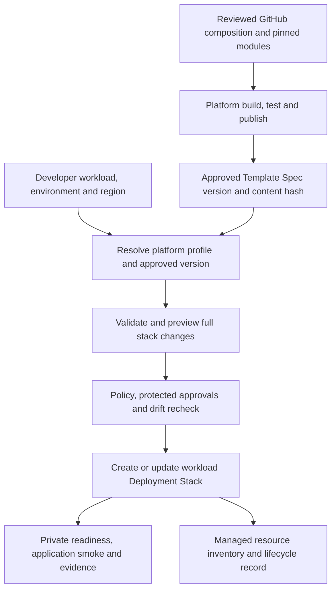

# Microsoft Learn assessment: self-service, Deployment Stacks and Template Specs

Reviewed 19 September 2026 against the current local checkout and official Microsoft Learn documentation. Azure/Microsoft Learn MCP tools were not available in this session; the sources below were accessed directly. This is a code-and-documentation assessment, not certification of Azure or Azure DevOps configuration. No Azure operations or deployment-code changes were performed for this review.

**Historical assessment:** the gaps below describe the checkout before the requested implementation. The subsequent [Deployment Stacks upgrade](deployment-stacks-upgrade.md) adds Template Spec publication, native stack preview/apply, subscription RG ownership and an `extends` entry template. Live Azure verification and platform configuration remain outstanding.

## Verdict

**The repository follows the developer-intent/platform-ownership model, but does not yet implement a Deployment Stacks plus Template Specs release architecture.** It is a locally tested, single-pattern self-service foundation. All targets remain disabled; enabled deployment is still awaiting live qualification.

Microsoft explicitly supports using existing engineering systems and parameterized workflows for self-service. Keeping GitHub and Azure DevOps is therefore appropriate; a new portal is not required. See [platform engineering systems](https://learn.microsoft.com/en-us/platform-engineering/engineering-systems).

## Findings against the checkout

| Area | Current evidence | Assessment |
|---|---|---|
| Developer intent | `config/platform.json`, `scripts/platform-contract.ps1`, generated Deploy menu | Aligned: four intent selectors resolve reviewed platform bindings; unsupported capabilities fail. |
| Composable infrastructure | `main.bicep`, `modules/`, generic endpoint module | Aligned for blob transfer. No general private-API/SQL/Key Vault catalog yet. |
| Central infrastructure | Existing DNS/subnet/resolver/workspace IDs and preflight | Partially qualified: implemented, but routing, permissions and resolution have only offline evidence. |
| Deployment Stacks | `Invoke-ServiceApply` invokes `deployment group create --mode Incremental`; outputs are read from ordinary deployments | Missing: no stack creation/update, managed-resource inventory, deny settings or lifecycle receipts. The YAML job name `ApplyStack` is only a label. |
| Template Specs | Bundle freezes `main.json` and `parameters.json` | Missing: no publish workflow, versioned Template Spec ID, reader/publisher permissions or content verification on consumption. A pipeline artifact is not a Template Spec. |
| Registry / AVM | Separate ACR template; local module imports | Registry modeled only. Modules are neither published nor consumed from ACR; AVM migration remains unqualified. |
| Preview / validation | Provider validation, property gates, hashes and apply-time recheck | Useful existing controls; ordinary deployment results do not provide stack ownership/detach semantics. |
| Policy / protected pipeline | Two Policy definitions, deployment environments and sequential lock behavior | Incomplete enforcement: assignments and ADO resource checks must be configured externally and verified. |
| Artifact promotion / lifecycle | Each target run rebuilds; no teardown/import workflow | Missing approved-version promotion, stack adoption/recovery and controlled retirement. |

## How the components fit

- **GitHub:** reviewed source, tests, configuration and changes.
- **Bicep modules / optional private ACR:** reusable building blocks consumed when composing infrastructure.
- **Template Spec:** a published, versioned workload template shared through Azure RBAC.
- **Deployment Stack:** ownership and lifecycle management of one workload instance.
- **Azure DevOps:** request resolution, qualification, approvals, orchestration and evidence.
- **Azure Policy / RBAC:** enforcement independent of the pipeline's scripts.

These components are complementary, but using all of them is not a universal Microsoft requirement. Microsoft allows Git-hosted Bicep to be deployed directly through stacks when Azure-hosted distribution is unnecessary. Template Specs add value here if the platform wants a centrally published catalog of approved releases. See [Git versus Template Specs](https://learn.microsoft.com/en-us/azure/governance/blueprints/migrate-to-template-specs#when-to-use-a-git-repository-instead) and [Template Specs versus a module registry](https://learn.microsoft.com/en-us/azure/azure-resource-manager/bicep/template-specs).

Proposed target flow; **not implemented**:

## Changes needed before stack adoption

1. **Define ownership before changing commands.** Prefer a platform-controlled subscription-level wrapper for a dedicated workload RG when that boundary is appropriate. Keep hub, shared zones/resolver/workspace and existing destination outside workload ownership. Explicitly decide ownership of the role assignments created in the destination subscription; the destination account is existing, but `destination-access.bicep` creates grants there. Confirm cross-scope behavior in a disposable deployment.

2. **Resolve the two-phase resource set.** `New-ServicePlan` sets `deployFunctionApp` false for Foundation and true for Release. Existing-app Foundation runs are skipped today. With stacks, omission can detach or delete resources, so a resumed/bootstrap phase must never accidentally shrink the managed set. Design either one complete desired-state stack after bootstrap or disjoint foundation/runtime stacks with explicit references and no resource managed twice. Retain app-package sequencing and smoke tests.

3. **Create a real publication contract.** Publish a qualified composition version, pin its complete resource ID, preserve source commit and canonical template digest, and reject different content under an already approved version. Grant publish rights separately from deployment read rights. Template Spec versions can be updated, so a version label alone is not an immutability guarantee. See [Template Spec permissions/versioning](https://learn.microsoft.com/en-us/azure/azure-resource-manager/bicep/template-specs) and [version-content updates](https://learn.microsoft.com/en-us/powershell/module/az.resources/set-aztemplatespec).

4. **Add stack-aware preview and receipts.** Current Microsoft Learn documents `az stack-whatif` and stored `Microsoft.Resources/deploymentStacksWhatIfResults`, including Detach/Delete and property-level retrieval. Implement a dedicated parser and capture stack ID, prior managed inventory, intended membership, deny settings, unmanage behavior and exact content/parameter hashes. Recheck before apply. Stored preview resources require permission and retention/cleanup handling even though the preview does not apply workload changes. See [stack What-If](https://learn.microsoft.com/en-us/azure/azure-resource-manager/bicep/deployment-stacks-what-if).

5. **Preserve preview coverage when adding Template Specs.** Ordinary ARM What-If does not expand nested `templateLink` references, including nested Template Specs. A top-level versioned spec and nested linked specs are different cases. Qualify the actual packaging: prefer inlined module templates, verify the preview covers expected resources, and reject unsupported/incomplete analysis. If preview uses exported content, prove it matches the version applied. See [What-If limitations](https://learn.microsoft.com/en-us/azure/azure-resource-manager/bicep/deploy-what-if).

6. **Select lifecycle and deny policies through platform configuration.** Begin migration qualification with detach behavior to preserve data; detachment still removes management and requires review. Add DenyDelete only after permissions and operational paths are tested; do not default blindly to DenyWriteAndDelete. Require a distinct approved decommission workflow for destructive options. Test repeated deployment, removed-resource handling, interrupted phases, adoption and recovery. See [stack lifecycle and protection](https://learn.microsoft.com/en-us/azure/azure-resource-manager/bicep/deployment-stacks).

7. **Close enforcement gaps outside the repo.** Restrict service-connection use to approved pipelines; configure branch checks, reviewers, environment approvals and exclusive locks. If adopting the native Required Template check, introduce a centrally controlled `extends` template: current stage-template includes alone do not satisfy that contract. Assign and test Policy at intended scopes, with reviewed exceptions and least-privilege identities. See [ADO resource checks](https://learn.microsoft.com/en-us/azure/devops/pipelines/process/approvals).

Microsoft documents that deleting a parent RG can bypass protection for a resource-group stack and that resource moves have protection limitations. Subscription-level ownership of a dedicated RG, access boundaries and tested controls matter; stack deny settings alone are not a complete security boundary. Do not give developers permission to change the stack that enforces their restrictions. See [stack known issues](https://learn.microsoft.com/en-us/azure/azure-resource-manager/bicep/deployment-stacks-known-issues).

## Current documentation caveats and product direction

The dedicated stack What-If page documents the feature and commands, while the known-issues page still says it is unavailable. Treat the dedicated feature/CLI references as implementation guidance, then verify the pinned agent CLI, API and target cloud before enabling it. The earlier architecture review's unresolved documentation conflict is not a reason to claim stack preview cannot be implemented.

Azure Deployment Environments is a separate product from Azure Deployment Stacks. Its current retirement guide says ADE retires **22 February 2027**, and lists direct ARM/Bicep, AVM and Azure DevOps/GitHub workflows among transition approaches. Do not introduce ADE as a new dependency for this platform. This does not retire Deployment Stacks or ADO deployment environments. See [ADE retirement guidance](https://learn.microsoft.com/en-us/azure/deployment-environments/deployment-environments-retirement-guide).

## Recommended implementation order

1. Agree and encode workload/RG/shared-resource lifecycle boundaries.
2. Add Template Spec publish/read/pin/hash contracts and approved-version promotion.
3. Add the stack wrapper, preview adapter, managed-resource evidence and guarded apply path behind a disabled platform option.
4. Configure external Policy/RBAC/ADO protections and the required private build/deployment connectivity.
5. Qualify create, update, no-change, recovery, detach and approved teardown in a disposable environment before enabling dev.

Keep the simple developer menu. Neither Template Specs nor Deployment Stacks automatically supplies cascading ADO dropdowns; version/topology choices should continue to be resolved by the reviewed platform catalog.
