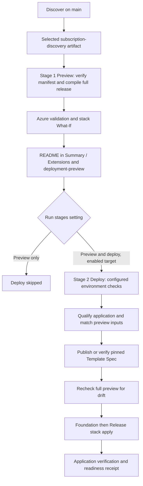

# Pipeline flow and refactor

[Wiki home](README.md) · [Workload catalog](workload-catalog.md) · [Status](completion-status.md)

**Recovery policy evidence:** workload Preview now publishes `recovery-policy.json` and an explanatory summary section; the deployment coordinator annotates its final receipt after resolving the target policy. Eligibility remains `Not assessed`, with no recovery executor. [Recovery rules](recovery-rules.md) describes the offline rule checks and portal views. No recovery YAML or queue-time option is registered.

**Tag governance update (27 September 2026):** subscription evidence, deterministic checks, structured Codex advice, editable drafts, source proposals and two manual ADO pipelines are implemented locally. Apply is disabled until onboarding and live acceptance. See [the tagging guide](tag-governance.md) for current methods, source structure, permissions and limits. Earlier dated verification records remain historical.


**Register the suite:** [ADO setup](ado-pipeline-registration.md) creates missing root entry-point definitions from the portal after review. Registration itself does not execute any of the stages below.

The separate [AVNM network allocation flow](network-discovery-and-diagrams.md) uses `azure-pipelines-network.yml`, registered as **Network - AVNM allocation**. Its manual menu defaults to read-only Plan. Reservation requires the protected `platform-network-allocation` environment; the optional create path adds exact-prefix PreviewNetwork and separately approved ApplyNetwork stages. It publishes `network-plan`, `network-reservation`, `network-preview` and `network-binding`. These are connectivity evidence, not substitutes for workload discovery manifests or deployment approval. Existing workload pipelines below retain their own flow.

**Seven-product routing:** fourteen dedicated menu roots now feed the existing Discover and Preview/Deploy templates. Five offerings use the shared product adapter and bundle schema v3; infrastructure-only offerings have no application package and use Release directly in the dedicated flow. See [exact menus and methods](workload-onboarding.md). Existing Blob copy/Event flow adapters and older generic sequencing remain compatibility paths.

[Platform Studio](local-portal.md) is an optional local entry point to these same four dedicated YAML definitions. It resolves definition IDs, reviews allowlisted parameters, pins a selected discovery run and queues main only after confirmation. It adds no YAML stages and cannot bypass disabled targets, artifact checks or ADO environment approvals. Live integration acceptance is pending registration.

For the resource catalog, exact methods and current verification boundaries, see [how self-service works](self-service-catalog.md) and [completion status](completion-status.md).

Event flow discovery now saves a [prerequisite resource plan](prerequisite-resolution.md): reuse compatible selected resources, create absent standard resources within the workload stack, and block when inventory is unknown. Rerun Discover before using this behavior.

The manual Build definition and four workload-specific Discover/Deploy definitions use the same GitHub checkout. Two original generic roots remain compatible with existing ADO definitions. Discovery supplies verified inventory. Deploy freezes its own release, publishes the compiled infrastructure as a Template Spec, then manages the workload through a Deployment Stack. Reusable Bicep modules remain local to this repository; no module registry is required.

## Entry points

Discover now runs `Export-SelfServiceAnalysis.ps1` after inventory when the saved manifest/inventory pair exists, including partial-evidence cases. It publishes an additional offline summary and retains static SVG/Mermaid/JSON under `subscription-discovery/analysis/`. The renderer does not call Azure or change handoff inputs; a failed discovery remains failed. The authored pipeline change is locally checked but has not been accepted in a live ADO run. [Report semantics](self-service-analysis.md)

Recommended menus: `Discover - Blob copy` (`/azure-pipelines-blobcopy-discover.yml`), `Deploy - Blob copy` (`/azure-pipelines-blobcopy-deploy.yml`), `Discover - Event flow` (`/azure-pipelines-eventflow-discover.yml`), `Deploy - Event flow` (`/azure-pipelines-eventflow-deploy.yml`). Each fixes the workload type and exposes only its summaries. Each Deploy definition selects runs from its own named Discover definition. [Registration steps](self-service.md#register-the-new-definitions-in-ado) are required; the dedicated Deploy menus use the two-stage flow below; protected resource names remain unchanged.

The table below lists the original generic entry points retained for compatibility.

| ADO definition | YAML path | Purpose |
|---|---|---|
| Build / Validate | `/azure-pipelines.yml` | Compile, test, exercise local runtime and package; no Azure deployment. |
| Discover (`Enetact.Bicep`) | `/azure-pipelines-self-service.yml` | Read selected subscription scope and publish `subscription-discovery`. |
| Deploy | `/azure-pipelines-self-service-deploy.yml` | Select workload type/name, environment and region; choose the discovery run under **Resources > discovery**. |

Push, PR and discovery-completion triggers remain disabled. Deploy downloads the exact selected discovery run. The standalone Build artifact is for validation/inspection; Deploy does not consume or promote its application ZIP.

The native Resources picker operates before queueing. A discovery artifact cannot populate a new interactive form midway through an executing YAML pipeline. Platform owners review inventory, update approved target configuration and regenerate the catalog. See Microsoft's [pipeline resource picker](https://learn.microsoft.com/en-us/azure/devops/pipelines/process/resources?view=azure-devops#manual-resource-version-picker) and our [discovery handoff guide](subscription-discovery.md).

**All eight checked-in targets remain disabled.** Dedicated Deploy menus default to hosted Preview and can analyze fully configured targets while keeping workload deployment disabled. Placeholders and missing Azure permissions produce blockers. Legacy generic Deploy retains `SetupOnly` for disabled targets.

## Workload routing

`config/workloads.json` identifies both patterns and their allowlisted composition/wrapper/package/phase contracts. Blobcopy keeps the Function qualifier and phase parameter `deployFunctionApp`. Eventflow uses `qualify-logic-app.yml`, deterministic Standard workflow packaging and `releaseActivated`. Its schema-2 discovery/bundle cannot be substituted with blobcopy artifacts.

Eventflow Qualify compiles/tests but does not run a local Logic Apps host. In ApplyRelease it applies the stack first, then deploys/compares workflow files, verifies indexing and waits for a matching synthetic receipt. Blobcopy retains its original Function deployment and three-request smoke path. The dedicated menus group qualification, publication and Foundation/Release execution inside stage Deploy. The legacy generic menu retains the six-stage map below; those detailed action rows describe blobcopy unless otherwise stated. See the [Event Flow action/method map](../workloads/logic-app-event-grid/README.md). The standalone Build also packages both applications.

## Dedicated two-stage flow



Preview uses hosted `windows-latest` and publishes failed as well as successful reports. It performs management-plane validation using local compiled Bicep, before Template Spec publication or application packaging. It creates/deletes temporary stack What-If metadata only. The full infrastructure release includes the application host; ZIP contents are outside ARM What-If. [Full report, method and permission details](deployment-preview.md).

Deploy contains sequential `BuildBundle`, `PublishTemplateSpec` and `ApplyStack` jobs. Frozen infrastructure/discovery/source must match Preview; a fresh full What-If must match its fingerprint before workload apply. Environment approvals and exclusive locks must be configured outside YAML; selecting both stages does not create an approval automatically. The private jobs are excluded at compile time for Preview-only or disabled selections.

## Legacy generic six-stage flow

The following map applies to `/azure-pipelines-self-service-deploy.yml`. It remains compatible with existing ADO definitions; use a dedicated workload Deploy definition for Preview-first execution.

| Stage | Implementation and actions | Artifact | Agent / gate |
|---|---|---|---|
| Discover | `Export-DeploymentInventory.ps1`: scoped subscription/network/DNS and optional ADO inventory; distinguishes empty from unknown results. | `subscription-discovery` | Hosted Windows; authorized discovery connection. |
| Qualify | `Test-DiscoveryHandoff.ps1` verifies manifest, source run, scope and freshness. Shared qualification compiles/tests, runs recovery and local-host smoke. `Build-Package.ps1` packages the app; `New-SelfServiceBundle.ps1` freezes parameters, costs, discovery, application and stack template hashes. | `self-service-bundle`, `self-service-tests` | Hosted Windows; enabled target, manual main, valid handoff. |
| PublishTemplate | `Publish-WorkloadTemplate.ps1` checks provenance and publisher bindings; publishes or verifies the exact content-hashed Template Spec version. | `template-publication` | Private publisher pool; protected publication environment. |
| PlanFoundation | `Invoke-SelfService.ps1 -Action PlanFoundation` validates prerequisites, ownership, published content and native stack What-If; saves approval fingerprint. | `plan-Foundation` | Private deployment pool; deployment connection. |
| ApplyFoundation | `Invoke-SelfService.ps1 -Action ApplyFoundation` rechecks the saved plan and applies initial foundation. An already released stack skips foundation mutation. | `result-Foundation` | Protected deployment environment, approval and exclusive lock. |
| PlanRelease | `Invoke-SelfService.ps1 -Action PlanRelease` previews the complete runtime-enabled stack and freezes its fingerprint. | `plan-Release` | Private deployment pool; deployment connection. |
| ApplyRelease | `Invoke-SelfService.ps1 -Action ApplyRelease` rechecks the approved plan, uploads/verifies the package, applies the same stack and checks private connectivity, five indexed Functions and three smoke requests. | `result-Release` | Protected deployment environment, approval and exclusive lock. |

Every legacy enabled stage depends on its predecessor succeeding. Apply consumes the matching current-run plan and bundle. A failed/missing plan cannot authorize apply. Plan stages write temporary Azure preview metadata; they differ from read-only Discover. See [stack ownership, preview cleanup and recovery](deployment-stacks-upgrade.md).

## Source and deployment responsibilities

```text
modules/*/main.bicep                       reusable resource implementations
workloads/<type>/modules/*.bicep    workload-specific compositions
               ^ local relative references
workloads/<type>/main.bicep                resource-group composition
workloads/<type>/stack.bicep               subscription wrapper and owned RG
               | compile during Qualify
self-service-bundle/stack-template.json   embedded ARM templates
               | protected publication
Template Spec / sha256-<content hash>      pinned infrastructure version
               | preview and approved apply
Subscription Deployment Stack            tracks dedicated workload resources
```

The Template Spec packages the compiled composition; the Deployment Stack tracks ownership and lifecycle. Neither needs to clone GitHub or fetch source modules at deployment time. `platform/registry/main.bicep` remains a deferred source template compiled by project checks. There is no ACR deployment, module publication or registry dependency in this flow.

Environment values live in `workloads/<type>/environments/`; platform policy in `config/platform.json`; publication/lifecycle settings in `config/deployment-stack.json`; approved bindings in `self-service/targets/`. The catalog generator owns all six self-service roots (four dedicated and two generic), `pipelines/deploy-entry.yml` and `pipelines/catalog-bindings.yml`. Change their source configuration and regenerate instead of hand-editing generated routing.

## Refactor delivered

- `pipelines/templates/steps/qualify-application.yml` supplies identical tool installation, contracts, recovery, local-host checks, cleanup and packaging to Build and Deploy. Separate task names pinpoint failures. Packaging retains the default success condition.
- Local-service cleanup is a dedicated `always()` step, with a five-minute cancellation allowance. It stops only services recorded as owned by local mode. Cancellation before the job starts or agent loss can prevent cleanup/evidence; these steps are best effort.
- `steps/publish-qualification.yml` collects all available project, tooling, self-service, discovery, cost, platform, stack, recovery and local-host evidence. Missing test files before tests start no longer cause a second failure; failed tests still fail the run. Build's `validation-evidence` groups results under those folders, including `project/unit.trx`. Its `blob-transfer` and optional `local-host-evidence` names remain stable.
- `steps/prepare-stage-evidence.yml` creates run/stage/attempt/commit context before downloads and Azure sign-in in publication, preview and apply jobs. Publication now cleans its workspace too. Failure/cancellation uploads require a successfully prepared directory, avoiding an additional missing-directory error.
- Disabled setup guidance now covers the Template Spec catalog, publishing identity/environment, external checks, fresh stack-owned RG and local-module model. It is retained as `setup-guidance`.

This follows Microsoft's [include and extends templates](https://learn.microsoft.com/en-us/azure/devops/pipelines/process/templates?view=azure-devops). `deploy-entry.yml` remains the Required Template entry. Cleanup/evidence follow [ADO condition and cancellation semantics](https://learn.microsoft.com/en-us/azure/devops/pipelines/process/conditions?view=azure-devops); deployment actions retain success dependencies.

## Inspecting a run

1. Open the first failed task and its log. Qualification actions now have separate names.
2. Inspect artifacts. `pipeline-context.json` means an Azure stage entered its job, not that its action succeeded. If `receipt.json` is absent, check download, authentication or interruption logs.
3. For dedicated pipelines, review `deployment-preview/README.md` in Summary / Extensions before approving Deploy. Drift requires a fresh preview. Configure an exclusive lock on the protected deployment environment. Legacy runs retain separate Foundation/Release approvals and rechecks.
4. Inspect `deployment-result/receipt.json` and its phase/smoke evidence (legacy: `result-Release/receipt.json`). Discovery, publication, Foundation or setup success does not establish workload readiness. Failure can leave resources in Azure; there is no automatic rollback or destructive teardown.

## Platform rollout and checks

Keep targets disabled until [onboarding](deployment-stacks-upgrade.md#platform-setup-and-exact-local-checks) is complete: catalog RG, scoped federated connections, deployment/RBAC/deny permissions, private agents/network paths, protected environments, main-branch/Required Template checks, approvals and exclusive locks. These ADO settings live outside YAML. Do not precreate the workload RG. Module registry setup is excluded.

From the repository root, validate configuration/source changes in this order:

```powershell
./scripts/Update-ServiceCatalog.ps1
./scripts/Test-Project.ps1
./scripts/Update-Manifest.ps1
./scripts/Update-Manifest.ps1 -Check
```

After merge, run Discover on main and inspect its artifact, then select that matching successful run in Deploy. Enable dev first only after platform onboarding. Verify server-expanded stages and resource authorization before approving Azure actions. Local checks cannot prove ADO expansion, UI rendering, permissions or Azure behavior. See [dated validation evidence](validation.md).
