# Deployment evidence timeline and reviewed recovery

**27 September 2026 — source audit and implementation design, not a delivered rollback feature.** The existing Preview/Deploy path is implemented; a durable before/after timeline and recovery execution are not. This plan extends the [workflow standard](../agent-workflow-standard.md) and [deployment Preview](../deployment-preview.md). No target enablement, new pipeline registration or Azure change follows from this document.

**Subsequent rules increment implemented:** [Recovery rules](../recovery-rules.md) documents fourteen registered policies, an executable offline assessor, portal policy views and Preview/receipt annotations. This delivers the policy portion of R2, not retained-baseline verification or recovery execution. The original source audit below remains the pre-increment baseline. Planned `config/recovery-capabilities.json` now exists; its `executionEnabled` must remain false. The current assessor lives in `scripts/recovery-common.ps1`; the proposed `SelfService.Lifecycle` library is not introduced by this increment.

## What exists today

| Requested state | Current evidence and code | Gap |
|---|---|---|
| Before | `AzureDiscovery.Discover` and the deterministic observed topology show browser-visible configuration. A same-subscription snapshot can be compared with the selected proposal. | This page-session snapshot is not a retained, run-bound deployment baseline or backup. |
| Prepare | `New-WorkloadPreviewInputs` compiles and freezes the selected target, discovery, effective parameters and templates. Portal proposals come from reviewed `config/portal-topologies.json`. | Proposed diagrams are conceptual components, not expanded/evaluated Bicep instances. |
| Azure What-If | `New-StackPreview` runs `az stack sub validate` and `az stack-whatif sub create` with Provider validation. `Convert-StackPreview` checks scope, ownership, certainty, property changes and security. The pipeline uploads a README summary and `deployment-preview` artifact. | Prediction remains subject to provider limitations; successful local contracts do not prove live Azure acceptance. |
| Preview visual | `AdoGateway.Preview` verifies the registered run and retrieves the bounded artifact. `PreviewDiagram.Read` projects resource actions; `previewTopology` renders them. | Property-level details remain in the artifact/ADO summary. This display reader is not the deployment approval validator. |
| Apply and verification | `Invoke-PreviewedWorkloadDeployment` verifies the same frozen bundle, rechecks Preview, then invokes product plans/apply and readiness checks. `deployment-result/receipt.json` records status, outputs and available smoke/acceptance evidence, including failures. | The portal status reader returns run status; completed runs load Preview again. There is no connected observed-after/reconciliation diagram. |
| Rollback | No common recovery adapter, recovery pipeline or rollback button exists. | An old template, inventory, What-If response or Mermaid diagram is not a restorable environment snapshot. |

The dedicated workload menus share `pipelines/templates/self-service-two-stage.yml`. Preview-only remains available independently of Deploy. Normal deployment rejects Delete, Detach, potential/unknown changes and ownership loss. A rollback implementation must preserve these controls; adding a button cannot bypass them.

Microsoft documents [stack What-If](https://learn.microsoft.com/en-us/azure/azure-resource-manager/bicep/deployment-stacks-what-if) as a prediction stored in a separate result resource. Our command creates that metadata and attempts to delete only its own result in `finally`; it does not apply the workload during Preview. Cancellation can interrupt cleanup. The present `P1D` retention requires explicit cleanup; use the documented automatically expiring interval in a future cleanup hardening change.

## User experience to implement

Use one evidence timeline on the deployment detail page. Every tab shows its run, target, capture time, coverage and evidence hash. The user must be able to reopen it after a page refresh or a later browser session, subject to artifact permissions/retention.

```mermaid
flowchart LR
    B[Observed before] --> P[Prepared proposal]
    P --> W[Azure What-If]
    W --> A[Protected Deploy]
    A --> O[Observed after]
    O --> V[Reconciliation and product verification]
    V --> R[Plan rollback when supported]
    R --> C[Fresh recovery Preview]
    C --> G[Protected recovery approval and apply]
    G --> F[Observed recovery result and verification]
```

These are evidence/lifecycle states, not necessarily separate ADO stages. Keep normal Preview and Deploy; capture and verification are jobs/steps. Recovery is a new manual run with Preview, protected Apply and always-attempted Verify stages.

| Tab or action | Required meaning |
|---|---|
| Observed before | Frozen, bounded ARM configuration read for the exact workload scope. Show shared/referenced resources separately from stack-owned resources, and missing/denied reads as unknown. Capture before Preview and recheck before the first write. |
| Prepared proposal | Reviewed component model plus effective settings. Label conceptual groups separately from expanded instances. |
| Azure What-If | Actual Azure resource actions and redacted property deltas bound to the prepared bundle. Unknown is never “no change.” |
| Observed after | Fresh reads following Apply, including partial failures. Azure provisioning success alone cannot produce a Verified badge. |
| Confirmation | Compare the approved changes, applied ownership and allowlisted observed properties; include product verification results. Show Confirmed, Mismatch, Incomplete or Unknown outcome, with reasons. |
| Plan rollback | Assess eligibility and construct a reviewable recovery plan; opening it performs no resource mutation. Show disabled reasons when no qualified recovery exists. |
| Preview recovery / Apply reviewed recovery | New current-to-target What-If, then a separately protected ADO Apply. Never reuse the original forward Preview as recovery approval. |

The Microsoft resource-visualizer skill can optionally explain the frozen before, Preview and after evidence through the existing AHP/Codex/MCP path. Deterministic views must work without a model. Extend the diagram evidence contract before asking the model for proposed or deleted nodes: the current visualizer validates against observed resource/relationship evidence. Do not relabel invented edges as verified, or feed an agent's diagram into execution. Keep **Agent interpretation** separate from observed configuration and Azure predictions.

## What “rollback” can mean

The supported goal is **restore a previous qualified configuration**, with explicit exceptions. It is not a promise to return every byte, identifier or side effect to the original state.

Microsoft's [rollback-on-error](https://learn.microsoft.com/en-us/azure/azure-resource-manager/templates/rollback-on-error) redeploys a previous successful resource-group deployment in complete mode. It is not the rollback mechanism for this repository's subscription-scoped Deployment Stacks and must not be added as a stack command flag.

Maintain two different baselines:

1. **Observed before:** actual collected state, including drift and collection gaps. This supplies comparison evidence, not automatically executable source.
2. **Previous qualified release:** exact template/Template Spec version, effective parameters, stack settings and application package digests that passed the product's acceptance checks. This supplies the recovery candidate. Do not silently select the latest successful ADO run; Preview-only or partially ready runs do not qualify.

If these disagree, explain which settings the candidate would restore and require review of the differences. Never generate executable inverse Bicep from a What-If diff or from AI advice. A resource GET/export can omit secrets, contain read-only properties and lack application data; it is not a recovery package.

| Workflow / product | Proposed recovery policy | Essential exclusions |
|---|---|---|
| Discovery, diagrams, agent reviews and source drafts | Not applicable: re-run reads or retain/discard the local draft through its normal lifecycle. | No cloud rollback button; retain audit receipts. |
| Private Storage Workspace | Reapply qualified mutable configuration, where provider compatibility is proven. | Blob/file contents, deleted accounts, data-plane ACLs and irreversible settings need separate recovery. No automatic deletion of new storage. |
| Key Vault | Qualified configuration restore after identity/policy checks. | Secret/key contents and versions, purge protection, deleted vault recovery and lost identity cannot be reconstructed from Bicep. |
| Observability | Qualified workspace/diagnostic configuration restore. | Deleted/expired logs and retention side effects are not recovered. |
| Blob copy / HTTP API | Compatible prior infrastructure plus the exact retained application package, with product smoke checks. | Copied data, external requests, identity replacement and incompatible state/schema changes are separate. Never replay transactions as rollback. |
| Event flow | Compatible prior workflow/configuration/package with trigger and connector review. | Delivered events and downstream actions remain delivered. Restoring triggers can resume processing; require explicit operational review. |
| Service Bus worker | Compatible hosting/package and namespace/entity configuration. | Consumed messages, acknowledgements, external effects, queue recreation and message replay require product-specific procedures. |
| External-resource tag changes | Compensating per-key operations from the before/apply receipts, with current-value conflict checks. | Existing Merge-only Apply cannot remove a newly added key. Add and qualify scoped removal separately; never replace the entire old tag dictionary. |
| Source-owned tags | Revert the reviewed source settings and use normal workload Preview/Deploy. | Do not patch behind the source of truth. |
| Network / AVNM IPAM | Manual recovery assessment initially; preserve reservations and owned resources. | Detaching/deleting a resource does not prove its address space can be released. Require durable allocation/reference reconciliation and a separate qualified release operation. |
| ADO definition registration | Reconcile recorded Created/Reused/Uncertain outcomes. | Do not delete reused definitions or delete created definitions that may now have runs/users. No automatic inverse batch. |

First deployment has no earlier qualified release. Offer a retained-resource inventory and separate reviewed retirement/cleanup plan, not “rollback to nothing.” If an earlier release omits newly managed resources, today's Delete/Detach guards must block it. `detachAll` leaves resources behind and loses ownership; it is not an exact restore. A supported recovery composition must preserve those resources or wait for a separately reviewed decommission workflow. Do not switch to `deleteAll` to make a plan pass.

## Contracts and source placement

The following files/contracts are **proposed**, not existing APIs. Keep reusable evidence/recovery logic separate from portal transport, pipeline entry points and workload adapters.

| Location | Implementation responsibility |
|---|---|
| `src/SelfService.Lifecycle/` with matching unit tests | Typed evidence, baseline, eligibility and reconciliation contracts; provider/property allowlists and schema versions. No generic ARM property replay. |
| `scripts/workload-preview-common.ps1` and product adapters | Capture before, pre-apply drift evidence and after; produce retained evidence even when product verification fails. Preserve primary errors if evidence collection also fails. |
| `pipelines/templates/self-service-two-stage.yml` | Publish `deployment-state` with before/after/reconciliation and redacted README summary. Link it to existing `deployment-preview`, `self-service-bundle` and `deployment-result`. |
| `src/SelfService.Portal/DeploymentState.cs` plus `AdoGateway` routes | Verify registered definition, repository, branch, run, target, commit and artifact hashes before returning safe display projections. Reuse bounded archive and token-separation controls. |
| `src/SelfService.Portal/wwwroot/deployment-state.mjs` | Durable run selector, state tabs, action table/diagrams, evidence downloads and capability-specific recovery controls. Never infer Ready from whole-run success. |
| `config/recovery-capabilities.json` | Versioned code-allowlisted adapters and required evidence by workflow/product. A config entry alone cannot enable recovery. Default unavailable until qualified. |
| `scripts/New-WorkloadRecoveryPlan.ps1` and `scripts/Invoke-WorkloadRecovery.ps1` | Validate historical candidate/current state, run fresh What-If, enforce policy/ownership, apply exact approved candidate and verify. Invoke qualified product code, not model-produced commands. |
| `azure-pipelines-recovery.yml` and `pipelines/templates/recovery.yml` | New manual protected Preview/Apply/Verify path. Update generated registration/catalog assets together when this exists. No CI trigger and no automatic recovery after failure. |
| `SelfService.Tagging` and network lifecycle adapters | Domain compensation/preconditions; retain independent tag/network evidence and gates instead of pretending every workflow is a Bicep workload. |

Minimum `DeploymentEvidence` fields: schema, tenant/subscription, target and stack ID, run/definition/repository/commit, prepared bundle digest, snapshot phase/time, collection coverage, owned/reference-only resources, supported property values, errors classified without secrets, artifact digests and verification result. Resource type/API version and normalization rules are required for meaningful property comparison. Missing reads remain unknown; tolerate provider convergence with a bounded retry deadline, not indefinite polling or a false success.

Minimum `RecoveryCandidate` fields: baseline qualified run, current affected run, previous Template Spec/version/content hash, source commit, parameter/package digests, stack ownership/settings, adapter/contract version, restore scope, preserved resources, exclusions, secret references and retention expiry. Keep secret values out of generic snapshots and browser downloads. A secure external reference must resolve to the approved version; never roll credentials backwards implicitly.

Minimum `RecoveryPlan` fields: candidate/evidence digests, exact current-state fingerprint, deterministic eligibility/block reasons, actions/property differences, unsupported effects, freshness deadline, protected target bindings and approval context. Apply must resolve artifact IDs against registered ADO definitions; reject arbitrary artifact URLs, script paths, inline templates and old-run code execution.

Use current protected recovery code to consume a compatible retained release. Do not blindly rerun an old pipeline definition/commit, bypass today's security policy, or select an arbitrary older vulnerable package. Each candidate must pass current qualification and compatibility checks. Missing/deleted artifacts or unsupported schema versions block recovery; no model reconstruction fallback.

## Execution, retention and failure rules

- Retain qualified releases and their evidence beyond the agreed recovery window in access-controlled durable storage. Document ADO retention, Template Spec immutability, package retention, deletion protection and owner/RPO/RTO decisions before enabling a target. Current ordinary pipeline artifacts alone do not establish this service guarantee.
- Serialize operations for the same target across forward deployment, recovery and relevant tag/network actions using a common protected environment with an exclusive-lock check configured in ADO. YAML `lockBehavior` alone does not create that check. Re-read state under the lock and compare the approved fingerprint immediately before writes.
- Enable eligible recovery only after explicit user selection, a fresh Preview and protected environment approval. Sign-in, a failed deployment or an agent recommendation never starts it.
- Freeze the restore candidate once reviewed. Changes to live state, policy, package, source, secrets reference or desired parameters invalidate the approval and require a new plan.
- An apply may partially succeed. Persist step outcomes and resource IDs; always attempt after-state collection without masking the original failure. If the agent is cancelled or the response is lost, mark Unknown outcome and reconcile Azure before retrying. Absence of a receipt is not proof of no writes.
- Tag compensation changes only keys owned by that operation and only when the current value matches what it applied. Preserve unrelated edits. Generic tag writes are not a proven atomic transaction; serialize platform writers and block/flag concurrent external conflicts without promising race-free restoration.
- Post-recovery confirmation requires configured-property reconciliation and product-specific verification. Report “Configuration restored; data excluded” where appropriate, never “Environment restored” from template success alone.

## Delivery phases and acceptance

| Phase | Deliverable | Acceptance boundary |
|---|---|---|
| R0 — this audit | Current-state matrix, recovery policies and source placement. | Documentation plus existing mocked Preview/pipeline checks only. No recovery code or new UI state delivered. |
| R1 — evidence timeline | Run-bound before/after collection, artifact and redacted property/action projection, portal timeline. | Tests for scope/hash mismatch, stale selections, denied reads, partial apply, provider normalization, cancellation and reopened historical runs. Verify against a real authorized ADO run before calling it live accepted. |
| R2 — recovery assessment (policy portion delivered) | Fourteen policies, offline checks, portal explanations and pipeline policy evidence are implemented. Trusted retained-release resolution and verified recovery drafts remain planned. | Offline caller assertions never authorize execution. First deployment, expired/missing baseline, shared resources, drift, incompatible package/schema and Delete/Detach must fail closed in the future trusted adapter. |
| R3 — configuration recovery pilot | Current-code manual recovery pipeline, fresh Preview, protected Apply and Verify for one narrowly qualified mutable configuration update. | Prove lock, approval, immutable binding, after-state and smoke checks in an authorized disposable target. Adding one adapter does not qualify all products. |
| R4 — qualified adapters | Tag compensation, app/package recovery, remaining infrastructure products; network manual recovery remains explicit. | Per-product conflict, data preservation, partial failure and operational drills. Separate registration and enablement review for each adapter. |

Required manual scenarios: deploy a first release (no earlier recovery); change a supported setting (restore earlier value); add a stateful resource (automatic removal blocked); edit outside the pipeline while approval waits (drift blocked); fail after partial apply (honest after-state); expire a historical artifact (blocked); restore app code with smoke checks; compensate one tag while preserving another user's unrelated tag; interrupt a run after Azure accepts the request (Unknown, then reconcile); deny a snapshot read (Incomplete, never empty-success). Record run IDs and before/Preview/after/recovery artifact hashes. Keep targets disabled until their own acceptance gates pass.

This design adds no universal “undo” command. It defines a consistent recovery experience whose enabled actions depend on deterministic evidence and a tested product adapter.
