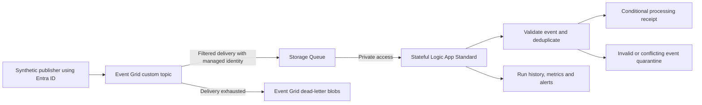

# Implementation plan: Logic App and Event Grid workload

Status: repository implementation completed and locally verified, 19 September 2026. The sections below preserve the implementation plan. The [delivered runbook](../../workloads/logic-app-event-grid/README.md) is authoritative for current behavior, methods, exceptions and limits. Both pattern menus, modules, composition/wrapper, workflow package, typed discovery/bundle and guarded deployment adapters are implemented. All eight targets remain disabled; Azure acceptance and platform configuration remain outstanding. Module registries are excluded.

Delivery decisions: use HTTP actions with managed identity for Storage Queue/Blob operations; use a reviewed key-based private runtime mount; require Azure-provided DNS with linked zones for this V1; monitor queue count (age monitoring deferred). No local Logic Apps runtime execution, automated replay, content rollback/slots or application promotion is claimed. See [verification evidence](../validation.md).

## Objective and proposed product

Add a second independent workload pattern, `logic-app-event-grid`, with example registered instance `eventflow`. A developer selects it through the existing self-service Deploy definition and receives an independently owned resource group, Deployment Stack, versioned Template Spec, workflow package and readiness evidence. Keep `blob-transfer` / `blobcopy` working unchanged.

The example accepts synthetic `Document.Received` notifications, validates a versioned metadata contract and writes an auditable processing receipt. It demonstrates production deployment mechanics without adding claims adjudication, payment actions, email or external business-system writes. Integrating events from blobcopy is a later, explicit integration; neither stack depends on the other initially.

Recommended first profile: **Logic App Standard, stateful workflow, Event Grid Basic custom topic, Storage Queue delivery bridge**. Standard fits the existing private-agent/private-network direction. This has fixed hosting and private-endpoint charges; it is not an all-free demonstration. Consumption with a public webhook would be a separate architecture/profile, not an interchangeable SKU toggle.



The topic's private endpoint controls publisher ingress. Event Grid Basic delivery to Storage uses the service delivery path, not our VNet private endpoint. The proposed bridge account uses a reviewed firewall/trusted-services policy and Event Grid's system-assigned identity. The Logic App accesses Queue/Blob through private endpoints and VNet integration. A platform policy requiring public network access disabled with no trusted-service exception blocks this profile; do not silently weaken the policy. Reassess Event Grid namespace pull delivery or another approved transport if that exception is unavailable. Microsoft describes [managed-identity delivery and firewall restrictions](https://learn.microsoft.com/en-us/azure/event-grid/deliver-events-using-managed-identity).

A direct managed Event Grid webhook trigger is unsuitable for the private-only Logic App ingress: Microsoft documents that these managed triggers require a publicly reachable endpoint. See [Standard networking limitations](https://learn.microsoft.com/en-us/azure/logic-apps/secure-single-tenant-workflow-virtual-network-private-endpoint).

## Planned resource inventory and ownership

| Resource | Workload responsibility |
|---|---|
| Dedicated resource group and subscription Deployment Stack | Own only this instance; no adoption of another workload's resources. |
| Logic App Standard site and Workflow Standard hosting plan | One initial stateful processing workflow; managed identity; restricted deployment endpoint. Select a supported reviewed SKU, initially evaluate WS1. |
| Runtime storage | Dedicated Logic App runtime/content/state storage; required services, mounts and identity/credential support verified before implementation. |
| Event/receipt storage | Queue, processing receipts, quarantine and Event Grid dead-letter container. Separate from runtime storage so its trusted-service exception is not applied to runtime storage. |
| Event Grid custom topic and event subscription | Entra-authenticated publishers, allowed event types/subject filters, retry/TTL policy, queue destination and dead-letter configuration. |
| Identities and RBAC | Event Grid delivery/dead-letter permissions; Logic App queue processing/receipt permissions; scoped synthetic publisher/readiness identity. |
| Private endpoints and DNS references | Topic ingress, site/deployment endpoint and required storage services. Reuse approved VNet/subnets and central DNS; do not own shared zones. |
| Monitoring | Application Insights where supported, diagnostics to approved Log Analytics, delivery failures, queue backlog/age, workflow failure, dead-letter and quarantine alerts. |

No Function App, external destination data lake, Event Grid namespace, Service Bus, module registry or business connector is required for this initial profile. Standard uses `Microsoft.Web/sites` with the appropriate workflow kind, not a Consumption `Microsoft.Logic/workflows` deployment. The site is infrastructure; workflow definitions/connections are application content deployed separately. Follow Microsoft's [Standard workflow build/deployment guidance](https://learn.microsoft.com/en-us/azure/logic-apps/automate-build-deployment-standard).

## Repository findings that make this a platform refactor

| Current coupling verified in the checkout | Planned change |
|---|---|
| `config/platform.json` and `Read-PlatformConfiguration` allow only blob-transfer and its composition. | Separate global platform policy from explicit, reviewed per-pattern definitions. |
| `Update-ServiceCatalog.ps1` generates blobcopy descriptions, Function resources and hosting costs. | Generate both patterns, exact valid intent combinations and per-pattern resource/cost reference text. |
| Target schema v2 has no workload type; validation requires blob smoke settings. | Introduce typed target schema v3, with explicit backwards compatibility for existing v2 blob targets. |
| `common.ps1` / `New-SelfServiceBundle.ps1` compile fixed blob-transfer sources and require `functions.metadata`. | Resolve approved sources and package contracts through a workload adapter. |
| `Read-ServiceBundle`, network/destination checks and smoke logic assume two Function storage accounts and a destination lake. | Common provenance validation plus workload-specific prerequisites, outputs, packaging and readiness. |
| `Get-WorkloadStackState` interprets `deployFunctionApp` as the release phase. | Adapter-defined monotonic phase contract; preserve the existing blob parameter and ownership IDs. |
| `config/deployment-stack.json` has one Template Spec name. | Shared publication policy plus distinct pattern-specific spec names; retain existing blob spec identity. |
| Shared qualification always runs .NET, Azurite and the blob Functions host. | Common repository checks followed by a statically selected workload qualification template. Build/Validate covers both; Deploy qualifies the selected workload. |

## Proposed source layout

All paths below are planned additions or changes, not files already delivered:

```text
config/workloads.json                         approved pattern definitions
workloads/logic-app-event-grid/
  README.md
  workload.json                               composition/package/capability contract
  request.schema.json
  request.example.json
  main.bicep
  stack.bicep
  environments/main.{dev,qa,uat,prod}.bicepparam
  modules/event-delivery.bicep                 topic/subscription/RBAC composition
  modules/workflow-host.bicep                  host/storage/monitoring composition
src/LogicAppEventFlow/
  host.json
  connections.json                            parameterized, no secrets
  parameters.json
  process-event/workflow.json
  local.settings.json.example
modules/logic-app/standard/main.bicep          reusable resource module if interface is generic
modules/event-grid/topic/main.bicep
modules/event-grid/event-subscription/main.bicep
scripts/workloads/logic-app-event-grid.ps1     approved adapter implementation
pipelines/templates/workloads/
  qualify-blob-transfer.yml
  qualify-logic-app-event-grid.yml
self-service/targets/eventflow.{dev,qa,uat,prod}.json
tests/logic-app-event-grid/                    schema, workflow and adapter fixtures
```

Reuse the existing storage/private-endpoint modules only where their interfaces support the required behavior. Do not silently change blob-transfer defaults to accommodate the new pattern. Continue using relative Bicep module references and compile a self-contained subscription wrapper for each Template Spec.

## Shared contracts and self-service UI

1. Define approved workload metadata: pattern ID, schema/version, composition and stack paths, package kind, required files, expected outputs, capabilities, phase semantics, cost model and adapter ID. Resolve adapter IDs through trusted code; never execute a script path supplied in an artifact or queue-time parameter.
2. Bind bundle and discovery identities to workload type, instance, environment, region, subscription, target key and source run. Hash the workload contract and application content as well as the ARM template. Reject cross-workload bundles, discovery manifests and plan artifacts before any Azure mutation.
3. Preserve existing blob stack/RG/spec names, ownership tags and phase behavior. New instance names must not collide with existing stack/RG identities. Intent uniqueness includes type and region; separately reject resource-ID collisions across catalog entries.
4. Keep the Deploy fields: workload type, registered workload, environment and region. Add `logic-app-event-grid` and `eventflow` only after their implementation qualifies. Native ADO choices are static rather than cascading: invalid combinations must fail in generated routing before Azure execution. Show clearly labeled descriptions/cost assumptions for both patterns instead of retaining Function-only summaries.
5. Add explicit workload type to the Discover selection and generated literal routing; retain the existing subscription/network scope choices. Inventory requirements are pattern-specific. For this pattern add relevant provider registration status, hosting availability/preflight signals, approved network/storage/monitoring resources and naming conflicts. Do not claim discovery proves capacity, permissions or readiness.
6. Preserve empty/unknown distinctions, successful-main-run provenance, freshness and exact selected-run download. Existing schema versions require an explicit adapter; never reinterpret an old blob discovery artifact as valid Logic App discovery.
7. New targets default to disabled. Their setup-only jobs remain hosted and reference no unavailable protected resources. Reuse the existing service connection only when its subscription and required permissions match; do not assume subscription access implies every necessary RBAC grant.

## Delivery sequence and acceptance gates

### Phase 0 — resolve service constraints

Before committing to Bicep interfaces, produce a small compatibility report and fixtures for:

- Event Grid queue delivery, system-assigned identity, firewall/trusted-service bypass and dead-letter access. Prove the proposed network exception is supported and platform-approved before enabling a target.
- Built-in Queue connector message encoding, visibility, retry and deletion behavior. Do not assume the Event Grid payload encoding matches the trigger's defaults. A recurrence plus explicit Get Messages/Delete is an acceptable first implementation if it gives clearer acknowledgement control. Microsoft documents [the built-in connector operations and identity options](https://learn.microsoft.com/en-us/azure/logic-apps/connectors/built-in/reference/azurequeues/).
- Standard runtime storage/content-share requirements, current identity support, private DNS/service endpoints and app/SCM deployment authentication. Prefer identity; if a required runtime mount still needs a credential, document the exact secure source/reference/rotation mechanism and prohibit it in outputs, artifacts and logs. Do not promise a wholly keyless runtime before verification.
- Supported Standard workflow package deployment, content replacement semantics, disabled-trigger startup and required tools. Pin compatible stable versions based on current documentation and local installed tools.
- Stack What-If support for every proposed resource and deployed setting. Existing uncertainty/destruction gates must remain strict.

Exit: documented choices and offline fixtures; later Azure dev acceptance must prove the network/runtime assumptions. No production enablement on documentation alone.

### Phase 1 — introduce the common workload contract

Add workload definitions, typed targets and static adapter selection. Extract blob-specific behavior behind the first adapter with no resource/name/lifecycle changes. Generalize compilation, bundle validation, costs, publication name resolution, discovery identity and readiness dispatch. Extend existing negative tests before adding the new pattern.

Exit: current blob suites pass; compiled infrastructure/environment parity is preserved apart from explicitly reviewed metadata; its current six-stage route and disabled behavior remain intact.

### Phase 2 — build the new workload and workflow package

Implement the modules, composition, subscription wrapper, workflow, schemas and disabled dev/qa/uat/prod profiles. Freeze a workflow ZIP/content manifest separately from its Template Spec; the stack owns Azure resources, not the contents of the deployed workflow package.

Use a small versioned event contract with event ID, event type, subject, timestamp, correlation ID and metadata only. Bound the fully encoded event to a conservative size, initially 16 KiB, and validate before processing. Never fetch an arbitrary URL provided by an event. V1 writes receipts only and has no irreversible external side effects.

Use a deterministic key derived from trusted topic scope plus event ID. Atomically create a receipt; repeat ID/same semantic payload is a no-op, repeat ID/different payload is quarantined. Validate conditional-write and concurrency behavior, including a crash after writing but before acknowledging the queue message. Acknowledge only after a durable receipt or quarantine entry. Bound business retries separately from Event Grid delivery retries. Dead-lettering only covers failed delivery to the queue, not a workflow that fails after delivery. Event Grid can redeliver and does not guarantee ordering; see [delivery/retry behavior](https://learn.microsoft.com/en-us/azure/event-grid/delivery-and-retry).

Exit: compiled infrastructure, deterministic package, workflow contract tests and failure fixtures pass. Local tests do not stand in for the hosted Logic Apps service.

### Phase 3 — integrate the existing six-stage pipeline

Keep the same three root entry files and six enabled deployment stages, with workload-specific qualification and apply/readiness handlers:

| Stage | Logic App / Event Grid behavior |
|---|---|
| Qualify | Validate selected discovery/intent; compile; validate workflow JSON, expressions, connection bindings and package layout; run supported local tests; freeze bundle and costs. No blob Functions metadata requirement. |
| PublishTemplate | Publish/verify the `logic-app-event-grid` content-hashed Template Spec in the approved catalog RG. |
| PlanFoundation | Preview owned host, storage, topic, delivery queue/subscription, identities, networking and monitoring. |
| ApplyFoundation | Create the empty runtime and supporting resources; buffer events in the queue until a qualified workflow is deployed. Never reset an already released instance during a later Foundation run. |
| PlanRelease | Preview final infrastructure settings and review the workflow package/version/diff alongside the ARM plan. ARM What-If cannot inspect application ZIP changes. |
| ApplyRelease | Recheck infrastructure plan and package hash; apply runtime settings; deploy workflow content via the supported authenticated private deployment path; verify content/workflow inventory; activate and smoke-test; then write Ready. |

The Logic App release order differs from the Function package-before-app model. The adapter must state that order explicitly. Pin package identity in the approved plan; reject unexpected workflow removal and stale package substitution. A successful ARM deployment with failed workflow deployment remains **NotReady**. Record each substep so an approved retry reconciles partial application deployment without deleting resources or weakening stack ownership checks. Define and test the deployment interruption window; do not promise zero-downtime workflow updates.

Preserve approvals, Required Template/main-branch checks, exact protected-resource bindings, sequential apply locks, plan expiry/drift rejection, deny/lifecycle controls and failure evidence. Infrastructure versions can be reused by hash. Cross-environment promotion of identical application bytes is still a separate feature; it must be implemented before production if release policy requires it.

Exit: offline expansion validates both patterns and all registered environments; invalid cross-pattern selections fail; disabled routes stay hosted-only; existing blob behavior is unchanged.

### Phase 4 — developer summaries, costs and operations

Generate pattern-specific resource inventories and cost assumptions: Standard hosting, storage, Event Grid operations, private endpoints/DNS, telemetry and agents. Obtain current regional retail rates during implementation; record currency/date/SKU/quantity and separate fixed monthly subtotal from usage. No guessed prices or free-tier promises. Freeze the selected estimate with the release and show it in approval summaries.

Document developer steps, event schema, method/adapter calls, all credential/network dependencies, partial-deploy recovery, queue backlog, dead-letter inspection and explicitly authorized replay. Keep payloads and connector credentials out of general logs; correlation IDs should link topic event, queue processing, workflow run and durable receipt.

### Phase 5 — controlled Azure dev acceptance

After platform onboarding and explicit deployment authorization, enable only eventflow/dev, run Discover and select its successful main run in Deploy. Use a dedicated fresh RG and publishing catalog, with reviewed cost/network configuration.

Acceptance must demonstrate:

- First deployment and unchanged rerun, separate blob/Logic App stack ownership and distinct Template Spec identities.
- One valid event, duplicate/concurrent delivery, conflicting duplicate, malformed/unsupported input and wrong-subject filter behavior.
- Receipt durability before queue acknowledgement; recovery after a crash; bounded workflow failure/quarantine; Event Grid delivery dead-letter behavior verified separately.
- Authentication denial, broken DNS, workflow/package mismatch and partial package deployment produce NotReady and retained evidence.
- Real trigger/workflow indexing, expected workflow inventory, end-to-end correlation and current-run receipt checks; successful provisioning alone cannot pass smoke.
- Drift, expired plan, attempted deletion, unsupported What-If and wrong-workload artifacts are rejected.
- Credentials are absent from artifacts; alerts and retention work; private deployment and trusted-service delivery behave exactly as approved.

Only then qualify QA/UAT/prod independently. Production additionally requires capacity/cost sign-off, recovery drills, artifact-promotion policy and monitoring ownership. A second pattern demonstrates the architecture; it does not itself certify production readiness.

## Definition of implementation complete

Both workloads are selectable through generated menus; both share the same protected lifecycle and evidence contract while using different qualification/deployment/readiness handlers. The new pattern compiles, packages and passes offline tests; blob-transfer has regression evidence. Documentation and manifest match delivered files. Enabled Azure behavior is claimed only after its recorded live acceptance, and no registry component is introduced.
