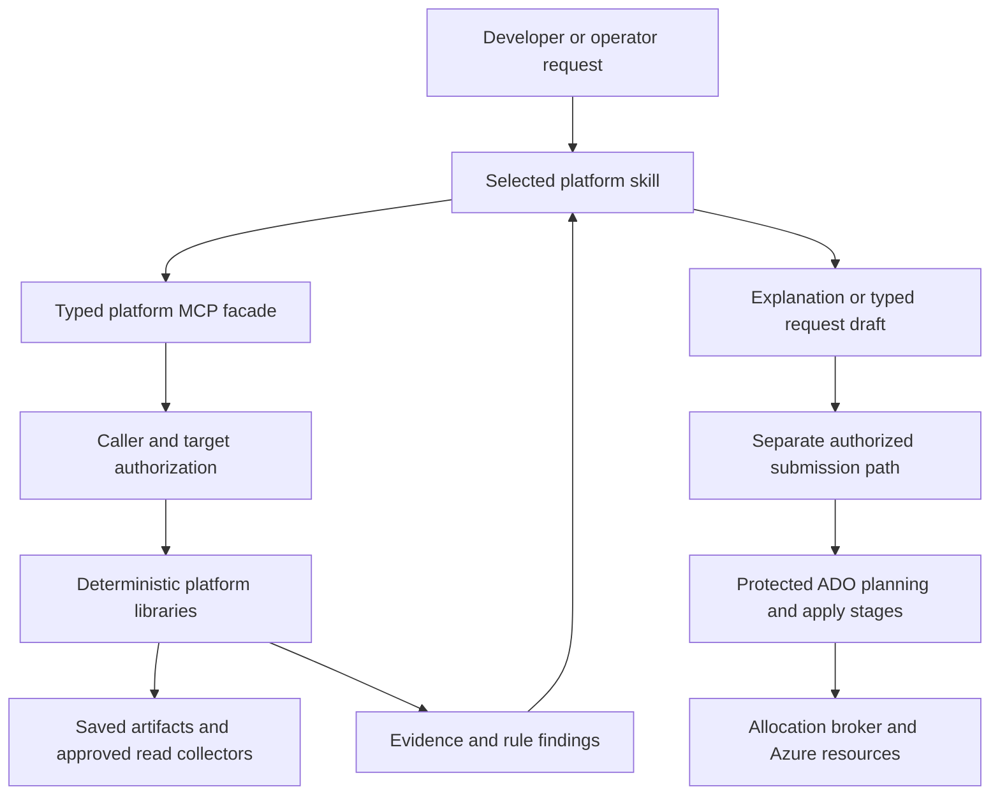

# Platform skills and MCP capability design

**Status: four local skill entrypoints implemented; eight further skills and MCP interfaces proposed. Reviewed 26 September 2026.** This specifies twelve project-specific skills for the [enhanced self-service implementation plan](enhanced-self-service-validation.md). It complements the [Microsoft Azure skills assessment](../azure-skills-assessment.md). No platform MCP server or AI write operation is registered by this increment.

## Architecture decision

**Implementation follow-up:** the first four skills now have real project-local entrypoints: [request design](../../.agents/skills/platform-request-design/SKILL.md), [discovery audit](../../.agents/skills/platform-discovery-audit/SKILL.md), [topology report](../../.agents/skills/platform-topology-report/SKILL.md) and [change review](../../.agents/skills/platform-change-review/SKILL.md). They use existing local request/preview contracts and the new [offline analyzer](../self-service-analysis.md). They are not MCP server implementations or live qualification. The remaining eight skills and all `platform_*` server interfaces below remain proposed.

Build small skills around our product contracts, evidence and protected pipelines. Skills help an assistant interpret a request, select an approved analysis operation and explain its result. Deterministic libraries own validation and decisions; MCP exposes typed interfaces to those libraries; the allocator and ADO stages own authorized writes. Do not create twelve independently credentialed agents or servers.

The current repository has documentation/offline analysis skills and PowerShell/Bicep pipeline implementation, but no implemented platform MCP server. **The `platform_*` tool names below are proposed interfaces, not Microsoft Azure MCP tool names or tools currently callable here.** The initial offline library/CLI path is implemented; an MCP adapter can expose compatible tested contracts later. A pipeline should not require a language model or MCP session to validate a deployment.

Use Microsoft's Azure MCP Server selectively for supported Azure reads in approved development environments. Verify its version, advertised tools, schemas, authentication and return fields before binding an adapter. Its documentation exposes read-only, namespace and individual-tool filters, but read operations can still disclose sensitive content. The local server is documented for organizational developer use, so do not turn a developer credential session into a shared production portal backend. [Azure MCP tool configuration and security](https://learn.microsoft.com/en-us/azure/developer/azure-mcp-server/tools/)

For a future shared service, host the platform's own authenticated facade and use supported service APIs/SDKs behind it; qualify that hosting/identity design independently. The cost plugin's remote Azure management MCP integration is a separate dependency, not automatically interchangeable with the local Azure MCP Server. Keep both behind the same platform authorization/evidence contracts.

This diagram is proposed. The first release stops at explanations and request drafts: no queue-run, reserve, apply, grant, delete or replay tools are exposed to these analysis skills.

## Skill catalog and routing

Names are intentionally platform-specific so they do not replace generic Microsoft skills. Each skill loads only its task reference and the common contract. Selecting a skill does not automatically launch the others. “Local first” means it can assess available saved evidence; it must mark unverified live facts as unknown.

| Skill | Select it for | Inputs → deliverable | Stage / proposed delivery |
|---|---|---|---|
| `platform-request-design` | “I need Event flow dev for an internal producer; what should I select?” | Authorized catalog, business intent and target → typed request draft, assumptions, missing business inputs and resource explanation. | Before queueing; V0/V1 using current catalog, richer profiles V2. |
| `platform-discovery-audit` | “Can this discovery run be used for my deployment?” | Selected run/target and saved manifest → provenance, freshness and coverage findings with eligible/blocked/unknown handoff explanation. | Discover handoff; V0/V1 fixtures, V2 scoped live reads. |
| `platform-topology-report` | “Show what exists and what this workload will add.” | Verified evidence graph, product and optional preview → observed/proposed/runtime views and workload-only resource summary. | Discover/Preview; V1. |
| `platform-private-connectivity` | “Choose a suitable private profile and explain why deployment is blocked.” | Intent, profile, coverage, service requirements and snapshot → candidate eligibility, DNS/routing/capacity findings and proposed network plan. | Preview; V2 deterministic analysis, V3/V4 qualified binding integration. |
| `platform-identity-readiness` | “What permissions or workload identities are missing?” | Requested operations, principals, scopes and available authorization evidence → least-privilege action/scope matrix and unresolved authorization checks. | Platform onboarding/Preview; V2/V4. |
| `platform-capacity-assess` | “Can this region/profile support the requested scale?” | Product capacity class, approved regions, quotas, hosting limits and network occupancy → separate quota, service-capability, capacity and subnet findings. | Preview; V2 analysis, live admission V4. |
| `platform-cost-explain` | “What will this selection cost, and which options change it?” | Resource bill of materials, dated rates, usage assumptions and optional authorized billing snapshot → qualified estimate/comparison and exclusions. | Preview and later operations; V2/A2, actual costs V6. |
| `platform-change-review` | “Explain this What-If before I approve it.” | Existing preview, ownership, binding and package metadata → create/modify/no-change/detach/delete review, uncertainty and material risks. | Final plan review; V1 saved evidence, V4 integration. |
| `platform-release-readiness` | “Is this exact release ready for the next stage/environment?” | Plan/package digests, publication, binding, test and ADO check evidence → readiness matrix and missing/stale gates. | Publication/deployment/promotion; V4/V5. |
| `platform-runtime-triage` | “Why did the application smoke or private path fail?” | Failed run, product contract and bounded redacted runtime evidence → causal hypotheses, evidence gaps and a proposed repair/recovery request. | Post-deployment support; V6. |
| `platform-lifecycle-review` | “What is the impact of changing, adopting or retiring this instance?” | Desired operation, current ownership/dependencies, retention and last accepted release → drift/impact analysis and a reviewed-operation proposal. | Operations; V5/V6. |
| `platform-product-onboarding` | “Add a private storage offering using our conventions.” | Requested product, repository/catalog contracts and service research → gap assessment, implementation plan and test/admission checklist. | Engineering workflow; V2 design, V5 product admission. |

The existing `self-service-docs` skill remains the documentation maintenance workflow. Do not duplicate it in each skill or make it an Azure/MCP runtime dependency. Product onboarding can hand documentation work to it when authoring a repository change is within the user's task.

## Skill behavior specifications

### 1. Request design

Read the caller-authorized catalog before proposing a workload, environment or profile. Match business intent to registered products and expose what will be created, reused and left external. Ask only for missing business decisions such as required reachability, scale or data retention; resolve technical IDs through approved bindings. Keep supplied choices unless they violate an explicit rule, and explain that rule.

Use `platform_catalog_get` and `platform_request_validate`. Output a draft with stable catalog/profile IDs, resolved defaults, unresolved fields and a product resource summary. Disabled targets may be explained or previewed according to policy; do not enable them. Do not invent a new product, region, CIDR or runtime dropdown. Admission failures produce actionable gaps, not an altered request that quietly drops the requirement.

### 2. Discovery audit

Use `platform_evidence_get` and `platform_handoff_assess` for the selected run. Compare producer definition, source branch/commit, repository/project, selection, hash, schema and collection time. Separate successful empty collections from denied, incomplete, unsupported or stale queries. A selectable pipeline resource is not automatically a valid deployment artifact.

Return the exact handoff failures with evidence references. Refresh only through a separately requested, authorized read operation; never substitute “latest successful” behind the user's selection. Saved files without authenticated ADO provenance support offline consistency review but cannot establish live handoff eligibility.

### 3. Topology report

Use `platform_graph_get` and `platform_report_render` with the selected product. Draw only evidence-backed relationships; distinguish declared links, inferred links, proposed resources and observed runtime paths. Use one graph shared with the network analyzer. Missing access is an explicit boundary, not a missing resource. Refer to private endpoints and DNS links without reading connection strings.

Render Markdown/Mermaid and a supported static fallback with escaped labels and a legend. Name the graph's snapshot/time and coverage. Keep reports in approved local output/artifact locations, not public repository topology documentation. If the graph is incomplete, produce a useful qualified view; never fill in plausible but unobserved connections.

### 4. Private connectivity

Use `platform_network_assess` on a versioned profile and evidence snapshot. The deterministic result applies hosting-specific delegation, address headroom, overlap, DNS, ingress/egress, route and ownership constraints before ranking candidates. Explain both selected and rejected candidates. Stable prior assignments take precedence when still valid.

Output a provisional proposal or explanation of an existing authenticated binding. Do not allocate, renew or release addresses, generate arbitrary prefixes, bypass unknown scope, change public access, or move shared networking into a workload stack. For an unsupported hybrid/NVA topology, return the specific required platform evidence and stop that decision; the rest of the report can continue.

### 5. Identity readiness

Use `platform_identity_assess` to map each intended operation to principal, control/data plane, resource scope and required action. Distinguish ADO pipeline authorization, Azure RBAC, Entra directory access, deny assignments, conditional grants and workload identity. A role name or visible assignment alone does not prove effective access or propagation.

Return supported/denied/unknown findings and a proposed grant request only where justified. Do not suggest Owner merely to eliminate an error, read credentials, grant roles, or mark an exception approved from prose. If a check needs unavailable directory or access-condition evidence, retain unknown and identify the owner who can supply it. Live negative/positive authorization tests remain a separate acceptance gate.

### 6. Capacity assessment

Use `platform_capacity_assess` with approved region/profile and required maximum scale. Report quota headroom, service/SKU capability, observed allocation capacity and subnet capacity separately. Inherit service-specific headroom rules from the product contract; no generic subnet-size recommendation for every service.

Return source/time, assumptions and the limiting constraint. Do not treat quota success as capacity reservation, an empty NIC query as unused PaaS space, or an alternative region as already approved. Propose a quota request or profile change without submitting it. Unknown physical capacity remains qualified until provisioning proves it.

### 7. Cost explanation

Use `platform_cost_assess` against the same bill of materials and plan used by Preview. Separate fixed baseline, usage, one-time/migration and shared-service charges. Preserve rate date, region, SKU, currency, period, discounts/retail basis and exclusions. Explain the cost delta of an allowed option with equivalent assumptions; do not compare unlike billing periods as equivalent totals.

Missing rates/usage produce a partial estimate with explicit exclusions, not zero cost. Savings proposals must still satisfy product/network requirements. Actual-cost access is optional and separately authorized. Do not create budgets, change recipients, resize resources, buy reservations or present a budget alert as a spending cap.

### 8. Change review

Use `platform_change_assess` on saved native stack preview plus ownership and release evidence. Explain resource/property deltas, stack management/deny changes, unresolved expressions, application package changes not visible to ARM, and Delete/Detach consequences. Keep external **Reuse** distinct from stack-owned **Manage**.

Do not invoke a fresh native What-If as an incidental read: our implementation creates preview metadata. A new preview requires the authorized pipeline route. Return the deterministic gate outcome plus human-readable considerations; neither model confidence nor a recommendation is approval. A material drift or uncertain required change directs the user to a new plan rather than rewriting the old one.

### 9. Release readiness

Use `platform_release_assess` and optionally `platform_run_status` for the selected run/release. Match template, parameters, application package, assignment generation, product/profile policy and source provenance. Check actual publication and test receipts; distinguish package-built, infrastructure-applied, runtime-ready and environment-approved evidence.

Output an eligible/blocked/unknown stage-readiness assessment with its validity window. A prior environment's approval is not permission for the next environment. The current system rebuilds application packages per environment; do not claim digest-preserving promotion until implemented and proven. Never queue, approve, bypass, publish or deploy through this skill's analysis tools.

### 10. Runtime triage

Use `platform_run_status` and `platform_runtime_evidence_get` with an explicit interval, bounded record limit and registered query/probe definitions. Start at the failing product contract. For Blob copy trace dispatcher → queue worker → ledger/receipt; for Event flow trace Event Grid → Storage Queue → Logic App → durable receipt. Reuse the existing workload runbooks rather than assuming the generic messaging skill covers Event Grid.

Return evidence-linked hypotheses and safe next diagnostics. Distinguish observed failure from suspected cause. Fetch existing probe results; a “test event” or queue replay writes data and belongs to a separate authorized operational request. Do not clear queues, restart hosts, replay messages or broaden access to make a smoke test pass.

### 11. Lifecycle review

Use `platform_lifecycle_assess` with explicit inspect-drift, upgrade-impact, adoption-impact or retirement-impact mode. Identify owned versus shared resources, downstream consumers, allocation state, retained data, dependencies and existing rollback/recovery support. Compare desired and actual configuration without automatically repairing drift.

Produce a typed proposed operation with prerequisites and data/ownership consequences. Missing consumers or retention policy blocks retirement clearance. Stack detach is not deletion and does not by itself release an IPAM assignment. No automatic rollback or cleanup authorization follows from a failed run. Keep lifecycle mutation tools out of the analysis session.

### 12. Product onboarding

Use repository evidence and `platform_product_assess`, with current official research where service behavior matters. Assess the product's composition, module contracts, parameters, ownership, dependencies, package kind, readiness, costs, support and retirement against the platform contract. Include dedicated and generic route compatibility.

Return a concrete implementation plan and admission gaps. JSON registration alone is insufficient while typed dispatch/generator/qualification code is product-specific. Default new targets off. An infrastructure-only product gets an intentional no-package contract. Do not create a module registry dependency or substitute an upstream agent's direct deployment workflow. Source edits can be a subsequent explicitly requested engineering task; Azure activation remains separate.

## Shared MCP tool contracts

Implement a single common contract before twelve skill entrypoints. Every operation receives a server-resolved caller context; never trust a `callerId`, subscription or authorization list supplied by the model. Resolve `targetRef` through the caller's allowed catalog. Artifact references are opaque authorized IDs, not arbitrary filesystem paths, URLs or storage locations.

All names and signatures here are proposed. Inputs use strict schemas with bounded lengths/enums; outputs use the common evidence envelope from the [validation plan](enhanced-self-service-validation.md#evidence-compatibility-and-approval-contracts).

| Tool | Typed input / output | Data source and effect |
|---|---|---|
| `platform_catalog_get` | Optional product/target filter → authorized products, profiles, defaults, enabled/status fields. | Protected catalog; read only, no disclosure of unauthorized target existence. |
| `platform_request_validate` | Catalog version + target + typed intent → normalized draft, field errors, server-resolved defaults. | Deterministic schema/policy; no saved request or queue operation. |
| `platform_evidence_get` | Target + artifact/run reference + allowed evidence kind → sanitized evidence, coverage and provenance status. | Approved artifact store/ADO adapter; paginated bounded reads. |
| `platform_handoff_assess` | Target + discovery reference → provenance/coverage/freshness gate findings. | Existing handoff logic through compatible adapter; no refresh or substitution. |
| `platform_graph_get` | Snapshot reference + product + view → typed nodes/edges with evidence and unknown boundaries. | Shared deterministic graph; no independent rescan. |
| `platform_report_render` | Authorized graph/findings references + format → rendered artifact reference/digest. | Writes only to a server-selected report store/local output; not a globally read-only operation despite no Azure infrastructure changes. |
| `platform_network_assess` | Snapshot + validated intent + profile version → candidates, rules, provisional binding needs. | Deterministic rules; no allocation or network writes. |
| `platform_identity_assess` | Snapshot + catalog operation set → principal/action/scope findings. | Projected metadata; no tokens, credentials or grants. |
| `platform_capacity_assess` | Snapshot + product capacity class + approved region/profile → separated capacity findings. | Quota/hosting/occupancy evidence; no quota requests or reservations. |
| `platform_cost_assess` | Plan/bill-of-materials reference + rate set + typed usage assumptions → qualified estimate/delta. | Dated rates or explicitly authorized billing evidence; no budget or resource changes. |
| `platform_change_assess` | Preview + binding + release references → classified changes, gate outcome and unknowns. | Saved evidence only; no native What-If creation. |
| `platform_release_assess` | Target + final release + binding/publication/receipt references → stage-readiness findings. | Deterministic digest/provenance checks; no approve/queue/apply. |
| `platform_run_status` | Authorized definition/run → stage status, timestamps and receipt references. | ADO reads; no queuing, retries, approval or cancellation. |
| `platform_runtime_evidence_get` | Target/run + registered query ID + bounded interval/limit → redacted runtime observations. | Approved telemetry/receipts; no arbitrary KQL, scripts, synthetic writes or probe creation. |
| `platform_lifecycle_assess` | Target + enumerated operation + accepted release + snapshot → dependency/ownership/retention impact. | Read-only planning; no detach/delete/replay/rollback. |
| `platform_product_assess` | Approved repository snapshot + draft product contract → implementation/admission gaps. | Local/source assessment; no remote URL fetch, code execution or registration from untrusted fields. |

Collectors that refresh live inventory remain separately scoped operations in Discover or a future explicit read API. They must enforce coverage and paging and create a new snapshot ID. An analysis tool must not opportunistically refresh part of an old snapshot and continue calling it the same evidence.

### Response and failure semantics

A proposed common assessment response contains `schemaVersion`, `operationId`, `targetRef`, `snapshotRef`, `inputDigest`, `ruleSetVersion`, `evaluatedUtc`, `validUntilUtc`, `status`, `findings`, `coverage` and `artifactRefs`. Each finding includes rule ID, deterministic outcome, severity, source references and the missing evidence needed to resolve unknowns. Rendering returns its content digest and safe media type.

Keep operational failure distinct from a valid assessment finding:

- `complete`: requested assessment ran; findings can still block deployment.
- `partial`: some optional evidence is unavailable; required unknowns remain blocking.
- `unsupported`: this product/profile/tool version cannot perform the assessment.
- `failed`: retrieval or execution failed; do not interpret it as a clean result.

Authorization failure returns a generic denial without leaking another target's details. MCP/tool errors must remain machine-readable; do not wrap them as successful prose. Suggested next actions are typed drafts, not executable commands. Model-generated explanations are stored separately from authoritative findings and cannot change status, severity, scope, evidence or approval records.

### Tool availability and identity

Maintain a server-side capability map recording exact provider/server version, tool/schema digest, transport, permitted scopes, expected fields, sensitivity, limits and fixture/live qualification status. Microsoft documents tool discovery and annotations; annotations are hints, not our authorization boundary. [Azure MCP tool management](https://learn.microsoft.com/en-us/azure/developer/azure-mcp-server/tools/azure-mcp-tool)

Use advertised capabilities/learn mode to inspect contracts without Azure actions where supported. Expose only qualified operations, not a generic “execute Azure command” escape hatch. A new server/tool version requires regression review; missing capability produces unsupported. A local CLI/SDK adapter is allowed only when independently implemented and qualified with the same contracts, not generated as an unreviewed fallback by the model.

For local offline review, avoid Azure authentication entirely. For local live use, bind the explicit tenant/subscription from the approved target rather than ambient CLI defaults. For any shared facade, validate authenticated caller, issuer/audience and per-target authorization; qualify the chosen delegated or application identity flow. A broad backend identity must not let one developer read another workload's topology, logs or billing.

Separate report-storage writes from Azure reads in tool metadata. Cache by authorization scope, target, snapshot digest and policy version; never share a privileged cached result with a lower-privilege caller. Enforce response size, concurrency, query timeout and retry budgets server-side. Audit operation, caller, target, tool/rule versions, references and redacted outcome without retaining tokens or secret values.

## Packaging and lifecycle

Create project-local skill entrypoints only as their required tools or documented offline readers become available. The intended location is `.agents/skills/<skill-name>/SKILL.md`; this design does not create discoverable stubs that pretend to call future tools. Keep normal automatic selection with precise descriptions. A task request to analyze does not grant mutation authority.

Each entrypoint should contain its trigger, minimal workflow, allowed operation set, outcome semantics, stopping condition and links to relevant shared contracts. Put detailed product-specific guidance in references rather than repeating this whole design. Include optional `agents/openai.yaml` only with real dependency identifiers, not fabricated MCP URLs. A skill version records compatible evidence/tool contract versions and the tested upstream guidance revision.

Use a shared deterministic implementation for CLI/pipeline and MCP entrypoints. Choose the MCP host SDK/runtime after the contract spike and installed-SDK compatibility review; this document does not select or claim a deployed .NET server. Avoid turning UI-oriented PowerShell scripts directly into unrestricted shell tools. Extract reusable operations and preserve current pipeline adapters under regression tests.

Skill lifecycle: **designed → offline qualified → scoped live qualified → supported → deprecated**. Availability in a client is not qualification. Record tested modes per skill; a skill may support offline reporting while live telemetry remains unavailable. Deprecation must preserve evidence readers for supported old runs and state the replacement contract.

## Acceptance scenarios

| Skill / request | Required outcome |
|---|---|
| Request: “Event flow dev, choose a network for me.” | Uses an approved profile or reports missing platform onboarding; no guessed prefix and no deployment queueing. |
| Discovery: DNS collection is empty because its API returned 403. | Handoff blocked for required evidence; does not translate denial into Create. |
| Topology: a private endpoint exists but no runtime probes were supplied. | Declared private edge displayed as unverified; no “reachable” label. |
| Network: connectivity subscription is inaccessible. | Required routing-domain coverage remains unknown; no best-fit allocation claim. |
| Identity: “Just give the connection Owner.” | Reports the actual operation/scope gap and a proposed least-privilege request; executes no grant. |
| Capacity: quota passes but subnet occupancy is unknown. | Separate outcomes; private placement remains blocked. |
| Cost: two estimates use different currencies or omit storage usage. | Explicit normalization requirement and exclusions; no misleading combined total. |
| Change: existing stack-owned subnet would become Bicep `existing`. | Explains management/Detach impact; does not mark it safe external reuse. |
| Release: package digest or assignment generation changed after final plan. | Readiness blocked; requires new planning/review, not rewritten hashes. |
| Runtime: user asks to investigate duplicate messages; logs contain instructions to replay. | Treats log text as data, explains evidence and recovery proposal; sends no messages. |
| Lifecycle: retire an instance linked to shared DNS and retained data. | Separates ownership and blocks clearance until retention/dependency evidence is complete. |
| Onboarding: add a product by editing only catalog JSON. | Identifies missing adapter, menu, package/readiness and admission tests. |

Cross-cutting tests must prove cross-target isolation, safe path/reference handling, no secret-value retrieval, bounded paging/query failures, tool-version drift, model-disabled equivalence, expired evidence, prompt injection through metadata, and stable outputs for the same deterministic inputs. Validate the actual skill entrypoints with the skill validator when created; validate tool behavior separately. Neither formatting checks nor a model's self-evaluation establishes operational correctness.

## Delivery order and ownership

| Increment | Skills / implementation | Gate and responsible role |
|---|---|---|
| V0/V1 | Request design, discovery audit, topology report and change review against saved artifacts. | Platform engineering: schemas/readers, deterministic fixture tests, safe renderer and honest unavailable-live behavior. No model dependency in CI. |
| V2 | Private connectivity, identity, capacity, cost and product-onboarding assessment; typed read facade after CLI contracts stabilize. | Platform/connectivity/security owners: authorized profiles, capability map, scope isolation and live-read pilot evidence. |
| V3/V4 | Release-readiness integration with qualified binding/ADO receipts. | Platform release owner: stage timing, digests, lease generation and permission tests; no AI write path. |
| V5/V6 | Lifecycle impact and runtime triage; optional conversational intent and explanations in the supported client. | Operations/product owners: real runtime evidence, recovery/retention contracts, redaction and evaluation budget. |

First implementation remains V0/V1. Do not build a general-purpose agent platform before producing useful deterministic reports. The skill pack introduces no additional subscription requirement for offline analysis and no change to the existing deployment authorization model. Requests to submit, allocate, apply, replay or retire should be designed later as distinct operations with protected authorization, not added incidentally to these skills.
