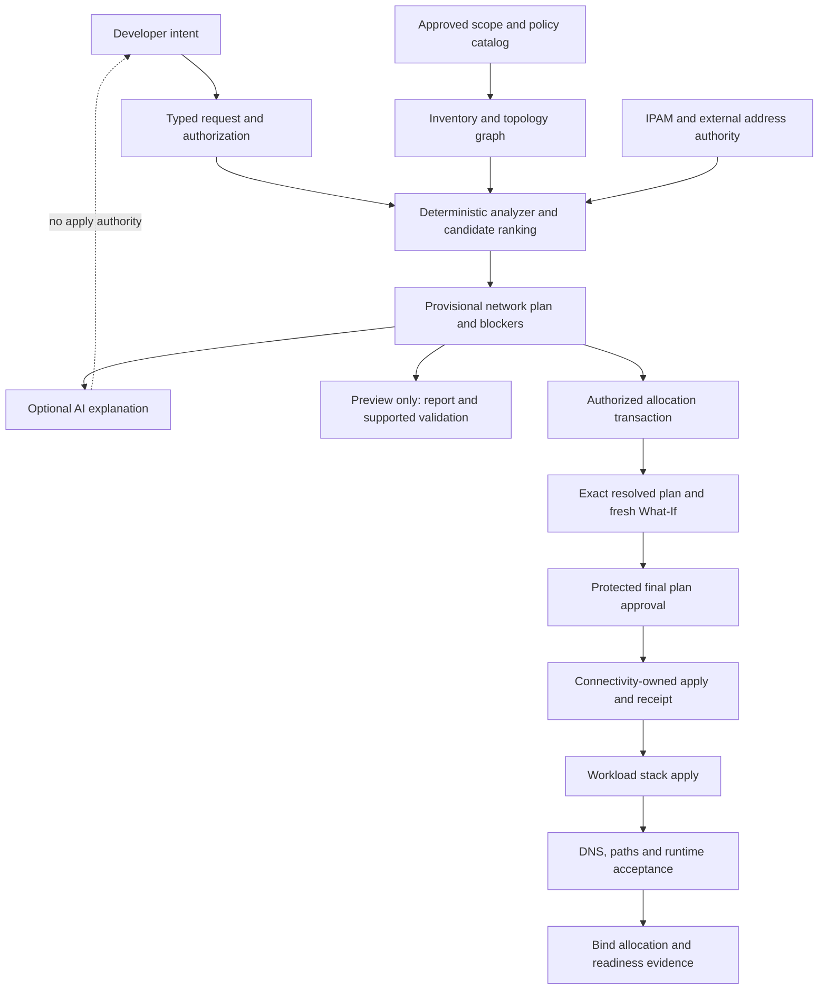

# Private networking self-service: analyzer, allocation and AI assistance

**Status: proposed, not implemented.** Source and Microsoft Learn research reviewed on **26 September 2026**. This design expands the [self-service roadmap](../self-service-expansion-plan.md); it does not change current target settings, grant access, allocate addresses or deploy resources. Azure service behavior below is documented guidance; the architecture, interfaces and acceptance gates are proposals for this repository.

The [implementation readiness review](enhanced-self-service-validation.md) controls delivery order and final validation. It corrects approval timing to separate ADO stages, distinguishes non-deploying Preview from read-only discovery, and defines compatibility and live-pilot gates.

## Recommended direction

The companion [Microsoft Azure skills assessment](../azure-skills-assessment.md) identifies reusable lookup, visualization and enterprise-planning guidance. Its proposed evidence model and reporting pilot support this design. No reviewed skill provides the authoritative allocation, concurrency controls or runtime proof required here; those remain explicit platform deliverables.

Build a **network planning service** shared by all workload adapters. Developers request a workload, environment, capacity and connectivity needs. The platform resolves approved networks, subnets, private endpoints, DNS and egress from governed profiles, live evidence and an authoritative IP address management system (IPAM). Optional AI translates intent and explains decisions. Deterministic rules decide admissibility; an allocation service owns reservations; reviewed Bicep and protected pipelines own deployment.

Prefer an adapter to Azure Virtual Network Manager IPAM when it fits the enterprise. Integrate an existing enterprise IPAM instead when that system already owns addresses. Do not introduce competing authorities over the same ranges. AVNM supports hierarchical pools, automatic nonoverlapping allocations within a pool, static allocations and delegated use. It does not discover every external network for us: import and reconcile on-premises, other-cloud and reserved allocations into the authoritative coverage model. [Microsoft IPAM overview](https://learn.microsoft.com/en-us/azure/virtual-network-manager/concept-ip-address-management)

**No developer-entered CIDRs does not mean no network planning.** Platform onboarding must establish address authority, routing domains, owners, connectivity profiles and authorized scope once. The service then automates repeat requests within those boundaries. If no approved pool or profile is available, return a platform onboarding request instead of guessing a `10.x` range.

## Current repository baseline and gaps

| Existing source | What it does today | Required extension |
|---|---|---|
| `scripts/Export-DeploymentInventory.ps1` | Scoped VNet/subnet/DNS inventory; delegation and basic subnet candidate flags; explicit failed-query status. | Multi-scope coverage, topology, capacity, effective-policy evidence and authoritative allocation references. |
| `config/logic-prerequisites.json` | Fixed per-environment `/16` VNet ranges and `/26` subnets. | Profile/pool-driven requests and persistent assignment per workload instance. These fixed ranges must not become a multi-instance allocation strategy. |
| `scripts/logic-prerequisites-common.ps1` | Expected-name or explicit-ID resolution; Create / Reuse / Manage / Blocked; IPv4 overlap against visible VNets; saved policy/target hashes. | Typed, workload-independent network constraints; authoritative coverage and concurrency-safe reservations. |
| `scripts/self-service-common.ps1` | Blob copy checks reviewed existing topology and explicit resolver references. | Share validated facts without assuming Event flow supports all Blob copy DNS modes. |
| `modules/network/workload-vnet/main.bicep` | Creates one workload VNet, delegated integration subnet, endpoint subnet and integration NSG; endpoint policies disabled. | Separate owned-network creation from controlled attachment to shared networks; explicit DNS, route, egress and policy profiles. |
| Preview/Deploy templates and workload adapters | Frozen inputs, provenance, What-If, drift checks and workload smoke contracts. | Network plan schema, reservation lifecycle, final plan rebinding and dedicated connectivity ownership boundary. |

There is currently no enterprise network graph, shared allocation ledger, automatic best-fit subnet selection, AI network planner, or dynamic portal. `SC-AZ-A-Bicep` is registered for one subscription; that does not establish visibility or write permission in a connectivity subscription or on-premises. Existing platform checks and disabled targets remain unchanged. See [current prerequisites](../prerequisite-resolution.md) and [verification status](../completion-status.md).

## Developer experience

Keep technical selections out of the normal request form. Use reviewed product defaults wherever business intent is already known.

| Developer input | Platform resolution |
|---|---|
| Workload and environment | Allowed subscription/region, identity boundary and product network requirements. |
| Capacity class, such as small or growth | Maximum scale, upgrade headroom, endpoint count and supported subnet capacity model. |
| Connectivity needs: application only, corporate systems, or named private dependencies | Routing domain, spoke/hub or Virtual WAN attachment, DNS authority and permitted flows. |
| Approved exposure profile | Private-only by default; a separate reviewed ingress product when needed. No automatic public fallback. |
| Optional natural-language description | AI proposes structured fields with evidence and unresolved questions; the user confirms intent. |

Network IDs, subnet IDs, DNS zone IDs and prefixes become **read-only plan outputs**. Developers may inspect them, but cannot override them with arbitrary text. Selecting a named dependency must be access-controlled; a name is not permission to connect to it.

Example intent: "Create Event flow dev for documents from our internal producer, with growth capacity." The result should explain the chosen connectivity profile, whether an existing compatible subnet is reused or new space is required, the DNS/egress path, cost drivers and blockers. Missing business intent may require a question; the answer should be about reachability or scale, not subnet arithmetic.

Start with native ADO menus containing stable profile/capacity choices and an Auto option. The analyzer chooses concrete resources in the run and publishes a plan. A later authenticated request UI can show live candidates and AI explanations before queueing ADO. Native runtime parameters are expanded before execution, so a Discover artifact cannot inject new dropdown values into an already-running pipeline. [ADO parameter timing](https://learn.microsoft.com/en-us/azure/devops/pipelines/process/runtime-parameters?view=azure-devops)

## Architecture and trust boundaries



Use one canonical planner across CLI, ADO and future UI. Begin with library/CLI integration and the existing PowerShell entrypoints. A typed C# library/service is a reasonable later implementation for graph queries, contracts and transactional orchestration; select it when justified by concurrency and service hosting, not merely to add another runtime. Do not put independent allocation algorithms in each workload script.

### Read-only inventory and coverage

Represent resources and relationships, not a flat list of subnet names:

| Domain | Facts to collect and qualify |
|---|---|
| Scope | Tenant, approved subscription list, management-group/profile bindings, identity used, per-query status, timestamps, API versions, paging completion and inaccessible scopes. |
| Address authority | Root/child pools, routing domains, existing allocations, reservations, exclusions, on-premises and other-cloud prefixes, known NAT mappings and import freshness. |
| VNets/subnets | Prefixes, location, delegation, service association links, supported IP configuration usage, reserved capacity, NSG/UDR/NAT associations, service endpoints/policies and endpoint policy flags. |
| Connectivity | Both directions of peering, forwarding/gateway-transit flags, Virtual WAN attachments and route tables, gateway advertisements, UDRs and supported effective routes. |
| DNS | Authoritative zones/records, zone groups, VNet links, VNet DNS settings, resolver endpoints/rulesets/links, conditional forwarding and named namespace ownership. |
| Policy/security | NSG rules, applicable AVNM security admin rules, approved firewall/NVA policy, Azure Policy assignments/exemptions, locks, deny assignments and required join/deployment rights. |
| Runtime paths | Package source, SCM endpoint, storage subresources, telemetry, identity/token acquisition and external service dependencies; private agent/probe placement. |
| Ownership | Stack-managed resources, external platform owner, references from other workloads and retirement constraints. Names/tags are supporting metadata, not ownership proof. |

Use Resource Graph for broad discovery and graph joins, then direct ARM reads for selected resources before allocation and apply. Resource Graph is eventually consistent and its results are limited by caller permissions; an empty result is not evidence of complete enterprise visibility. Retain an explicit expected-versus-observed scope matrix and pagination evidence. [Resource Graph behavior](https://learn.microsoft.com/en-us/azure/governance/resource-graph/overview)

Allow a central, independently operated inventory service to return a narrowly scoped, authenticated snapshot where workload connections lack central read access. It must include issuer, scope, freshness and evidence references; it cannot make visibility complete simply by asserting it. Do not expose unrelated tenant topology to developers or models. Use existing approved federation/identity mechanisms; do not ask for subscription Owner to make discovery convenient.

Required facts have states **Known / Unknown / Stale / Unsupported**, separate from resource actions **Create / Reuse / Manage / Blocked**. Unknown required routing-domain coverage blocks new allocation. Unsupported NVA configuration is not treated as an allow rule. Missing optional metrics can reduce ranking quality without turning into a security approval.

## Deterministic network and subnet analyzer

Evaluate hard constraints before ranking. A weighted score must never offset a failed security, ownership or capacity constraint.

1. Resolve product/hosting version, environment, region, routing domain, dependency flows and the caller's allowed profiles.
2. Validate complete required coverage and the authority of each dependency. Reject unknown scope and conflicting address authorities.
3. Find compatible existing allocations for the same workload instance first. Preserve stable assignments on reruns; do not move a running app to a newly cheaper network.
4. Evaluate candidate subnet sets together: containment/overlap, separate required roles, delegation, service association restrictions, region/subscription rules, capacity, DNS, routes, NSGs, egress and ownership.
5. Admit only policy-approved reuse. Otherwise calculate a request to the assigned pool for a new subnet set or spoke. A free-looking subnet belonging to another app is not a free platform asset.
6. Rank admissible options by approved preference: reuse compatible reserved capacity, smallest supported allocation with growth headroom, existing reachability/DNS, then cost/fragmentation. Use stable tie-breaking; return NeedPlatformDecision for policy ambiguity.
7. Emit per-rule evidence, rejected candidates, required shared changes, expected cost drivers and a plan validity boundary. Revalidate mutable facts under the allocation transaction before apply.

### Capacity and product-specific rules

Define a versioned `networkRequirements` contract per product/hosting plan: subnet roles, delegation, address family, supported minimum/recommended size, maximum planned scale, temporary scale/upgrade overhead, endpoint IP needs, sharing rules, required service subresources, DNS namespaces and source/destination/port/protocol flows.

For IPv4, subtract Azure's five reserved addresses from subnet capacity, then subtract known occupancy, authoritative reservations and product headroom. Do not equate an empty NIC list with unused PaaS capacity. Unknown occupancy blocks automatic shared-subnet placement. Round required address counts to valid CIDR boundaries; validate child containment and sibling disjointness. Plan across connected routing domains and avoid allocating a default `/16` to every small product. [CAF IP planning](https://learn.microsoft.com/en-us/azure/cloud-adoption-framework/ready/azure-best-practices/plan-for-ip-addressing)

App Service integration supplies outbound connectivity, while inbound private access needs a separate mechanism. Sizing must account for temporary scaling/upgrade consumption. For this repository's current Web-based hosts, keep its conservative `/26` baseline until an explicit tested product rule changes it; do not apply that mask to every Azure service. [App Service integration](https://learn.microsoft.com/en-us/azure/app-service/overview-vnet-integration)

For example, Functions Flex Consumption uses `Microsoft.App/environments` delegation and different capacity rules from Web-based hosting. A subnet admitted for one hosting type is not universally compatible. Pin references and validate service/region/SKU support as new products are admitted. [Functions networking](https://learn.microsoft.com/en-us/azure/azure-functions/functions-networking-options)

Start with IPv4 for the existing products. Admit dual stack, AKS pod/service ranges, Container Apps infrastructure subnets and special hub subnets only through their own tested contracts. Never silently ignore an IPv6 prefix or an overlay/service range when it could affect a requested path.

## Allocation authority, concurrency and lifecycle

### Backend choice

| Option | Recommended use | Conditions |
|---|---|---|
| AVNM IPAM adapter | Azure-first estate without another authoritative allocator. | Platform-owned pools, external-prefix reconciliation, delegated permissions, verified region/API support and lifecycle behavior. |
| Enterprise IPAM adapter | Existing organization-wide allocation authority. | Supported transactional API, stable allocation IDs, idempotency/concurrency semantics and reconciliation with Azure. |
| Reviewed static allocations | Transitional small-scope operation. | Explicit platform assignment per instance; no claim of dynamic enterprise allocation. Retain current behavior while migrating. |

Do not use a JSON file in Git or a downloadable discovery artifact as a concurrent reservation database. Do not hash a workload name into RFC1918 space and call the result unique. One backend owns a pool; the orchestrator's journal tracks requests and receipts, not a competing source of free addresses.

AVNM documents static CIDR resources with requested address counts, and subnet schemas expose `ipamPoolPrefixAllocations`. These are useful building blocks, not evidence of an atomic reservation-to-resource transfer API. Conduct a spike against pinned API versions before choosing the production binding model. [Static CIDR schema](https://learn.microsoft.com/en-us/azure/templates/microsoft.network/networkmanagers/ipampools/staticcidrs), [subnet schema](https://learn.microsoft.com/en-us/azure/templates/microsoft.network/virtualnetworks/subnets)

Qualify either a backend-supported reservation/commit operation, or a durable allocation owned by the network service with explicit downstream prefix assignment and reconciliation. Do not reserve a static block and then request a second dynamic allocation for the same VNet. Never release a reservation to create a gap before deployment. If native allocation determines the exact prefix only during network creation, expose that network creation as a separately authorized action and preview the dependent workload afterward; do not present a pre-allocation What-If as an exact approved CIDR plan.

Microsoft currently documents that removal of IPAM-managed address spaces from VNets/subnets, and removal of spaces from pools, is restricted. This affects resizing, adoption and teardown design. Automatic renumbering is out of scope; prove backend-specific release behavior instead of assuming a TTL can undo any allocation. [AVNM limitations](https://learn.microsoft.com/en-us/azure/virtual-network-manager/concept-limitations)

### Proposed transaction contract

- Key assignments by tenant, routing domain, workload instance, environment and logical subnet role. A rerun returns the same assignment; ADO run ID is an attempt identifier, not a new allocation identity.
- Use atomic conditional operations or a backend-supported lock covering the allocation domain. Serialize shared subnet/VNet writes as well as prefix reservation. Per-target ADO locks alone do not protect two products drawing from the same pool.
- Journal `Proposed -> Reserved -> Applying -> Bound`; use `Quarantined` for ambiguous/partial outcomes and `Released` only after validated cleanup. Persist backend allocation ID, version/fencing token, owner, request/policy hashes, prefixes, expiration and resource bindings.
- Preview-only does not reserve or consume address space. Its result is provisional where allocation is needed. A protected deployment request may reserve space; report this write separately from workload deployment.
- Before apply, validate the reservation version/lease, fresh relevant ARM state and policy hashes. Expiration or changed topology requires renewed analysis and approval of the exact resulting plan, not silently refreshed artifact hashes.
- Renew during bounded approval/deployment waits. On cancellation, release only an unused reservation after checking for a still-running Azure operation and created resources. On partial success, quarantine and reconcile; never hand occupied space to another workload.
- Bound allocations remain reserved for the deployed resource lifetime. Retirement checks dependent endpoints, DNS records, routes, peerings, ownership and retention, confirms deletion, then uses the backend's supported release procedure.
- Preserve crash recovery and an operator repair path. Native provider allocation protects only its documented scope; the full request spanning IPAM, DNS, networking and a workload is not a distributed Azure transaction.

## Private connectivity as a complete product

### DNS and endpoint placement

Maintain a centrally governed map of service subresource to namespace, approved DNS authority and supported topology. Reuse authoritative enterprise zones where appropriate; keep isolated workload-owned zones only in an explicitly isolated profile. DNS links do not create data routing, and peering does not automatically provide the required private DNS configuration. [Private Endpoint DNS integration](https://learn.microsoft.com/en-us/azure/private-link/private-endpoint-dns-integration)

Choose endpoint placement by caller location, service support, inspection policy, isolation and resilience. Prefer workload-local endpoints for ownership/isolation when suitable; support approved shared endpoints only with their owner's contract. Centralized DNS is independent of whether an endpoint is in a hub or spoke. [Private Link hub/spoke guidance](https://learn.microsoft.com/en-us/azure/architecture/networking/guide/private-link-hub-spoke-network)

Model direct Azure DNS links, hub Private Resolver, custom forwarders and Virtual WAN extensions as distinct profiles. For hybrid paths, evaluate inbound/outbound resolver endpoints and forwarding rules in the relevant direction; reject loops and missing authority. Test the actual service FQDN from each approved source, following CNAMEs to the intended private answer. Do not simply test the `privatelink` zone name. [Private Resolver architecture](https://learn.microsoft.com/en-us/azure/architecture/networking/architecture/azure-dns-private-resolver)

Check endpoint connection approval and provisioning state, target subresource, zone group, records and private IP bindings. Multiple endpoints for the same service hostname require an explicit DNS/region design; DNS records must not steer clients to unreachable endpoints. Platform-owned DNS writers must serialize conflicting updates and preserve other workloads' records. Public DNS fallback must never be introduced automatically to make a failed private lookup pass.

### Routing, security and egress

Represent required flows as source role, destination/dependency, protocol/port, DNS path and permitted inspection path. Check forward and return reachability, non-transitive peering assumptions, UDR/BGP routes, firewall/NVA behavior, NSGs and applied AVNM policies. An opaque NVA or missing hybrid route evidence remains an explicit blocker for paths that depend on it. Topology discovery is not packet-delivery proof.

The current repository's endpoint-policy-disabled assumption is a profile limitation, not universal Azure best practice. Azure supports NSG and route-table policies for private endpoints. An inspected profile needs qualified policy flags and specific routing; a default `0.0.0.0/0` UDR alone does not establish endpoint inspection. Shared-subnet flag changes affect existing consumers and need separate review. [Private Endpoint network policies](https://learn.microsoft.com/en-us/azure/private-link/disable-private-endpoint-network-policy)

Define explicit egress: private dependencies, approved public service endpoints, package feeds, ADO connectivity, image pulls, identity and telemetry. NAT provides address translation, not an application allowlist. Treat firewall/NVA inspection and SNAT capacity as separate design checks. Azure's newer VNet API defaults require explicit VM outbound connectivity; this is not a blanket claim that existing VNets or every PaaS host changed behavior. Set intended configuration explicitly in new profiles. [Default outbound access](https://learn.microsoft.com/en-us/azure/virtual-network/ip-services/default-outbound-access)

Private endpoints alone do not prove public ingress is disabled or that identity/RBAC is correct. Verify each target's public access behavior and required data-plane authorization. Preserve explicitly reviewed service exceptions: the current Event flow trusted-service delivery path cannot be relabeled entirely private merely because its storage has endpoints. New topologies must continue to enforce the existing exception contract until a tested alternative replaces it.

### Ownership and bootstrap

Keep hub/Virtual WAN, shared firewall, DNS authority, resolver and IPAM under the connectivity platform. A workload stack consumes a versioned network binding receipt; it must not adopt shared assets or delete them during retirement. Prefer separate connectivity-owned deployment units for new spokes/subnet attachments, with the workload stack owning application resources and explicitly assigned endpoints. Preserve existing workload-owned Event flow prerequisites until an explicit migration is approved; no implicit stack ownership transfer.

Existing VNets with inline subnet definitions need special care: avoid two stacks deploying competing parent subnet collections. Use one owner and a qualified child-subnet mutation mechanism, serialize writes, preserve unowned subnets and reject destructive reconciliation.

Bootstrap independently of the network being created. A control-plane job with approved ARM/IPAM access can prepare networking; private package deployment and smoke jobs need a pre-existing connected agent path. Do not place the only agent inside an uncreated spoke or use hosted agents as proof of private data-plane connectivity. Central DNS/peering updates may need a separate protected connection/job with its own permissions and receipt.

## Generative AI assistance

AI is optional for usability and diagnosis. The deterministic path must support the same valid requests when the model is unavailable or disabled.

| AI-assisted function | Permitted input/output | Enforcement outside the model |
|---|---|---|
| Intent translation | Natural language to schema-valid product, capacity and named dependency suggestions. | Server checks caller access, allowed enums, required fields and user confirmation; no resource IDs or CIDRs invented by the model. |
| Plan explanation | Approved candidate IDs, rule results and minimal evidence excerpts to cited reasons/tradeoffs. | Planner result remains authoritative; unsupported claims are rejected or shown as unknown. |
| Blocker diagnosis | Sanitized failure codes and relevant configuration differences to a bounded remediation proposal. | Cannot change policy, approve an exception, grant RBAC or open public access. |
| Design exploration | Compare already admissible profiles and explain cost/isolation implications. | Hard constraints precede ranking; model confidence never overrides a blocker. |
| Engineering assistance | Draft a proposed profile/module/test change for code review. | Normal PR qualification and platform review; no generated executable content in the deploy path. |

Suggested future response fields: `schemaVersion`, `requestId`, `snapshotHash`, `suggestedIntent`, `candidateIds`, `evidenceRefs`, `explanations`, `questions`, `warnings`. These are a proposed API contract, not current request fields. The model must not emit deploy credentials, executable script paths, approval records or authoritative assignments. Bind each answer to the exact snapshot and policy version; reject stale candidate references.

Expose narrowly scoped read tools such as `GetAllowedProfiles`, `ExplainCandidate` and `GetSanitizedFailure`. Keep allocation/apply credentials out of the AI process. Validate tool arguments and retrieved content; resource tags, names, logs and user text are untrusted data. Render generated text safely, protect topology as sensitive operational data, and retrieve only the caller-authorized subset. Microsoft documents tool argument validation, approval and prompt-injection trust boundaries; model output is not an authorization boundary. [Agent safety guidance](https://learn.microsoft.com/en-us/agent-framework/concepts/agents/safety)

Cache explanations by snapshot/policy/request/model version, cap tokens/tool calls/retries, and log model/prompt version plus validated outputs with sensitive content minimized. Use deterministic templates for standard blockers. Evaluate grounding, injection resistance, unknown handling and meaningful clarification, not just prose quality. Select the Microsoft AI orchestration/model stack in a later implementation decision after package, privacy, region and cost validation; this research does not install an AI runtime.

## Pipeline and artifact evolution

Keep separate Discover and Deploy entrypoints. Preserve the current two-stage deployment route for compatible existing bindings; the new automatic-allocation route requires additional stages so protected approvals can review plans published earlier. Use the [validated stage topology](enhanced-self-service-validation.md#stage-and-permission-topology). Extend shared templates rather than duplicating allocation logic in every workload YAML.

| Boundary | Proposed behavior |
|---|---|
| Discover | Read-only inventory plus coverage manifest and provisional candidates. No lease acquisition or hidden writes; optional network verifier jobs that create analysis resources must be separately labeled and authorized. |
| Preview | Resolve intent and validate policies/topology; publish proposal, diagrams, blockers and costs. Run applicable provider/What-If checks, clearly identifying unallocated prefixes as provisional. Cannot claim exact deployment readiness without an exact binding. |
| Deploy: reserve | After authorization for allocation, acquire/reuse the assignment and re-read mutable facts. Obtain a final exact network binding or enter a separately approved native-allocation path. |
| Deploy: final plan | Freeze assignment, topology and workload parameters; produce new exact network/workload What-If artifacts and a visible comparison with the provisional plan. Apply the protected approval to these final hashes. |
| Deploy: apply | Connectivity owner applies required network changes; retain receipt. Revalidate readiness and apply the workload's Foundation/Release flow using the binding. |
| Acceptance/reconciliation | Probe permitted and forbidden paths, run product smoke, bind allocation to resources and retain recovery state on failure. |

Reservation and final-plan approval are distinct authority boundaries. ADO evaluates protected-resource checks before the consuming **stage**, including resources used by later jobs in that stage. Publish the final plan in an earlier stage than its protected apply stage; separate jobs alone are insufficient. Expiry that invalidates the binding, changed prefixes or topology require renewed planning/review. Explicitly version the existing preview/bundle comparison contract; do not bypass immutable input checks or silently replace a Preview artifact. [ADO check timing](https://learn.microsoft.com/en-us/azure/devops/pipelines/process/approvals?view=azure-devops)

Discovery and offline analysis are read-only. Native stack Preview is non-allocating and does not deploy workload resources, but creates/deletes Azure What-If result metadata. Give that operation its own authority and cleanup evidence; cancellation can interrupt cleanup. The current implementation requests one-day retention, so do not assume automatic expiry deletes the result. [Stack What-If lifecycle](https://learn.microsoft.com/en-us/azure/azure-resource-manager/bicep/deployment-stacks-what-if)

Proposed artifacts:

| Artifact | Minimum fields |
|---|---|
| `network-inventory.json` | Schema, expected/observed scope, query coverage, resource facts/relationships, collected times and source references. |
| `network-analysis.json` | Request/product/policy hashes, rule results, unknowns, candidates, rejected reasons, flow graph and proposed owner actions. |
| `network-proposal.md` | Developer summary, resources, capacity/headroom, DNS/route diagram, costs and provisional/exact status. |
| `network-binding.json` | Assignment ID/version, reservation state/expiry, authoritative prefixes and IDs, owners, required approvals and allowed operation scope. |
| `network-apply-receipt.json` | Actual resource bindings, operations, errors, pending cleanup and recovery state. |
| `network-acceptance.json` | Probe source identity/location/time, DNS answers, TCP/TLS/application results, forbidden-path results and coverage gaps. |

Hash and provenance-bind these artifacts to source and run identity. Authenticate centrally issued bindings and verify issuer/access scope; a hash alone does not prove an artifact came from the platform. Avoid signing mutable credentials into artifacts. Set a short, policy-defined validity period for volatile topology/reservations and recheck before writes; the existing seven-day discovery limit alone is not sufficient allocation safety.

Share one canonical evidence envelope/graph with the analysis layer. Network artifacts are typed projections, not independently collected competing inventories. Bind approved content to the immutable assignment generation; keep authenticated lease-renewal state separate so a heartbeat does not rewrite an approved plan. Reassignment invalidates it. See the [contract and recovery requirements](enhanced-self-service-validation.md#evidence-compatibility-and-approval-contracts).

## Proposed implementation placement and interfaces

All new paths/methods below are **planned**. Existing workload entrypoints remain compatibility adapters until migration is tested.

```text
config/networking/profiles/                  approved connectivity policies
config/networking/product-requirements/      per-hosting network constraints
config/networking/scopes.json                expected discovery domains and authorities
schemas/network-*.schema.json                versioned intent/evidence/binding contracts
scripts/networking/                          shared collection/planning/adapter entrypoints
platform/networking/                         connectivity-owned Bicep compositions
modules/network/                            reusable resource interfaces
pipelines/templates/networking/              plan/reserve/apply/accept jobs
tests/networking/                            fixtures, allocation and topology contracts
```

Proposed core interfaces: `CollectNetworkSnapshot`, `ValidateCoverage`, `ResolveNetworkIntent`, `EvaluateNetworkCandidates`, `ProposeNetworkAllocation`, `AcquireNetworkAssignment`, `ValidateNetworkBinding`, `CompileNetworkPlan`, `VerifyNetworkAcceptance`, `ReconcileNetworkAssignment`. The first five are read-only. Acquire and Reconcile require the allocator's narrowly scoped write authority. Compilation does not imply deployment authority.

Use a fixture-backed fake allocator and recorded, sanitized topology graphs for local tests; never scan the enterprise to run ordinary unit tests. Pin contract/API versions and retain compatibility readers for older discovery manifests. Add feature flags per target/profile, with new behavior disabled until acceptance. Do not add a module registry dependency.

## Verification strategy

Use three layers: deterministic rule tests, supported Azure static analysis, and real probes/runtime acceptance. AVNM network verifier models supported policies and resources, with limitations including a running VM requirement for subnet analysis. It does not certify an entire PaaS application's DNS, identity and behavior. Its analysis resources also have permissions and lifecycle effects. [Network verifier scope](https://learn.microsoft.com/en-us/azure/virtual-network-manager/concept-virtual-network-verifier)

Use Network Watcher connection troubleshooting where the probe source is supported. A VM/agent test is evidence for that source path, not a substitute for the actual Function/Logic App runtime. Retain runtime DNS, storage, package and smoke checks, including negative tests from unauthorized sources. [Connection troubleshooting](https://learn.microsoft.com/en-us/azure/network-watcher/connection-troubleshoot-overview)

| Scenario | Required acceptance |
|---|---|
| Two simultaneous requests from one pool | Distinct allocations; same request retry returns its existing assignment; cross-pipeline locks tested. |
| Crash after reservation or during apply | Resume by assignment ID; no duplicate apply or premature address release. |
| Pool exhausted or unregistered | Clear blocker; no random range, public fallback or silently enlarged pool. |
| Missing subscription permission, failed page or stale inventory | Unknown required scope blocks allocation; partial listing never becomes successful empty. |
| On-premises overlap or unsupported NVA | Affected routed profile blocked until authoritative evidence/design exists. |
| Nearly full, wrongly delegated or shared subnet | Capacity/role/isolation rules reject it even if its name matches. |
| DNS split authority, loop, missing link or wrong endpoint approval | Explanation identifies the missing edge; no public resolution workaround. |
| Conflicting NSG/UDR/admin policy or return route | Expected flow fails analysis/acceptance; unsupported semantics reported. |
| Agent can reach storage but app cannot | Workload remains unready; agent probe alone cannot pass runtime acceptance. |
| Tampered binding, expired lease or changed policy | No apply; new analysis and final review required. |
| Malicious tag/log instructs AI to change a route | No write-capable tool, no instruction adoption, validated output and safe audit record. |
| Model timeout or malformed JSON | Deterministic flow still works; AI response cannot become a deployment input unchecked. |
| Shared DNS/peering/subnet deletion requested | Ownership/dependency gates reject workload-driven shared deletion. |
| Public network access or forbidden lateral flow unexpectedly works | Acceptance fails even if the intended happy path succeeds. |
| Resizing/retirement with bound IPAM space | Backend lifecycle restrictions respected; no untested automatic renumbering. |

## Phased delivery and decisions

| Phase | Deliverable | Exit gate |
|---|---|---|
| N0: authority and product contract | Inventory of approved routing domains/owners/pools, supported topology profiles and current-product flows. | Platform owner confirms address authority and scope; isolate missing organizational inputs from code gaps. |
| N1: read-only analyzer | Coverage manifest, graph, typed rules, candidate explanations and report artifact. | Existing products preserve behavior; complete/partial/overlap/DNS/delegation fixtures pass; real scoped discovery validated without writes. |
| N2: IPAM spike and broker | Backend/version selection, reservation/commit/recovery semantics, concurrency and lifecycle tests. | Prove two concurrent requests, cancellation, native-allocation/preview behavior and safe release in an approved sandbox. No rollout based on schema presence alone. |
| N3: bounded private networking pilot | Auto placement for one region and one approved spoke/DNS profile; exact final plan approval and binding receipt. | Both existing workloads deploy and pass private/runtime and negative-path acceptance; allocation survives retries. |
| N4: enterprise topologies | Central DNS/peering writers, hybrid routing, Virtual WAN or inspected profiles, expanded authority adapters. | Qualify each profile independently, including unavailable-scope handling and shared-resource retirement safety. |
| N5: optional AI assistance | Intent/explanation tools, constrained output, grounding/security evaluations, caching and no-model mode. | Same valid deterministic request produces the same authorized binding with AI on or off; model cannot alter a blocker or acquire write authority. |
| N6: ongoing operations | Capacity forecasts, drift/expiry reports, dependency impacts and reviewed remediation requests. | Named operational owner, reconciliation runbook, recovery drill and retention/cost reporting. |

Start N1 using the existing Event flow resolver's fixtures and outputs; its current successful-empty behavior is a useful regression baseline. Do not enable allocation until N0/N2 complete. Add AI explanation after deterministic analysis is useful, rather than making language-model quality a prerequisite for network safety.

Measure coverage completeness, time to explain a blocker, valid-preview rate, reservation collisions/leaks, near-exhaustion warnings, false readiness, time to recover partial allocation and AI cost per request. Establish baselines; no performance or reliability result is claimed by this plan.

### Costs, operational dependencies and open decisions

Estimate separately: workload endpoints/data processing; shared DNS queries/zones/resolver endpoints; NAT/firewall and public IPs where approved; peering/Virtual WAN/gateway traffic; AVNM/IPAM/verifier licensing or service charges as applicable; private agents/probes; logs and AI tokens. Show incremental workload cost versus allocated shared-platform cost. Reuse of a shared service is not evidence it is free. Validate actual region/SKU/meter prices when implementing; no new numeric price quote is established here.

Decisions required before automatic allocation: authoritative IPAM backend, imported address coverage, supported routing domains/regions, shared ownership boundaries, central read/write identities, service-specific capacity defaults, reservation retention and supported cleanup, DNS topology, inspection/egress policy, private runner placement, and acceptable AI data boundary. These are platform decisions once per profile; ordinary developers should not have to enter the underlying IP ranges.

Research did not inspect a live enterprise network, deploy AVNM, verify current service-connection permissions or run reachability tests. The principal recommendation is therefore architectural: build a deterministic, evidence-aware networking service first, integrate authoritative allocation, and add generative assistance around that controlled contract.
