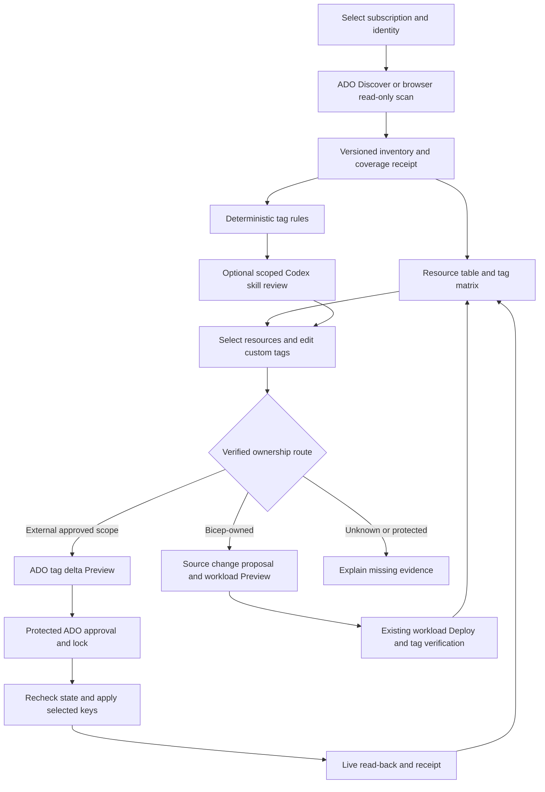

# Tag discovery, analysis and governed updates

**Status: researched implementation plan, 27 September 2026. No tagging skill, UI, pipeline or tag write is delivered by this document.** Existing seven workloads, five project skills, four agent reviews and 18 pipeline roots remain unchanged. This is a platform operations capability across resources, not an eighth workload that owns those resources.

## Intended experience

Add **Tag governance** beside Network discovery in Platform Studio. A developer selects an accessible subscription, discovers its visible resources and tags, understands deficiencies, drafts custom tags or accepts suggestions, and sends a reviewed request to ADO. ADO publishes the exact tag delta before any change, requires a protected approval for Apply, and returns verified per-resource outcomes. Discover and deterministic analysis work without Codex; optional AI explains evidence and proposes drafts.

### Screen and interaction specification

| View | Content and behavior |
|---|---|
| Scope bar | Subscription display name plus ID, tenant, Azure connection, ADO project and pipeline eligibility. Duplicate names remain distinguishable by ID. A subscription visible to the browser but not onboarded to ADO is labeled **Browser discovery only**. No run starts on selection or sign-in. |
| Scan controls | **Discover in ADO**, **Scan with my Azure connection**, and **Open saved discovery**. Explain whose permissions each uses; keep snapshots separate. Show progress, cancellation, observed time, source run and coverage. Refresh never changes an in-flight draft's evidence. |
| Overview | Counts for discovered resources, tag-capable resources, zero tags, missing required tags, conflicts, unsupported types and unknown/failed coverage. Show rule-set version and the denominator of each percentage. Never call unsupported resources noncompliant or equate a partial scan to subscription-wide compliance. |
| Resources | Searchable, sortable, paged table: name, type, resource group, region, subscription, ownership, tag support, tag count, findings, observation time. Every row expands to **all observed tag keys and values**, with masked values clearly marked. Untagged and unreadable are different states. Filters include key/value, missing key, type, group, owner, rule and status. |
| Tag matrix | Resources as rows; user-selected tag keys as columns. Sticky identity columns, explicit Missing/Empty/Masked/Unknown cells, keyboard navigation and text labels alongside color. Virtualize large results; filtering must not discard inventory. Add a key-centric view showing distinct values and usage counts. |
| Resource detail | Exact resource ID; current tags; proposed delta; rules and evidence; scope-level tags shown separately; verified/unknown source owner; policy/lock findings; authoritative Azure link built from validated IDs. No automatic claim of inherited resource tags. |
| Recommendations | Rule ID, severity, observed evidence, rationale, suggested value, provenance and missing input. Human-entered, deterministic and agent suggestions carry distinct labels. No recommendation is pre-approved. A team, cost center or classification is never guessed into a change. |
| Draft editor | Select explicit resources; add custom key/value rows; bulk **Add if absent** by default; explicit **Set value** with old/new display. Mixed existing values require review. Freeze the selected IDs, rather than applying later to whatever matches a filter. Validate each resource's resulting tag set before allowing Preview. |
| Review and results | Exact resource/key Add/Update/NoChange/Blocked diff; preserved-key count; ownership route; impacts of tags consumed by automation; stale evidence warnings; ADO Preview link; approval state and verified results. Download sanitized JSON, CSV and the README summary. |

The subscription selector is dynamic in the portal. Native ADO menus contain generated, reviewed subscription/profile choices; queue-time YAML values do not become new dropdowns after discovery. The rich grid/editor belongs in the portal. [ADO runtime parameters](https://learn.microsoft.com/en-us/azure/devops/pipelines/process/runtime-parameters?view=azure-devops)

## Research decisions

| Microsoft behavior | Platform design consequence |
|---|---|
| Tags are plaintext; names are operationally case-insensitive, values case-sensitive; subscription/RG tags do not automatically become resource tags. General limits are 50 pairs, 512-character keys and 256-character values; storage keys and some resource types have lower limits and other restrictions. | Preserve observed casing, compare keys case-insensitively, distinguish empty/missing values, validate per type, and flag sensitive content. Do not implement a universal 50-tag validator. [Tag rules](https://learn.microsoft.com/en-us/azure/azure-resource-manager/management/tag-resources) |
| Tag support and emission into cost reports are separate capabilities. | Maintain a dated provider support snapshot plus qualified write adapters. Unknown types remain visible but cannot be edited until qualified. [Support matrix](https://learn.microsoft.com/en-us/azure/azure-resource-manager/management/tag-support) |
| Resource Graph is permission-filtered and eventually consistent. Successful results can omit resources the principal cannot read. | Discover at scale with ARG, report visible coverage, and use direct ARM reads for Preview/Apply verification. Never certify tenant/subscription completeness from HTTP 200. [Resource Graph](https://learn.microsoft.com/en-us/azure/governance/resource-graph/overview) |
| ARG pages are bounded; sorting and continuation handling affect large inventories. | Query fixed projections ordered by ID, consume every continuation, reject repeated tokens/truncation and mark limits explicitly. Retain IDs in queries; test over 1,000 records. [Large datasets](https://learn.microsoft.com/en-us/azure/governance/resource-graph/concepts/work-with-data) |
| Tags REST supports Merge, Replace and selective Delete. | Use Merge for approved additions/value changes. Prohibit Replace and v1 deletion/rename. Preserve unrelated keys. This is a tag-operation preview, not ARM What-If. [Update at scope](https://learn.microsoft.com/en-us/rest/api/resources/tags/update-at-scope?view=rest-resources-2021-04-01) |
| Bicep tag declarations replace existing tags unless the desired set includes them. | Route known IaC-owned resources through their source of truth; do not create a second Deployment Stack to adopt existing resources just to tag them. [Bicep tagging](https://learn.microsoft.com/en-us/azure/azure-resource-manager/management/tag-resources-bicep) |
| Azure Policy Modify can govern tags; existing resources require remediation for changes to be applied. | Inspect applicable assignments, exclusions and exemptions; flag conflicts/unknown evaluation. Policy creation and remediation are separate approved work. [Modify effect](https://learn.microsoft.com/en-us/azure/governance/policy/concepts/effect-modify) |
| Cost Management inheritance applies tags to usage records rather than changing resource tags. | Keep observed resource tags separate from billing evidence. No claim that changing tags fixes historical costs. [Cost inheritance](https://learn.microsoft.com/en-us/azure/cost-management-billing/costs/enable-tag-inheritance) |

These are design inputs, not proof that this subscription's resources or policies have been inspected. Provider support/REST versions must be pinned and rechecked during implementation.

## Checkout findings and reuse

- `NetworkDiscovery.Scopes` already filters accessible subscriptions by configured tenant; it is network-specific and gated by `AllowExpandedNetworkDiscovery`. Extract a tested shared subscription reader instead of making tagging depend on that switch or requiring management-group listing permission.
- `NetworkPipeline.Review/Queue` and `PipelineRegistration` demonstrate browser-owned expiring tickets, fixed routes, catalog bindings and uncertain-response handling. Reuse the contracts, while adding stronger tagging-specific artifact and source qualification.
- `AgentWorkflows` currently exposes four workflows. `AgentMcpBridge` exposes only `platform_evidence` and `platform_skill`; use these existing read-only tools with a tagging evidence projection. Do not advertise invented Microsoft MCP tag-write tools.
- Workload compositions already declare `workload`, `environment`, `owner`, `costCenter`; Blob copy adds `dataClassification` and `managedBy`. Other products include lifecycle, principal or review-reference tags. Existing tags are compatibility inputs, not a reason to rename everything to new casing.
- `config/pipeline-registration.json` must include future tagging roots, because `PipelineRegistration.LocalCatalog` rejects unregistered root YAML. Extend generation/contract checks and package assets together. Two proposed roots would increase registration coverage from 18 to 20 when implemented.
- Keep tests/fixtures under `tests/`, reusable resource Bicep under `modules/`, compositions under `workloads/`, operational scripts under `scripts/`, and local outputs under ignored `artifacts/`. Do not modify vendored Azure skill instructions.

## Identity, scope and collection

### Subscription dropdown

Read enabled subscriptions visible to the signed-in Azure user in the configured tenant. Label IDs, browser visibility and ADO eligibility separately. ADO eligibility requires a reviewed subscription-to-service-connection mapping; browser access does not imply that a pipeline principal has access. Refresh handles consent denial, expired login and newly added access without inventing an empty list.

For the current registered subscription, `SC-AZ-A-Bicep` is a known deployment connection with broad permissions. Do not infer other subscriptions from it. Prefer a dedicated read connection and a scoped tagging writer for this workflow. The profile maps names to exact tenant/subscription and connection identities at template expansion; clients cannot supply arbitrary connection names. Recheck `az account` tenant/subscription at job start. No automatic RBAC grants.

Browser scans use browser Azure permissions. ADO scans use the registered discovery principal and require ADO sign-in to queue/read them. The portal must authorize access to saved artifacts through ADO, bind them to the configured private project, and state their principal/scope. Requiring browser visibility for a portal-selected scope is an additional product check, not a substitute for ADO permissions when runs are queued directly.

### Inventory algorithm

1. Validate one selected subscription and a versioned registered profile. v1 collects the subscription's visible ARM resources, with separate resource-group and subscription tag collections. Management-group/tenant multi-select is an extension, not a v1 completeness claim. Data-plane objects such as blob index tags are outside scope.
2. Query ARG `Resources` using an explicit subscription array and a fixed projection of ID, name, type, group, location and tags, ordered by ID. Query `ResourceContainers` separately for RG/subscription context. Use paged ARM subscription resource/group lists as reconciliation/fallback; provider-specific child resources need qualified supplemental collectors. Do not promise ARG covers every Azure object.
3. Capture tags as supplied, including empty values. Record null/absent semantics by collector contract. An actual successful response with no tags is **Untagged**; denied/malformed/unsupported reads are **Unknown** or **Unsupported**. Never convert permission/provider errors to an empty dictionary.
4. Record principal, query/API/version, start/end time, pages, deduplicated IDs, support-data version, truncation/denials and exclusions. Cap time/pages/bytes/resources explicitly. Start with a configurable 50,000-resource/15-minute bound; overflow produces Partial and requires narrower scope. These are proposed platform limits to performance-test, not Azure quotas.
5. Collect policy/lock and ownership evidence where authorized. Record inherited-scope read gaps. No complete general-purpose Azure Policy evaluator is promised; unsupported expressions or missing assignments block dependent changes until platform review.
6. Publish a sanitized inventory plus manifest and README. Direct ARM reads establish each selected resource's current tag map during Preview and immediately before/after Apply. ARG refresh is only a later reporting check.

Complete-visible collection, proven subscription-wide read scope, provider coverage and freshness are independent fields. Analysis may explain partial inventory; v1 Apply requires successful required collections and current evidence for every selected resource.

## Rule engine and skill contract

Tagging follows the [shared agent workflow standard](../agent-workflow-standard.md) and its [blueprint](../templates/agent-workflow-blueprint.md). It reuses `AgentHostChannel` for AHP session/readiness, `/api/agent/run` for typed execution, `CodexAgentRuntime` for Astra/High/Standard inference, and `AgentMcpBridge` for evidence/skill reads. No separate tagging agent server is needed. Add a typed tagging evidence reference and domain adapter; do not misuse `NetworkReportId` or treat a skill-library entry as a runnable workflow. Implement shared structured-review validation before recommendations can populate a tag draft. AHP coordination alone neither performs AI analysis nor authorizes a tag write.

Create a first-party **`platform-tagging-review`** skill and portal agent workflow `tagging` during implementation. Bind it to a chosen saved inventory/analysis ID. Preserve GPT-6 Astra / High / Standard and the existing explicit Codex Run behavior. Authentication only unlocks readiness; it does not run analysis, queue ADO or apply tags.

The skill reads a bounded, sanitized evidence projection and pinned rule definitions through `platform_evidence` and `platform_skill`. It explains findings, suggests supported values, identifies missing business inputs and returns schema-validated advisory JSON plus readable prose. A suggestion must reference an observed resource, rule/evidence IDs, provenance and any uncertainty. Reject invented IDs, unknown keys outside the permitted custom namespace, secret-bearing values and changes to protected fields. Over-budget inventories require an explicit subset or clearly disclosed batches; never silently omit resources. Avoid extra model calls by caching on evidence/rule/skill/model hashes.

Deterministic code owns schema validation, resource selection, tag limits, applicable requirements, policy/ownership classification, eligibility, diff generation and authorization. Model output cannot call a writer or become executable KQL, YAML, PowerShell, HTML or Markdown links. Tags and resource names are untrusted prompt content. A deterministic-only workflow must support the entire discovery/edit/preview/apply path.

### Initial rule pack

| Rule group | Proposed behavior |
|---|---|
| Ownership/accounting | Reuse `owner`, `costCenter`, `workload`, `environment` where an approved profile makes them applicable. Detect missing, blank and placeholder values. Resolve values from reviewed team/cost-center mappings; otherwise ask for user input. Do not infer an owner or environment solely from names. |
| Classification | Suggest `dataClassification`, criticality and lifecycle metadata only under a reviewed organizational standard. Distinguish recommended from required; Microsoft examples are not the organization's policy. |
| Consistency | Detect case variants, aliases such as env/environment, inconsistent enumerations and conflicting group/resource values. No automatic key rename or subscription/RG propagation. |
| Integrity | Validate type-specific limits, tag capability, sensitive-looking content, approved custom keys and exact value semantics. Reserved/system keys are blocked rather than normalized. |
| Governance | Surface policy conflicts, locks, denied reads, source ownership and automation-consumed tags. Unknown is not Pass. Findings include rule version, severity and evidence. |
| Reporting | Report required-key coverage and missing-value distributions over applicable, readable resources. Show cost-report support separately; no invented savings, prices or compliance certification. |

Protect platform control/review tags including `managedBy`, `workloadType`, `releaseActivated`, `deploymentPrincipal`, `trustedServiceReview` and `runtimeCredentialReview`, plus platform-configured operational/billing keys. Tags are not proof of authorization or ownership. Evidence from registered workload outputs/stack membership and reviewed source mappings determines the route; an arbitrary `managedBy` tag cannot grant edit permission. Existing external resources require a platform-approved ownership classification, even when no IaC marker was found.

## Change plans and execution routes

### External resources: tag operations

Allow **AddIfAbsent** and **SetValue** only for qualified resource types and approved scopes. Preview calculates an explicit Merge patch per resource, expected old values, resulting count, canonical full-map fingerprint and preserved-key count. Key normalization is case-insensitive; values remain exact. Case collisions fail rather than choosing a winner. Missing, empty and masked remain distinct. No resource creation/deletion or full resource PUT occurs.

Apply downloads the immutable reviewed plan, validates its provenance and rules, then directly re-reads every selected resource before the first write. Any drift blocks the batch and requests a new Preview; recheck each resource immediately before its write. Use an ADO exclusive lock keyed to subscription/profile and a reviewed change window for resources with external writers. Apply Merge once, read back the full tag set, verify requested values and preservation of unrelated tags, and record provider request IDs.

Do not claim atomic compare-and-swap: the documented generic Tags PATCH contract does not specify an `If-Match` precondition. Read-before-write plus an ADO lock cannot exclude Azure Portal, Policy or another deployment. Qualify provider-specific conditional writes where supported; otherwise disclose the residual race and block high-contention/protected resources. Never retry an uncertain write blindly. Re-read and classify Verified/Conflict/Unknown; stop subsequent writes on failure. No automatic rollback: it could undo later legitimate edits. A compensating change needs its own current-state Preview and approval. Successful earlier writes remain visible in partial receipts.

### Bicep-owned resources: source changes

Direct tagging can be overwritten by the next workload deployment. For registered resources, generate a source-change proposal with exact target/config locations and a tag diff; keep GitHub publication/PR submission a separate deliberate action. Add validated `customTags` to typed requests/targets and propagate it through all seven compositions, RG wrappers, prerequisite resources, adapters, Template Spec parameters and release bundles. Reject protected-key overrides case-insensitively before combining custom and required tags. Existing reusable module `tags` inputs remain the boundary; introduce no generic resource-adoption module.

The source proposal is reviewed/merged, then the existing workload Discover → Bicep What-If Preview → Deploy path applies it. Include a tag-preservation regression: add an approved custom tag through source, redeploy twice, and verify it persists with platform tags. Third-party Terraform/Bicep or unknown source owners receive an actionable handoff, not a guessed repository patch. Mixed-source selections become separate change plans; do not claim one atomic cross-system update.

## ADO pipeline contract

Proposed names/paths below are **not present yet**:

| Definition | Root | Stages and menu |
|---|---|---|
| **Discover - Tags** | `azure-pipelines-tags-discover.yml` | `Discover` → `Analyze`; registered subscription/profile and optional reviewed RG filter; publish `tag-discovery` containing inventory, analysis, manifest and README. Read-only connection. |
| **Tags - Preview and Apply** | `azure-pipelines-tags.yml` | `Preview` → protected `Apply` → `Verify`; **Preview only** default, or **Preview and apply**; registered profile, exact discovery run, validated change request and source hashes. Publish `tag-preview` and `tag-apply`. |

Both roots disable CI/PR/resource triggers and schedules. Use the existing qualified Windows agent configuration; tag management-plane requests do not inherently require a private VNet agent. Resolve service connections from reviewed literal mappings; never broaden the existing connection's scope. Shared templates enforce the same checks for portal and native ADO runs. No model is required inside a pipeline.

`Preview` validates discovery provenance, refreshes ARM evidence, analyzes ownership/policy/support, and uploads an Extensions README with resource ID, each key's old/new value, action, reason and blockers. It does not invoke Bicep What-If for generic tag-only PATCH operations. For IaC routes, link the separate actual workload What-If. Apply is omitted for Preview-only runs. To proceed after a completed Preview-only run, queue a new Preview-and-apply run bound to the same draft and prior plan hash; any changed plan requires new user review. The current run's Preview artifact is the one approved in ADO.

Apply uses a deployment job and a dedicated tagging environment with approval, protected branch/required-template checks and a subscription-scoped exclusive lock. The platform configures these outside YAML; a UI review ticket does not replace them. Verify runs after attempted Apply even on partial failure where possible; preserve receipts if cancellation prevents verification. Rejected/cancelled approval performs no tag write. [ADO approvals and checks](https://learn.microsoft.com/en-us/azure/devops/pipelines/process/approvals?view=azure-devops)

### Request and artifact transport

Use the existing ADO Run API with a **bounded non-secret change-request parameter**, encoded as base64url JSON to prevent multiline/quoting problems. Encoding is not encryption. Initial limits: 100 explicitly selected resources and 32 KiB encoded request; smaller limits win and overflow is rejected, never truncated. The pipeline maps the parameter into an environment variable, decodes it with a strict parser, and never interpolates it into script text or prints it. Qualify Azure DevOps limits in server-side tests before admitting this transport. Larger requests require a separately designed private intake store, not a public GitHub file.

Runtime parameters are visible metadata and cannot hold secrets. Therefore both request queueing and artifact publication require a verified **private ADO project**, reviewed reader permissions and allowed non-sensitive values. Public GitHub remains source-only. If the ADO project is public or visibility cannot be checked, keep discovery local and block this pipeline path. Do not silently upload resource inventories. [Parameter behavior](https://learn.microsoft.com/en-us/azure/devops/pipelines/process/runtime-parameters?view=azure-devops)

The Preview pipeline materializes the request and publishes a content-hashed artifact. Apply consumes that same run's artifact, never a local filesystem path, arbitrary URL or unqualified latest run. Verify project/definition ID, repository, branch, source commit, success of the producing stage, tenant/subscription, schema, rule/support versions, digests and freshness. A separate semantic-plan digest excludes observation timestamps/run IDs while retaining scope, before-state, operations, rule versions and source bindings; use it to compare repeated Previews without confusing a fresh timestamp with a changed decision. Hashes detect changes but do not authorize an untrusted producer. A malformed direct ADO request must fail the same validations as a portal request. Bind portal queue tickets to browser session, selected pipeline ID, request/config hashes, expiration and one-use semantics; retain uncertain queue outcomes without resubmission.

### Versioned data contracts

| Contract | Required fields |
|---|---|
| `platform.tag-inventory/v1` | Tenant/subscription, actor/source, scope and coverage, observed interval, resource IDs/type/location/group, exact or explicitly masked tags, tag capability/support version, collection diagnostics without raw secrets. |
| `platform.tag-analysis/v1` | Inventory digest, rule version, resource/rule/evidence IDs, severity, observed problem, recommendation/provenance, unknowns and applicable coverage denominators. |
| `platform.tag-change-request/v1` | Request ID, profile, discovery run/definition/digest, explicit resource IDs, AddIfAbsent/SetValue operations, non-sensitive proposed values, rationale and expected before-state fingerprints. |
| `platform.tag-plan/v1` | Request/evidence/source digests, refreshed state, exact patches and preserved counts, ownership routes, blockers, rule/support versions, expiry and previous preview binding if supplied. |
| `platform.tag-receipt/v1` | ADO definition/run/stage, plan digest, timestamps, per-resource Attempted/Verified/Blocked/Conflict/Unknown, before/after fingerprints, preserved-key verification, provider request IDs and sanitized errors. |

Keep resource IDs scope-validated and canonicalized without losing original display strings. No wildcard target expansion during Apply. Sign-out/cross-session reads cannot access browser-owned evidence. Initial plan lifetime is 30 minutes; approval after expiry requires a new Preview, with no automatic plan refresh under an old approval.

## Public-repo security and operational limits

- Reuse existing ignored local credential storage; browser tokens do not enter YAML, run parameters, receipts, prompts or GitHub. Pipeline identities use ADO federation. Restrict writer connection authorization to the intended protected template/pipeline; do not grant all pipelines access.
- Prefer a reviewed custom role with required read operations and `Microsoft.Resources/tags/read`/`write` at approved scopes. Built-in Tag Contributor is an alternative to assess, not assume minimal: its published actions include operations beyond tags. Reader access is separately necessary for discovery/context. Role assignment changes are a platform onboarding task. [Role definition](https://learn.microsoft.com/en-us/azure/role-based-access-control/built-in-roles/management-and-governance#tag-contributor)
- Tags that control automation can affect backups, schedules, ownership or chargeback. Maintain a protected-key registry and consumer-impact field; tag updates are not universally impact-free.
- Detect likely secrets/PII before persistence, export or model transfer. Show masked values with a reason; deny proposals involving protected/sensitive values. Default model projections include only approved metadata keys and required evidence. Detection is imperfect; maintain local/ADO ACLs and explicit retention. Proposed sanitized artifact retention: 30 days, configured by platform policy.
- Render all names/values as text. Escape Markdown/CSV exports, including spreadsheet formula prefixes. Sanitize logs and never print complete CLI responses. Test HTML, Markdown links, shell substitutions, pipeline expressions, Unicode collisions and prompt injection as data.
- Read throttling uses bounded backoff/Retry-After and cancellation. Writes use durable intent/outcome records and reconciliation. Make partial completion and pending verification visible; no green success for a mixed batch.
- Do not label the whole workflow free: pipeline agent/artifact usage and optional Codex review can consume paid capacity. Initial reports have no live cost API dependency and make no savings estimate.

## Proposed source placement and methods

These paths are implementation targets, not claims of existing files:

| Path | Responsibility |
|---|---|
| `config/tag-governance.json`, `config/tag-resource-support.json` | Versioned rules, protected/custom keys, profile bindings, limits and dated support evidence; Apply disabled until qualification. |
| `self-service/operations/tagging/*.json` | Approved operation profiles: tenant/subscription, literal ADO bindings, scope eligibility, source ownership and approval/lock references. Keep resource inventories out of source. |
| `src/SelfService.Tagging/` | Shared .NET contracts and deterministic `Validate`, `Analyze`, `BuildPlan`, `CheckDrift`, `VerifyResult`; no portal, model or CLI dependencies. |
| `src/SelfService.Tagging.Tool/` | Pipeline CLI with `discover`, `analyze`, `preview`, `apply`, `verify` verbs; explicit reader/writer adapters. Reuse the repo's .NET SDK/lock conventions; qualify added Azure SDK versions during implementation. |
| `src/SelfService.Portal/Tagging/` | `TagDiscovery`, `TagEvidenceStore`, `TagPipeline.Review/Queue`, artifact reader and typed endpoints; reuse shared logic rather than a second validator. |
| `src/SelfService.Portal/wwwroot/tagging.mjs` | Resource table, matrix, editor, evidence/source labels and accessible review/result UI. |
| `.agents/skills/platform-tagging-review/SKILL.md` | Read-only evidence review contract and examples; wire into Catalog, AgentWorkflows, packaging and evidence-size tests. |
| `scripts/Export-TagInventory.ps1`, `scripts/Invoke-TagPlan.ps1`, `scripts/Invoke-TagChanges.ps1` | Thin wrappers over the shared CLI; fixed arguments/files, no executable user strings. |
| `pipelines/templates/tagging-discovery.yml`, `pipelines/templates/tagging-stages.yml` | Two manual roots' reusable discovery and Preview/Apply/Verify flow. |
| `tests/SelfService.Tagging.Tests/`, existing portal/infrastructure tests | Shared planner/adapter tests, authorization/artifact integration, UI contracts, fault injection and YAML checks. |
| `docs/tag-governance.md`, existing README/status/security/validation guides | Actual setup commands, method contracts, operator runbook and honest acceptance status when implementation lands. |

Proposed endpoints: `GET /api/tags/scopes`, explicit `POST /api/tags/discover`, `GET /api/tags/evidence/{id}`, `POST /api/tags/analyze`, `POST /api/tags/drafts`, and `POST /api/tags/pipeline/review` / `queue/{ticket}`. No browser `apply` endpoint. Agent review continues through the existing typed agent adapter using a saved evidence ID. Pipeline CLI owns cloud writes; source-owned changes continue through workload delivery.

## Implementation phases and release gates

| Phase | Deliverable | Exit evidence |
|---|---|---|
| T0 — Contracts and platform profile | Schemas, shared deterministic core, support snapshot, rule pack, profile mapping and threat review. Bind the shared workflow descriptor/evidence contracts (standard W1). Agree private ADO project, reader/writer identities and ownership policy. | Golden examples; missing/empty/denied distinction; case/value/type limits; no writable profile enabled. |
| T1 — Discovery | Shared subscription selector, paginated ARG/ARM collection, coverage manifest and Discover pipeline artifact. | >1,000 resources; unsupported children; 403/429/timeouts/duplicate tokens; separate browser/ADO principals; no secret/token leakage or false completeness. |
| T2 — Portal and skill | Table/matrix/detail/editor, deterministic findings, explicit optional `platform-tagging-review`, downloads; reuse existing AHP/Codex/MCP and implement the standard's W2 structured advice/draft contract. | Keyboard/browser tests; large inventory performance; custom tags; mixed selection; masked fields; malicious values; deterministic-only usability; bounded evidence, AHP/status fallback and no AI writes. |
| T3 — Preview and handoff | Typed transport, saved-run validation, resource-level refreshed diffs, Extensions README and plan artifacts. | Wrong project/run/branch/scope/hash/expired plan rejected; shell/YAML injection blocked; Preview-only queues no Apply; direct native ADO misuse fails closed. |
| T4 — External-resource Apply | Qualified Merge adapters, protected ADO job, lock, live preconditions, receipts and reconciliation. | Preserve unrelated tags; no blanket replacement/delete; drift blocks; partial/unknown outcomes; approval rejection/cancellation; locked/policy-controlled resources; no automatic retry or rollback. |
| T5 — Workload source integration | All seven typed requests/compositions preserve approved custom tags and protect platform tags; source-change handoff with existing workload Preview/Deploy. | Two redeploys retain custom tags; case-insensitive override rejection; RG/module/prerequisite propagation; Template Spec/bundle integrity. Required for claiming support for this repo's workloads. |
| T6 — Manual Azure/ADO acceptance | Operator uses a designated test RG and approved profile; verify UI, artifacts, real approval and one controlled tag update. | Azure Portal/ARM before-after comparison, no unrelated changes, proper policy conflict, drift and lost-response reconciliation; ARM64 and x64 packages; source manifest/docs current. |

Do not enable writes until T0–T4 acceptance for the selected external-resource profile. Do not claim the complete requested suite until T5 and T6 pass. Local mocks, compiled YAML and a rendered matrix cannot establish cloud write safety or full subscription visibility. No secrets or real inventories belong in committed fixtures.

### Manual acceptance script for the future operator

1. Sign in to Azure and ADO; verify subscription labels, private-project requirement and service-connection mapping. Sign-out and denied access must remove readiness.
2. Run Discover on a designated test scope with tagged, untagged and unsupported resources. Compare representative rows and every selected resource's tags with Azure. Inspect coverage and the saved source run.
3. Run deterministic analysis first; optionally run Codex with the disclosed sanitized subset. Suggestions must reference evidence and remain unselected drafts.
4. Enter one permitted custom tag and choose one approved value update; Preview only. Verify exact old/new values, preserved tags, README, source hash and absence of Apply.
5. Queue Preview and apply. Reject approval first and confirm no mutation. Run a freshly reviewed request, approve it and verify direct read-back plus UI receipt. This is a real Azure metadata change requiring the operator's authorized test scope.
6. Exercise drift, a denied/locked resource and a policy conflict. Use fault injection locally for lost responses rather than destabilizing Azure. No batch may silently proceed on unknown state.
7. For a source-owned workload, accept the separate source-change route and run its established Preview/Deploy acceptance. Confirm tags survive the next deployment; no second stack adopts the resource.
8. Review retained artifacts and resource state. Any test-tag removal is a separately reviewed change; v1 performs no automated cleanup/deletion.

## Deferred enhancements

Multi-subscription/management-group scans with explicit coverage; organization dictionaries/CMDB integration; policy initiative deployment and controlled remediation; tag deletion/rename with provider-specific concurrency qualification; billing-supported cost allocation reports; larger private request intake; scheduled drift reports; cross-IaC-owner PR integrations; custom conditional-write adapters. Each needs its own authorization and acceptance contract. The first release does not grant the agent autonomous remediation authority.
