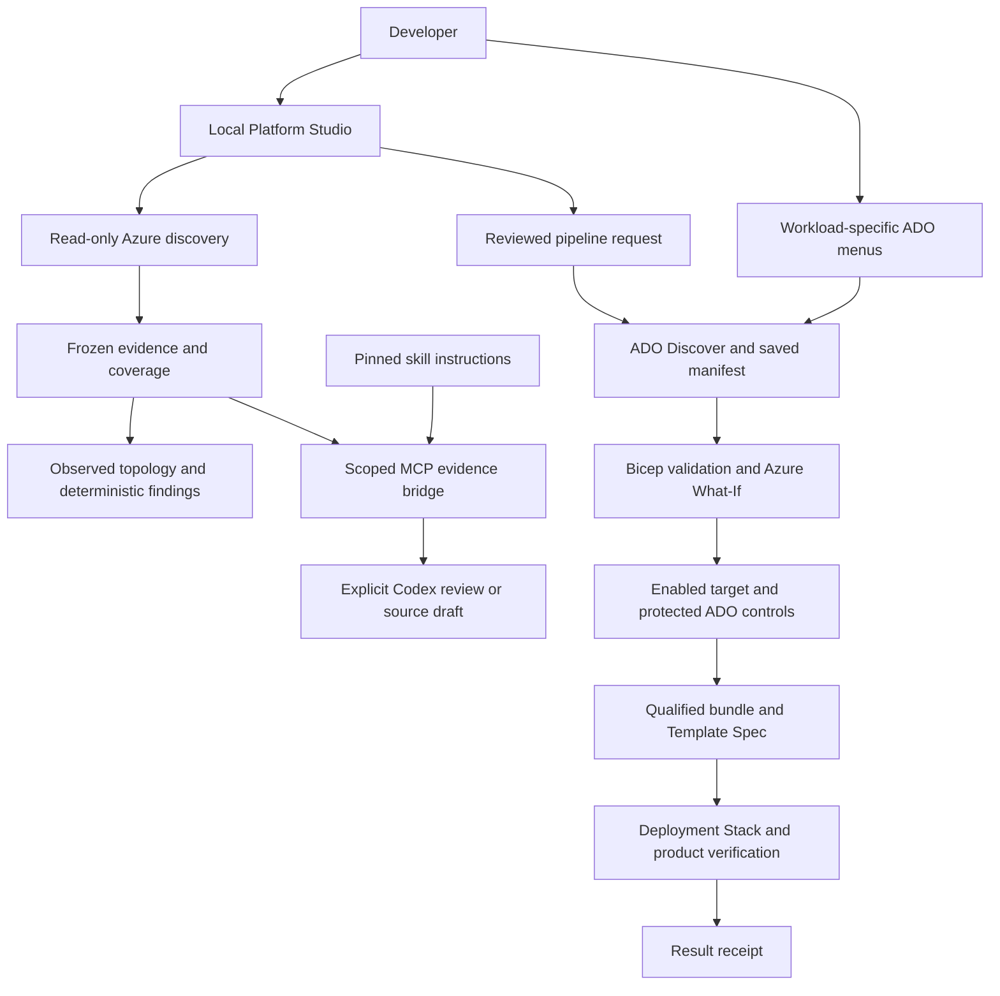

# Platform overview

[Wiki home](README.md) · [Get started](getting-started.md) · [Workload catalog](workload-catalog.md) · [Status](completion-status.md)

Platform Studio connects a local developer experience to governed Azure delivery. The portal reads evidence, explains choices and submits reviewed requests. Azure DevOps performs protected operations. Bicep compositions and reusable modules describe the infrastructure; Template Specs and Deployment Stacks provide versioned delivery and resource ownership.

## Components and responsibilities

| Component | Responsibility |
|---|---|
| Platform Studio | Single-user localhost web application: workload configuration, discovery, diagrams, agents, tagging, policy views and ADO request review. |
| Bicep modules and workloads | Shared resource contracts, workload compositions, stack wrappers and environment parameters. |
| Azure DevOps | Manual Discover/Preview/Deploy and operations pipelines, service connections, protected environments and private agent execution. |
| Evidence and governance | Manifests, source/bundle hashes, exact target bindings, ownership checks, drift rechecks and result receipts. |
| Codex and MCP | Explicit model review over frozen evidence and pinned skills; no model deployment or allocation tools. |
| Local runtime | Real Blob copy Functions/Azurite path; separate lifecycle from the portal. |

This is the implemented source flow; its presence does not enable targets or establish live Azure acceptance. Product details and YAML files are in the [workload catalog](workload-catalog.md).

## Identity and execution boundaries

Azure browser sign-in authorizes resource reads using the user's access. ADO sign-in authorizes the portal's pipeline/artifact actions. Pipeline service connections govern deployment permissions. Codex sign-in enables model execution separately. The portal needs its own Entra public-client registration, distinct from the pipeline principal.

Authentication does not automatically run discovery, inference or deployment. Source drafts and agent recommendations cannot enable a target, allocate network space or approve a change. Azure/ADO bearer tokens are not supplied to the model. See [portal authentication](local-portal.md), [agent contracts](agent-workflows.md) and [security/RBAC](security-and-rbac.md).

## Discovery and evidence views

| View | What it establishes | What it does not establish |
|---|---|---|
| Visible-resource inventory | Metadata and supported configuration within collected scope, with explicit coverage. | Complete tenant visibility, effective permissions or deployment readiness. |
| Network discovery | Registered/selected subscriptions, management-group descendants or accessible subscriptions in the configured tenant; deterministic configuration findings. | Free IP capacity, effective reachability or authority to allocate. |
| Saved discovery analysis | Coverage/findings from a matching inventory/manifest pair, plus Markdown, Mermaid, SVG and hashes. | Fresh live state or an authorization to deploy. |
| Workload proposal | Reviewed conceptual components for the selected product/environment. | Expanded Bicep resource counts, final names or verified reuse decisions. |
| Azure Preview | Resource actions returned by the saved What-If artifact; detailed property changes remain in ADO evidence. | A deployed or verified final state. |
| Recovery assessment | Policy requirements and deterministic checks over supplied assertions. | Verified historical baseline, execution approval or a guarantee of restoration. |

A completed portal deployment currently reloads the saved Preview. Durable run-bound before/after snapshots and a verified final-state diagram remain planned. Guides: [connected diagrams](portal-diagrams.md), [offline analysis](self-service-analysis.md) and [state/recovery design](plans/deployment-state-and-recovery.md).

## Azure Resource Visualizer and network evidence

The bundled [Azure Resource Visualizer skill](../vendor/azure-skills/skills/azure-resource-visualizer/SKILL.md), registered as `azure--azure-resource-visualizer`, guides both **Azure resource visualizer** and **Private network evidence review**. It is the foundation for the suite's agent-assisted network diagrams. The adapter intentionally exposes a narrower capability than the complete upstream skill.

1. The user connects Azure and Codex, then selects a visible resource group or hands off a recent browser-owned Network discovery snapshot.
2. The application collects or freezes scoped metadata and configured relationships. A handed-off network snapshot must be at most 15 minutes old; inaccessible dependencies remain coverage gaps.
3. The MCP bridge supplies only `platform_evidence` and `platform_skill`. The agent must read both; there is no general Azure CLI or cloud-write tool.
4. Codex produces advisory Markdown and, for visualization, Mermaid. The server validates restricted grammar and evidenced resource/relationship references before image-only SVG rendering.
5. The UI labels the result **Agent interpretation**. Rejected diagrams stay text-only; reviews, source and receipts remain available for download under the existing evidence controls.

Resource topology comes from discovery, not model inference. A diagram cannot prove connectivity, discover undisclosed subscriptions, establish free addresses or authorize subnet creation. The deterministic observed/proposed/Preview views continue to work without AI. See [diagram validation and manual acceptance](network-discovery-and-diagrams.md).

## Skills and agent workflows

The library contains **42 pinned Microsoft Azure skill definitions** and **eight project skills**. Microsoft cards say **No pipeline associated yet**: supporting discovery does not execute every upstream workflow. The [bundle](../vendor/azure-skills/bundle.json) retains source pinning, hashes and license material.

Six workflows are wired into the agent runtime:

| Workflow | Input | Connections |
|---|---|---|
| Azure resource visualizer | Selected-group metadata or browser-owned network evidence. | Codex + Azure |
| Private network evidence review | Configured network relationships and coverage. | Codex + Azure |
| Workload configuration advisor | Selected catalog product, target and proposed topology. | Codex |
| Saved Preview change review | Matching saved Preview resource-action projection. | Codex + ADO |
| Tag governance review | Selected saved tag evidence and deterministic findings. | Codex + Azure |
| Design Bicep source draft | Network evidence, workload context and source-hashed local module contracts. | Codex + Azure |

The repository policy selects GPT-6 Astra, High reasoning and Standard speed. Native Codex app-server performs inference; the experimental AHP profile coordinates session/readiness only. This is not a general Azure MCP server or fully conformant AHP host. Methods, setup and limits are documented in [agent workflows](agent-workflows.md).

The Bicep draft workflow supports 12 selectable modules from a 13-module audit; the IPAM reservation module stays separately governed. It generates main/stack/parameter source and provenance, with missing values marked as required. Drafts must compile, pass review and qualify before becoming deployable products. See [source drafts](bicep-source-drafts.md) and [module audit](plans/bicep-composition-and-module-audit.md).

## Operations workflows

| Workflow | Implemented experience | Remaining boundary |
|---|---|---|
| ADO setup | Inventory, review and register missing definitions from the 20-root catalog; reuse matching definitions and block conflicts. | Existing GitHub connection, permissions and live acceptance are required. Registration queues no runs. |
| Tag governance | Subscription tag table/matrix, deterministic findings, optional structured advice, custom-tag drafts and manual Preview/Apply/Verify. | Apply disabled. External resources require ownership/type qualification; source-owned resources produce source proposals. |
| Network/IPAM | Scoped discovery, deterministic findings and reviewed AVNM pipeline handoff. Plan/Reconcile are read-only; protected reservation precedes a separate exact-prefix Preview and network creation. | Profile disabled. Existing pool, protected ADO setup and live acceptance required; no automatic workload binding. |
| Recovery policies | Fourteen rulesets, selected-workload/all-workflow UI, Preview annotations and offline checks. | Caller assertions remain unverified; no recovery executor or rollback button. |

The current network creation profile uses a retained /24 reservation with /26 Web integration and /27 endpoint subnets. Effective DNS/routing, occupancy, external-address reconciliation and hub integration require further qualification. An IPAM/network receipt is not proof that a workload is ready. See [network/IPAM](network-discovery-and-diagrams.md), [tagging](tag-governance.md), [registration](ado-pipeline-registration.md) and [recovery](recovery-rules.md).

## Source and evidence ownership

`src/` owns application/runtime code; `modules/` owns reusable Bicep contracts; `workloads/` owns product compositions; `config/` and `self-service/targets/` hold reviewed catalog and target policy; `pipelines/` and root YAML define delivery. Project skills live in `.agents/skills/`; the pinned upstream bundle lives in `vendor/azure-skills/`.

Ignored `.local/` and `artifacts/` contain runtime state, reports and generated drafts. Private settings and credential caches must stay out of source control. Normal startup uses the real portal and analyzer, not test fixture servers. Follow [repository conventions](repository-structure.md) and the [workflow standard](agent-workflow-standard.md) when extending the suite.
