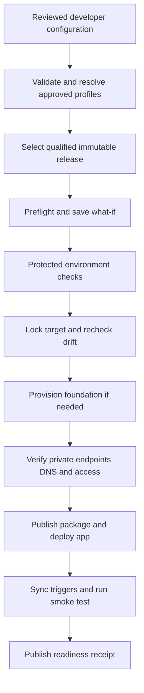

# Self-service Azure DevOps and Bicep assessment

Assessed 17 September 2026. This is an implementation design and local assessment, not a deployed pipeline. Existing application, Bicep, and pipeline files were not changed.

**Follow-up:** The repository was subsequently moved into `Bicep` and initialized with GitHub remote `Enetact/Bicep`. The baseline findings below are retained as the original assessment. Follow-up changes remove the legacy Function, fix the CLI adapter, add metadata/tooling tests, support custom parameter files and smoke prefixes, guard existing apps against Bootstrap, publish curated release evidence, and check the source manifest. See `validation.md` for current verification. The proposed network modes, split foundation/access/application entry points, frozen deployment approvals, and full self-service release pipeline remain future work.

## Recommendation

**Local runtime follow-up:** [Local development](local-development.md) now provides automatic prerequisite setup, a real Functions host with Azurite, lifecycle scripts, and an upload-to-destination smoke test without Azure. This local workflow is verified; the Azure self-service release design below remains future work.

Offer this as a versioned **private blob-transfer service blueprint** maintained by a platform team. Developers register a small workload configuration and deploy approved releases through a protected Azure DevOps template. Keep the existing .NET Functions, Bicep modules, queue, ledger, and recovery design.

The current project is a useful starting point, but it is not yet self-service or release-ready. Two failures were reproduced locally: duplicate Function names prevent compilation, and the Bicep wrapper fails when using its Azure CLI fallback. Resolve these before extending deployment automation.

The actual stack is storage transfer, not the broader claims/AI platform described in the workspace instructions. It contains no web UI, SQL database, Semantic Kernel, or LLM. Developers needing those capabilities would need separate blueprints.

## Review scope and evidence

Reviewed the 78 supplied source/configuration/documentation/artifact files outside generated `bin`, `obj`, and audit-created `artifacts` directories: root files, seven Bicep modules, four environment parameter files, six PowerShell scripts, both application projects, all tests, all three dependency lockfiles, documentation, twelve Mermaid sources, twelve SVGs, their render receipt, and the offline HTML guide. Lockfiles were parsed; SVG/HTML content and structure were inspected, not visually re-rendered. Generated compiler outputs are not treated as authoritative source.

| Check | Current result |
|---|---|
| Git checkout | This directory has no Git repository; `git status` reports that it is not a repository. Import reviewed source into Azure Repos before configuring branch policies. |
| Installed SDK | .NET SDK 10.0.300, matching `global.json`. |
| Bicep | Installed the pinned compiler 0.47.16 into an isolated audit folder. Main template and all four environment parameter files compile when the standalone compiler is on PATH. |
| Validation wrapper | `Invoke-Bicep` forwards positional arguments to `az bicep`; Azure CLI rejects them because `--file` is missing. |
| Application/test build | `dotnet test ... -c Release -p:RestoreLockedMode=true` fails with AZFW0017: `CopyUploadedBlob` is declared twice. Tests did not execute. |
| Dependency advisory check | Restore reported NU1900 because the NuGet advisory feed was unavailable. No fresh clean vulnerability result can be claimed. |
| PowerShell syntax | All six scripts parsed without errors; parsing does not validate CLI behavior. |
| Source manifest | All 74 listed file hashes match. Three additional source/test files are not listed: `CopyUploadedBlob.cs`, `CopyPolicy.cs`, and `CopyPolicyTests.cs`. The manifest itself is the remaining file in the 78-file inventory. |
| Dependency locks | All three parsed successfully; 58, 59, and 71 entries respectively, with resolved versions and hashes present for non-project entries. |
| Azure and Azure DevOps | No authenticated deployment, what-if, live smoke test, resource changes, or organization configuration was performed. |

The supplied `docs/validation-results.json` reports historical success for 23 tests. That is not current-checkout evidence. The extra legacy files help explain the discrepancy, but their origin is unknown. The integration suite was not rerun because the current application cannot compile.

## Existing components to retain

| Area | Existing implementation | Self-service implication |
|---|---|---|
| Infrastructure | Resource-group-scoped `main.bicep`, storage/network/private endpoint/identity/RBAC/monitoring/Function modules | Reuse these behind a stable, versioned contract. |
| Runtime | Polling dispatcher, explicit queue worker, three timers, SHA-256 verification, leased ledger, quarantine, reviewed recovery tool | Publish one approved application package per blueprint release. |
| Isolation | Two new private storage accounts; source and ledger have separate containers in the solution account | One dedicated resource group per workload instance and environment is the simplest initial boundary. |
| Destination | Existing Blob/ADLS destination container, optionally in another subscription within the same tenant | Destination ownership and approved access must be established during onboarding. |
| Deployment | Bootstrap, immutable-named ZIP upload, release deployment, trigger synchronization | Turn manual sequencing into governed jobs with explicit readiness checks. |
| Quality | Locked restores, policy tests, opt-in Azurite tests, packaging, synthetic Azure smoke script | Preserve and extend, including generated Function metadata checks. |
| CI | Hosted Windows agent, build/test/package, publishes `artifacts` | Keep unprivileged CI separate from private-network release execution. |

## Issues to address before developer rollout

1. **Remove the legacy direct-copy entry point from the shipping application.** `src/BlobTransfer/CopyUploadedBlob.cs:12` and `QueueFunctions.cs:14` declare the same Function name. Renaming the legacy Function would leave an unintended second copy path. Remove or explicitly exclude the obsolete implementation; review its associated policy/tests. Require exactly five generated Functions: one dispatcher BlobTrigger, one QueueTrigger, and three TimerTriggers. Regenerate validation evidence and the distribution manifest.

2. **Fix the compiler adapter.** `scripts/common.ps1:14` must translate to Azure CLI `--file` arguments, or consistently invoke a pinned standalone Bicep executable. Cover both tool-discovery branches. The present CI installs through `az bicep install`, so it must not depend on a separate executable already being on PATH.

3. **Replace environment-only configuration with workload-instance configuration.** `Deploy.ps1` reads only `environments/<environment>.bicepparam`, writes shared local output paths, and uses the fixed deployment name `blobcopy-<environment>`. Accept a validated configuration or compiled parameter artifact, generate unique deployment names, and persist explicit foundation outputs rather than rediscovering a potentially overwritten deployment receipt.

4. **Provide private connectivity as a platform prerequisite.** `network.bicep` always creates a new VNet and five private DNS zones. It provides no runner network path, peering, VPN, or resolver. Four fixed CIDR examples cannot be copied across teams without allocation. Add an existing-network mode with delegated integration subnet, private endpoint subnet, and centrally governed DNS zone IDs. Keep isolated-new-network mode for approved sandboxes.

5. **Separate foundation deployment from application release.** The current Release phase redeploys the complete infrastructure and destination role assignment. An ordinary application release therefore needs broad rights. Split into foundation, access grants, and app/config deployment entry points. Re-running Bootstrap on an existing stack also sets `enableRuntimeAlerts=false`; incremental deployment leaves the existing app running while those alerts are disabled. Foundation reconciliation must preserve runtime alert state.

6. **Make permissions explicit.** `packagePublisherObjectId` is optional, and the examples do not supply it. An infrastructure Contributor grant does not itself grant Blob data upload or role-assignment write. Grant package upload explicitly, and move destination grants to an owner-authorized workflow when the workload deployer cannot manage destination RBAC. Preflight same-tenant subscription visibility, destination existence/HNS settings, and endpoint approvals.

7. **Bind approval to exact deployment inputs.** The current script recompiles source and parameters independently for what-if and deploy. Produce a frozen deployment bundle and hashes; plan and apply that bundle. What-if is a preview, not an executable saved plan or a guarantee against subsequent drift. Re-evaluate under the deployment lock; significant drift requires a new review.

8. **Make the smoke test configuration-aware.** It uploads under `smoke/` and defaults to scope `default`. A legitimate prefix map without an empty-prefix fallback will reject those objects. Select an explicitly authorized synthetic prefix and derive its expected scope using the same contract. Pass actual source/ledger container names. Provide source write, ledger read, and destination read to a separate test identity. Retain synthetic evidence according to an approved policy.

9. **Tighten release evidence.** Publish test results even on failure, a persisted ZIP SHA-256, Function metadata, dependency inventory, tool versions, template and configuration digests, and provenance. Publish a curated release directory rather than the entire `artifacts` tree, which currently includes emulator tooling/data. Fail release qualification if advisory checking is unavailable; NU1900 is not currently in `WarningsAsErrors`.

10. **Define lifecycle and scale constraints.** Versions and ledger writes can accumulate without a configured lifecycle policy. Default scanning covers at most 500 source/version entries per five-minute invocation, before execution overhead; this is not a guaranteed throughput SLA. Retention, backlog thresholds, full-hash IO, maximum file size, destination naming, and developer environment expiry belong in the service contract. Never apply an incoming-data cleanup policy to ledger records accidentally.

There is also stale wording in `docs/architecture.md` describing a separate ledger account after correctly describing co-location. Refresh documentation alongside the baseline fix.

## Developer experience

Start with Azure DevOps Run pipeline and reviewed configuration files. A portal can be added later without changing the deployment contract.

1. The platform team registers an approved target profile once: subscription/RG boundary, region, network allocation, DNS, destination, identities, service connections, agent pool, and operational ownership.
2. A developer adds a workload configuration through a pull request and selects the blueprint version. Validation rejects unsupported or conflicting settings.
3. The developer selects the registered workload, environment, and approved release in Azure DevOps. Dev can deploy automatically within preapproved limits; UAT/Prod use the organization's approval policy.
4. The pipeline validates, previews, provisions when necessary, deploys the exact package, verifies transfers, and returns an onboarding receipt.
5. Subsequent updates promote the same package hash. Developers do not rebuild application binaries merely to change environment settings.

Example **proposed** developer configuration; this schema and its resolver do not exist yet:

```yaml
schemaVersion: 1
workload: claimsdocs
instance: primary
environment: dev
blueprintVersion: 1.0.0
targetProfile: claims-dev-eastus2
destinationProfile: claims-ingestion-dev
owner: claims-platform
costCenter: CC1234
source:
  container: incoming
  scopePrefixes:
    '': claimsdocs-dev
sizeProfile: small
```

The resolver must authorize profiles for the requesting project/team; a valid profile name alone is not authorization. Keep the resolved configuration and hash in the release evidence. Do not accept free-form subscription IDs, service connection names, role IDs, scripts, or arbitrary package URLs from a pipeline form. Shared destination containers need globally allocated scopes or separate containers, because content keys contain scope and hash but no workload ID.

Developers receive source account/container details, the approved authentication and network route, destination naming contract, deployed release/hash, monitoring links, status/recovery instructions, and support owner. A successful ARM deployment without a passing smoke test returns a failed/not-ready receipt.

## Platform responsibilities and identities

| Boundary | Owner and capability |
|---|---|
| Subscription/RG onboarding | Platform creates or assigns an RG and registers necessary resource providers. An optional subscription-scoped Bicep wrapper belongs in this privileged workflow. |
| Network/DNS | Network team allocates addresses/subnets, supplies routing and DNS, and approves endpoint connections. Validate from both release runner and actual uploader network. |
| Azure DevOps setup | Platform creates federated service connections, environments, permissions/checks, agent pools, repository policies, and pipeline authorization. Azure resource Bicep alone does not configure these DevOps objects; use a separate reviewed setup process/API. |
| Foundation deployer | Scoped infrastructure deployment rights; separately governed role-assignment authority where needed. Do not give all developers subscription Owner. |
| Destination owner | Grants the runtime identity the required destination-container access, with nested-deployment rights only if that delivery approach is retained. Approves destination private endpoints. |
| App releaser/package publisher | Approved app configuration/deployment operations and package-container data access. Must not automatically inherit cross-subscription RBAC administration. |
| Smoke tester | Source container write, ledger read, destination read. No ledger mutation or destination write is needed for test orchestration. |
| Runtime identity | Existing UAMI roles, reviewed against actual Functions host/trigger requirements. Broad polling roles remain a documented design constraint. |
| Recovery operator | Separate privileged recovery permission and operational approval process. Deployment self-service does not imply transfer-recovery authority. |

Use Azure Resource Manager service connections with workload identity federation, following the current identity setup rather than storing client secrets. See [Microsoft's service connection guidance](https://learn.microsoft.com/en-us/azure/devops/pipelines/release/configure-workload-identity?view=azure-devops).

Hosted Windows agents remain appropriate for compilation and emulator tests. Package publication and live smoke tests require a trusted private-network-connected agent pool. Ordinary Microsoft-hosted agents do not provide that private network path. See [hosted-agent networking](https://learn.microsoft.com/en-us/azure/devops/pipelines/agents/hosted?view=azure-devops). Do not execute untrusted PR scripts on the privileged release pool.

## Pipeline design

Use a central repository with protected, versioned `extends` templates. Consumer repositories contain only their small entry pipeline and workload configuration. Protect template tags/refs and ensure the matching scripts/Bicep are explicitly checked out or included in the signed-off release bundle; importing a YAML template does not supply its other repository files to script tasks. See [Azure Pipelines templates](https://learn.microsoft.com/en-us/azure/devops/pipelines/process/templates?view=azure-devops).



| Stage | Required behavior |
|---|---|
| Blueprint CI | Clean restore/build, all policy and Azurite tests, package metadata contract, compile parameter matrix, validate scripts/config schema, dependency scan, curated immutable artifact. Azure Repos PR build validation must be configured as a branch policy. |
| Resolve/Preflight | Validate profile authorization, names, scope map, reserved containers, allowed sizes, region/runtime/quota availability, destination, identities, network prerequisites, and release provenance. |
| Plan | Download exact artifact, produce effective parameters, validate against Azure, save machine-readable and readable what-if plus hashes. Include all affected scopes and flag unanalyzed changes. |
| Approve | Use resource-owner-managed checks and protected branches/template requirements. Do not let a YAML boolean bypass production controls. |
| Provision | Acquire target-level exclusive lock, recheck plan, deploy first-use foundation incrementally, perform governed access setup, record explicit resource outputs. Avoid disabling alerts on later runs. |
| Connectivity | Bounded retries for RBAC propagation and endpoint readiness; private DNS resolution and authenticated storage probes. An Approved endpoint alone is insufficient. |
| Release | Publish package with create-only semantics; on retry accept only the same bytes. Apply app settings from the frozen bundle; synchronize triggers. |
| Verify | Confirm expected Functions, timer heartbeat, real ordinary uploads/revisions, ledger completion, destination hash, source retention, and alert visibility. Test uploader reachability separately from runner reachability. |
| Receipt | Publish release/config/template hashes, deployment IDs, target outputs, test evidence, readiness, and operational handoff even if a later stage fails. |

Configure environment approvals, required-template/branch checks, and exclusive locks outside developer-editable YAML. Select service connections through protected template mappings, not runtime user variables. Lock the full mutation sequence for one target. See [approvals and checks](https://learn.microsoft.com/en-us/azure/devops/pipelines/process/approvals?view=azure-devops).

For the first implementation, `AzureCLI@2` with PowerShell Core can reuse the corrected scripts. Microsoft also provides a [Bicep deployment task](https://learn.microsoft.com/en-us/azure/azure-resource-manager/bicep/add-template-to-azure-pipelines); evaluate it against the required frozen-input, cross-scope, and evidence contracts rather than rewriting everything merely to adopt a task.

Default provider-level what-if requires deployment permissions. If using a lower-privilege planning identity, explicitly evaluate `ProviderNoRbac` and document its weaker permission assurance. Do not assume Reader alone can perform the current script's default what-if. See [Bicep what-if permissions and limitations](https://learn.microsoft.com/en-us/azure/azure-resource-manager/bicep/deploy-what-if).

Keep external-package managed-identity deployment and explicit trigger synchronization. ARM success or successful trigger sync is not end-to-end readiness. See [Functions deployment technologies](https://learn.microsoft.com/en-us/azure/azure-functions/functions-deployment-technologies).

## Proposed repository changes

These paths are planned additions, not implemented functionality:

```text
pipelines/
  blueprint-ci.yml
  deploy-self-service.yml
  templates/extends.yml
  templates/stages/{validate,plan,provision,release,verify}.yml
catalog/
  schema/workload.schema.json
  workloads/<workload>/<environment>.yaml
  profiles/                         # protected platform-owned mappings
infra/
  foundation.bicep
  access.bicep
  application.bicep
scripts/
  Resolve-WorkloadConfig.ps1
  Test-DeploymentPrerequisites.ps1
  Test-PrivateConnectivity.ps1
  Export-DeploymentReceipt.ps1
tests/
  DeploymentContracts/             # script, config, metadata, compiled ARM tests
```

Reuse/refactor the existing `modules/` and scripts. For a first release, a central template repo and protected catalog are enough; a private Bicep module registry and developer portal can follow when version distribution warrants them.

## Delivery order and acceptance

1. **Repair and qualify the baseline.** Resolve the duplicate trigger, fix both compiler invocation paths, add Function metadata validation, reconcile the manifest, and obtain current unit/emulator/package evidence with a working advisory feed.
2. **Build one Dev deployment path.** Register one approved target/destination, supply a private agent, add config resolution, frozen artifacts, what-if, bootstrap/release/readiness, and receipts. Prove clean first deployment, same-release retry, and failed-readiness reporting.
3. **Prove reuse with a second independent workload.** Require no edits to central Bicep or release scripts. Verify RG/network allocation, scopes, names, data boundaries, and concurrent-run isolation.
4. **Add governed promotion and operations.** Promote identical package bytes to QA/UAT/Prod, validate approvals/locks, test last-known-good application rollback, alerts, and restore procedures. Separate code rollback from ledger/config migrations; do not automatically reverse state or delete resources.
5. **Productize lifecycle.** Add scheduled drift reporting, budgets/cost attribution, capacity profiles, and an explicitly approved retirement workflow. Shared destinations and retained ledgers must not be deleted by routine developer teardown.

Self-service is achieved when a newly onboarded team can deploy a working, isolated instance by committing configuration and running the protected pipeline, with no hand edits to infrastructure templates and no manual repair between bootstrap and release. Production qualification still requires real Azure identity, network, trigger/versioning, load, and alert-delivery evidence.
