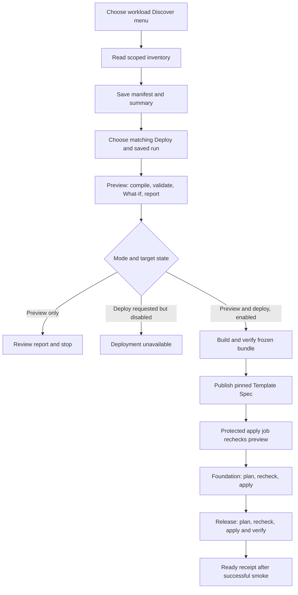

# Self-service catalog and how it works

[Wiki home](README.md) · [Workload catalog](workload-catalog.md) · [Status](completion-status.md)

**Lifecycle boundary:** saved What-If diagrams and deployment verification receipts exist; a durable before/after timeline and rollback buttons do not. The [deployment state and recovery plan](plans/deployment-state-and-recovery.md) maps each product and operations workflow to eligible configuration restoration, compensation or manual recovery. It adds no catalog offering or pipeline yet.

The [recovery rules layer](recovery-rules.md) now implements that policy mapping, an offline assessor and portal policy views for fourteen workflows. Preview/Deploy evidence includes the policy identity without claiming recoverability. No restore offering, new pipeline or execution permission is registered.

**Tag governance update (27 September 2026):** subscription evidence, deterministic checks, structured Codex advice, editable drafts, source proposals and two manual ADO pipelines are implemented locally. Apply is disabled until onboarding and live acceptance. See [the tagging guide](tag-governance.md) for current methods, source structure, permissions and limits. Earlier dated verification records remain historical.

**Operations workflow:** [Tag governance](tag-governance.md) discovers visible subscription tags, provides deterministic checks and optional structured agent advice, and prepares reviewed ADO or source-owned changes. It is separate from the seven deployment products.

**Pipeline registration:** use the portal **ADO setup** menu for all 20 root entry points, including the fourteen workload menus. Shared templates are not separate ADO definitions. See [setup, source checks and conflicts](ado-pipeline-registration.md).

**Network capability update, 27 September 2026:** Network discovery is a separate portal workspace with registered/selected/management-group/accessible-tenant scopes and an AVNM allocation request menu. Agent Mermaid can now render after evidence/grammar validation. The separate `azure-pipelines-network.yml` does not add a workload product or enable any of the 28 targets. See [contracts and tests](network-discovery-and-diagrams.md).

**27 September 2026 expansion:** seven registered types and 28 disabled profiles now include Private Storage Workspace, Key Vault, Observability, HTTP Functions API and Service Bus worker. Their complete source/menus and shared product adapter are described in [workload onboarding](workload-onboarding.md). The two original adapter descriptions below retain their workload-specific behavior. New ADO definitions and Azure acceptance have not been established locally.

Source review: **27 September 2026**. Seven workload types and 28 environment targets are registered; all targets have `enabled: false`. Local tests and supplied ADO discovery/blocked-preview logs establish partial verification. No successful Azure workload deployment is established by the evidence reviewed. See [current status](completion-status.md).

## What a developer can request

The [Agent workflows menu](agent-workflows.md) adds six review/draft workflows: resource visualization, private-network evidence, workload configuration, saved Preview changes, tag governance and [Bicep source design](bicep-source-drafts.md). Codex ChatGPT authentication enables model access; Azure/ADO authentication separately enables the required evidence readers. These are scoped MCP-backed reviews, not additional deployment products or permissions.

The portal's separate [Azure Skills library](azure-skill-discovery.md) contains 42 Microsoft skill definitions with **No pipeline associated yet** labels and read-only Azure discovery profiles. They do not register additional deployable products. The original two workload routes retain their ADO manifest contracts; five additional products use typed discovery v2.

The [local Platform Studio website](local-portal.md) now presents this same catalog with selected-workload descriptions, a discovery-run picker and explicit ADO request review. It also exposes local skill guidance and deterministic saved-discovery analysis. The UI does not itself provision Azure resources or enable targets. Entra registration and live authentication/ADO acceptance remain required.

The [connected diagram views](portal-diagrams.md) add observed Azure inventory, conceptual component diagrams for every selected product, and resource-action diagrams from the registered workload's saved ADO Preview artifact. Conceptual components are separate from exact Azure resource IDs; no name-based reuse or deployment approval is inferred.

Saved artifacts can now be examined with the [offline analysis workflow](self-service-analysis.md). It adds coverage/findings and observed/proposed containment diagrams for the selected workload. This is reporting, not another Azure product or deployment approval. The shared Discover template publishes it under `subscription-discovery/analysis/`; actual ADO rendering remains an acceptance step.

A **workload type** is a supported implementation, such as `blob-transfer`. An **instance** is its named deployment, such as `blobcopy`. A **target** binds an instance and environment to reviewed Azure scope, topology, identity and ADO resources. Four environments for seven instances are 28 targets, representing seven products.

| Item | Blob copy | Event flow |
|---|---|---|
| Type / instance | `blob-transfer` / `blobcopy` | `logic-app-event-grid` / `eventflow` |
| Purpose | Copy uploaded blobs to an existing destination with deduplication, a ledger and recovery. | Process document events through an Event Grid to Storage Queue bridge and a stateful Logic App. |
| Main resources | Function App and plan; two storage accounts; queues/ledger; identity; private endpoints, monitoring and alerts. | Logic App Standard and plan; Event Grid topic/subscription; two storage accounts; queue and receipt/quarantine/dead-letter containers; eight private endpoints; access, monitoring and alerts. |
| Dependencies | Existing destination account/container; approved topology; real tags/identity and private-agent connectivity. | Resolved networking, six DNS service zones and workspace; real tags/identity; two scoped exceptions; private-agent connectivity. |
| Create versus reuse | Reviewed existing-network profile, or new-network profile admitted by platform policy. Destination storage is external. | Discovery resolves standard prerequisites as Create / Reuse / Manage / Blocked. Owned VNet/subnets/NSG, DNS zones/links and workspace are conditional declarations. |
| Application package | ZIP containing five .NET Functions. | ZIP containing the Standard workflow and supporting JSON. |
| Ready evidence | Private connectivity, five indexed Functions and smoke verification of three requests sharing the expected destination. | Private connectivity, verified deployed workflow content/indexing and a synthetic event's durable receipt. |
| Local runtime | Functions + Azurite tested historically; local lifecycle scripts included. | Package/contract/infrastructure tests; no equivalent end-to-end local Logic Apps/Event Grid runtime is provided. |
| Current state | Four disabled targets; onboarding remains. | Dev tags, identity and exceptions configured; resource IDs resolve from discovery. Four disabled targets; higher environments need onboarding. |

Reusable resource modules are building blocks, not separately selectable products. Policy and registry templates are separately operated platform assets. Key Vault and Service Bus worker are now registered products. Databases, Container Apps and AI applications remain proposed. See [all new product resources and dependencies](workload-onboarding.md#current-catalog-and-delivery-status).

## Menus and inputs

| ADO definition | YAML entry | Editable request fields |
|---|---|---|
| Discover - Blob copy | `azure-pipelines-blobcopy-discover.yml` | Instance, environment, approved subscription and network profile. |
| Deploy - Blob copy | `azure-pipelines-blobcopy-deploy.yml` | Instance, environment, approved region, Run stages; saved discovery under Resources. |
| Discover - Event flow | `azure-pipelines-eventflow-discover.yml` | Instance, environment, approved subscription and network profile. |
| Deploy - Event flow | `azure-pipelines-eventflow-deploy.yml` | Instance, environment, approved region, Run stages; saved discovery under Resources. |
| Discover - Private Storage Workspace | `azure-pipelines-storage-discover.yml` | Instance, environment, approved subscription and network profile. |
| Deploy - Private Storage Workspace | `azure-pipelines-storage-deploy.yml` | Instance, environment, approved region, Run stages; saved discovery under Resources. |
| Discover - Key Vault | `azure-pipelines-keyvault-discover.yml` | Instance, environment, approved subscription and network profile. |
| Deploy - Key Vault | `azure-pipelines-keyvault-deploy.yml` | Instance, environment, approved region, Run stages; saved discovery under Resources. |
| Discover - Observability | `azure-pipelines-observe-discover.yml` | Instance, environment, approved subscription and network profile. |
| Deploy - Observability | `azure-pipelines-observe-deploy.yml` | Instance, environment, approved region, Run stages; saved discovery under Resources. |
| Discover - HTTP Functions API | `azure-pipelines-httpapi-discover.yml` | Instance, environment, approved subscription and network profile. |
| Deploy - HTTP Functions API | `azure-pipelines-httpapi-deploy.yml` | Instance, environment, approved region, Run stages; saved discovery under Resources. |
| Discover - Service Bus worker | `azure-pipelines-busworker-discover.yml` | Instance, environment, approved subscription and network profile. |
| Deploy - Service Bus worker | `azure-pipelines-busworker-deploy.yml` | Instance, environment, approved region, Run stages; saved discovery under Resources. |

Blueprint, requirements, lifecycle and price text are reference fields, not resource switches. Region is currently restricted to `eastus2`. Service connections, pools, subscription IDs, RBAC and deployment options come from reviewed configuration and literal generated bindings.

Native ADO parameters are resolved before execution. A previous stage's artifact cannot add dropdown choices midway through a run. This repository uses a separate Discover run followed by a Deploy run with Preview and Deploy stages. See [Microsoft's parameter timing](https://learn.microsoft.com/en-us/azure/devops/pipelines/process/runtime-parameters?view=azure-devops). Resource selections require reviewed catalog changes, not clicking a live Azure query in the form.

## From request to a running workload

1. **Discover:** read the selected connection's scoped subscription. Failed listings remain unknown. Event flow additionally reads provider/resource inventory and stack ownership. No resource creation, provider registration or access grant occurs.
2. **Save evidence:** `subscription-discovery` carries inventory, its hash and run provenance. Event flow embeds a prerequisite plan in the hashed inventory and writes a readable companion. Inventory is not deployment validation.
3. **Select the run:** Deploy requires successful matching `main` discovery in the same project/repository, at most seven days old. It checks ADO run provenance, hashes, selection and connection scope. Event flow rechecks its saved policy/target selection; changes require new discovery.
4. **Preview:** a hosted Windows agent checks the source manifest, compiles the full runtime-enabled stack, resolves saved inputs, validates onboarding and runs Azure validation/native stack What-If. The Markdown report retains blockers on failures reached after evidence preparation. Native stack What-If creates temporary preview metadata and attempts cleanup; it does not deploy the workload.
5. **Deploy:** `BuildBundle` qualifies/packages the application, freezes inputs and compares them with Preview. `PublishTemplateSpec` publishes or verifies the content-hashed infrastructure version. `ApplyStack` rechecks the full preview for drift, then runs Foundation and Release through the selected adapter. Protected environments/pools and configured approval/lock checks apply.
6. **Verify:** only successful application-specific readiness/smoke produces `ready: true` and `status: Ready`. Discovery, compilation, publication or Foundation success alone is insufficient. Failure can leave Azure resources; automatic rollback is not implemented.

Disabled targets can use Preview with complete inputs and real Azure permissions. Preview-only cannot become Deploy midway through a run. A fresh deployment run builds its application again; cross-environment promotion of an already approved application package is not implemented.

## Implementation map

| Concern | Source of truth / methods |
|---|---|
| Allowed workload types | `config/workloads.json`; `Get-WorkloadDefinition` in `scripts/workload-common.ps1` explicitly permits two adapters. JSON registration alone cannot add a third. |
| Instance/environment binding | `self-service/targets/*.json`; `Read-ServiceTarget`, `Assert-ServiceTarget`; strict intent resolution in `scripts/platform-contract.ps1`. |
| Region and platform options | `config/platform.json`; Blob copy endpoint/log-alert policy and isolated-network exceptions. Event flow address allocations use `config/logic-prerequisites.json`. |
| Generated menus/bindings | `scripts/Update-ServiceCatalog.ps1`; `-Check` detects generated-file drift. |
| Inventory and prerequisites | `scripts/Export-DeploymentInventory.ps1`; `Get-LogicPrerequisitePlan` and ownership resolution in `scripts/logic-prerequisites-common.ps1`. |
| Artifact trust | `scripts/Test-DiscoveryHandoff.ps1`, `Read-DiscoveryManifest`; hashes plus build/run identity checks. |
| Preview | `New-WorkloadPreviewInputs`, `Invoke-WorkloadInfrastructurePreview`, `Write-WorkloadPreviewReadme` in `scripts/workload-preview-common.ps1`. |
| Bundle and adapter dispatch | `scripts/New-SelfServiceBundle.ps1`, `Read-ServiceBundle`, `New-ServicePlan`, `Invoke-ServiceApply`; Logic App dispatches to its typed bundle/plan/apply methods. |
| Infrastructure lifecycle | `Publish-StackTemplate`, `New-StackPreview`, `Invoke-WorkloadStackApply` in `scripts/stack-service-common.ps1`; workload `stack.bicep` calls its `main.bicep`. |
| Apply coordinator | `scripts/Deploy-PreviewedWorkload.ps1` → `Invoke-PreviewedWorkloadDeployment`; input comparison, drift rejection, Foundation/Release and receipt retention. |
| Runtime acceptance | Blob copy: `Wait-ServiceFunctions` / `Invoke-ServiceSmoke`. Event flow: `Publish-LogicPackage` / `Invoke-LogicSmoke`. |

Reusable modules live under `modules/`; workload composition and environment values live under `workloads/<type>/`. Compiled local modules are embedded in the Template Spec. The application ZIP is separate; Template Spec publication does not install app code.

## Evidence to inspect

| Artifact | Meaning |
|---|---|
| `subscription-discovery` | Inventory/query status, source run and Event flow prerequisite decisions. |
| `deployment-preview` | README, inputs and Azure changes when reached. A blocked README is not a completed What-If. |
| `self-service-bundle` | Qualified ZIP, stack, parameters, hashes and discovery/cost data. |
| `self-service-tests` | Available qualification evidence; absent results do not imply a pass. |
| `template-publication` | Infrastructure version publication/reuse, not workload readiness. |
| `deployment-result` | Receipt plus phase, drift, connectivity, package and smoke evidence. |

Blob copy recovery currently uses the [operator runbook](operations.md), not an additional self-service menu. For setup, use [developer/platform guidance](self-service.md). Additional products and operations are proposed in the [expansion plan](self-service-expansion-plan.md).
