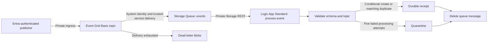

# Logic App Standard + Event Grid

Implemented and locally contract-tested, 19 September 2026. Registered pattern: `logic-app-event-grid`; example instance: `eventflow`; environments: dev, QA, UAT, prod. **All targets remain disabled until platform onboarding and Azure acceptance.** This independent workload neither consumes nor changes blobcopy resources.

## Runtime and resources



Event Grid Basic cannot push through our private endpoint to a private workflow. The queue bridge uses the topic's system identity and Storage trusted-service delivery path. The event account has public network access **Enabled**, firewall default **Deny**, bypass **AzureServices**, no IP rules, and shared keys disabled. This requires an explicit platform exception. Private endpoints serve the workflow and agent; they do not turn Event Grid delivery into VNet traffic. See [managed-identity delivery](https://learn.microsoft.com/en-us/azure/event-grid/deliver-events-using-managed-identity) and [private delivery limitations](https://learn.microsoft.com/en-us/azure/event-grid/consume-private-endpoints).

| Owned resource | Purpose |
|---|---|
| `rg-eventflow-<env>`, `stack-eventflow-<env>` | Dedicated resource group owned by a subscription Deployment Stack; no implicit adoption. |
| `logic-eventflow-<env>-<unique>`, `asp-<logic-name>` | Windows Logic App Standard, WS1 default, stateful workflow, private ingress and VNet outbound. |
| Runtime account `strt...` | Private Blob/Queue/Table/File; `workflows` file share. ARM resolves storage keys into protected app settings. |
| Event account `stev...` | `events` queue; `receipts`, `quarantine`, `deadletter` containers. Separate firewall policy from runtime storage. |
| `evgt-eventflow-<env>` and event subscription | Private publisher ingress, Entra authentication, `Document.Received` and `/documents/` filters. |
| Eight private endpoints | Runtime Blob/Queue/Table/File; event Blob/Queue; site/SCM; topic. |
| Scoped role assignments | Workflow queue processor and receipt/quarantine contributor; topic queue sender and dead-letter contributor; deployment identity topic sender and receipt reader. |
| Insights, diagnostics and five alerts | Workflow error traces, delivery failures, dead letters, queue count above 100, quarantine writes. |

Storage names use the workload/environment and a resource-group-derived suffix, truncated at 24 characters. The [prerequisite plan](../../docs/prerequisite-resolution.md) creates missing standard VNet/subnets, integration NSG, six DNS zones/links and workspace inside this stack, or references selected compatible existing resources. Action groups and the Template Spec catalog RG remain external. Existing stack-owned prerequisites retain their declarations on later runs. No Function application, namespace, Service Bus, module registry or business connector is required.

## Code and deployment contracts

| Location | Responsibility |
|---|---|
| `main.bicep` | Resource-group composition of local reusable and workload-specific modules. |
| `stack.bicep` | Subscription wrapper creates the dedicated RG and forwards every composition parameter/output. |
| `environments/main.<env>.bicepparam` | Platform values; placeholders intentionally block deployment. |
| `modules/prerequisites.bicep` | Conditional composition of the reusable network, DNS and workspace modules from the saved plan. |
| `modules/storage.bicep`, `modules/access.bicep` | Workload-specific storage separation and scoped RBAC. |
| `../../modules/event-grid/`, `../../modules/logic-app/standard/` | Shared resource implementations; no registry dependency. |
| `../../src/LogicAppEventFlow/` | Workflow content, packaged separately from Bicep. |
| `../../config/workloads.json` | Allowlisted source paths, package kinds and phase parameters for both patterns. |
| `../../self-service/targets/eventflow.<env>.json` | Disabled target with literal protected bindings. |

Compiled local modules are embedded in the **`logic-app-event-grid` Template Spec**, versioned by the existing content-hash policy. The Deployment Stack references that version and owns this instance. The separately hashed workflow ZIP is frozen in the same bundle. Template Specs do not install Standard workflow files. See [Microsoft's Standard build/deployment guidance](https://learn.microsoft.com/en-us/azure/logic-apps/automate-build-deployment-standard).

## Exact pipeline flow

1. Use **Discover - Event flow** (`/azure-pipelines-eventflow-discover.yml`) for Discover. The workload is fixed to Event flow. Select `eventflow`, `dev`, `azure-subscription-a`, `central-private`.
2. Run on protected `main`. Discovery reads network/DNS inventory, five workload providers and an ARM catalog of resource IDs/names/types/locations. Failed required listings mean **Partial/unknown**, not zero. It also reads stack ownership and saves Reuse / Create / Manage decisions. It publishes `subscription-discovery` with a typed version-2 manifest and `prerequisite-plan.json`.
3. Use **Deploy - Event flow** (`/azure-pipelines-eventflow-deploy.yml`) for Deploy. The workload is fixed to Event flow. Select `eventflow`, `dev`, `eastus2`; under **Resources > discovery**, choose the matching successful main run, no older than seven days.
4. Leave **Run stages = Preview only**. Stage Preview consumes the typed discovery manifest and analyzes the full stack with `releaseActivated=true`; inspect **Summary / Extensions** or `deployment-preview/README.md`. Disabled profiles can preview configured values; placeholders remain blockers. Choose **Preview and deploy** in a fresh run to execute stage Deploy after onboarding/enablement. See the [preview guide](../../docs/deployment-preview.md).

Dropdowns are generated from the reviewed catalog and restricted to this workload. Only Event flow resource/cost summaries appear. Register the matching Discover definition before Deploy; see the [exact ADO registration steps](../../docs/self-service.md#register-the-new-definitions-in-ado). All triggers remain disabled.

The dedicated menu has two stages: Preview, then Deploy. The following operations run within Deploy; the legacy generic pipeline still exposes them as six stages.

| Operation | Logic App behavior |
|---|---|
| Qualify | Verify discovery provenance; compile/test; build deterministic ZIP; resolve and verify the saved prerequisite plan and selected shared IDs; freeze typed bundle. No hosted Logic Apps runtime execution is claimed. |
| PublishTemplate | Publish or verify the content-hashed spec through the protected publisher connection. |
| PlanFoundation | Verify providers/network/DNS/workspace/ownership and stack preview; new Foundation uses `releaseActivated=false`. |
| ApplyFoundation | Recheck approved fingerprint, apply stack and check outputs/private DNS. Return `FoundationReady`, never `Ready`. Previously released stacks skip Foundation mutation. |
| PlanRelease | Preview `releaseActivated=true`; record deployed workflow names/content hashes. Review the ZIP separately: ARM What-If does not describe workflow content changes. |
| ApplyRelease | Recheck, apply stack, Entra-authenticated ZipDeploy through private SCM, compare all four files, wait for workflow indexing, send a synthetic event and verify its matching receipt. Only then report `Ready`. |

Uncertain previews, removal, ownership conflicts and sensitive security changes fail closed. Only the named runtime/bridge storage **Create** operations receive the narrowly validated exception handling. Existing security modifications retain the strict shared gate. Plans expire after 24 hours; failed rechecks require a new plan. Approvals/locks are configured externally on ADO protected resources.

## Platform onboarding

Dev's generated tags, supplied service-principal object ID and operator-authorized exception decisions are configured in `environments/main.dev.bicepparam`; see the [dev review record](../../docs/reviews/eventflow-dev-exceptions.md). Its resource IDs still come from matching discovery. QA, UAT and prod require independent configuration and authorization. Deployment remains subject to target enablement and live validation.

Fill all environment values independently; enable only dev after acceptance. Do not precreate the workload RG.

| Dependency | Requirement |
|---|---|
| Ownership | Real `owner`, `costCenter`, deployment principal **object ID** (not application ID). |
| Integration subnet | Create from reviewed policy, or select an existing same-region VNet/subnet delegated to `Microsoft.Web/serverFarms` with enough capacity for scale. |
| Endpoint subnet | Create from reviewed policy, or select a different nondelegated subnet in the same VNet with space for eight endpoints. |
| DNS | Create missing workload-owned zones/links or select compatible existing zones. Six `privateDnsZoneIds` keys: `blob`, `queue`, `table`, `file`, `sites`, `topic`; correct service zones linked to this VNet. V1 requires Azure-provided DNS. Custom hub/resolver topology is not supported by this adapter yet. |
| Workspace | Create a missing standard workspace, or select a discovered same-region workspace. Cross-subscription existing-only configuration is outside automatic resolution. |
| Alerts | Existing action group IDs; prod requires at least one. Empty dev action groups create signals without notifications. |
| Delivery review | `trustedServiceException: { approved: true, reviewReference: 'https://...' }` after approval of the trusted-service firewall policy. |
| Runtime review | `runtimeStorageCredentialException` with the same shape, approving private runtime storage keys in app settings. Runtime shared-key access is enabled; event-storage shared keys remain disabled. |
| Providers | Register Web, Storage, EventGrid, Insights, OperationalInsights; Network/Authorization capabilities also required. Discovery never registers providers. |
| Access | Stack/resource operations, role-assignment authority, approved subnet/DNS join and workspace reference rights. Contributor alone cannot create role assignments. See [stack onboarding](../../docs/deployment-stacks-upgrade.md). |
| ADO | Authorize private pool, publisher/deployer connections and protected environments; set main/Required Template checks, approvals, exclusive locks, build/artifact-read rights. |
| Private agent | Reach SCM, topic and storage privately; retain required ARM/Entra/tooling egress. Verify routing, DNS, NSGs, Azure Files access and capacity. |

Default connection: `SC-AZ-A-Bicep`; subscription: `f4f2eafe-2512-4c2f-9b5b-c88f6767e778`. Configuration is not proof of access. Fresh discovery plans missing standard network/DNS/workspace resources for creation in this stack. Explicit missing shared IDs, unknown listings, routing and ADO infrastructure still require platform action; see [prerequisite resolution](../../docs/prerequisite-resolution.md).

After reviewing the dev target, set its `enabled` flag and run:

```powershell
./scripts/Update-ServiceCatalog.ps1
./scripts/Test-Project.ps1
./scripts/Update-Manifest.ps1
./scripts/Update-Manifest.ps1 -Check
```

Merge source and generated YAML together, then queue fresh Discover and Deploy. Higher environments require independent acceptance. Application artifacts are rebuilt per target; byte-identical promotion is not implemented.

## Workflow actions

`process-event` runs every 30 seconds, one run at a time. `Get_messages` calls Storage Queue REST with system-assigned identity, requesting up to eight messages and 300-second visibility. The loop processes sequentially. There are no managed API connections or public callbacks.

| Actions | Behavior |
|---|---|
| `Queue_message`, `Decode_base64`, `Decode_plain`, `Event` | Parse queue XML and base64 JSON, with plain JSON fallback. |
| `Validate_schema`, `Validate_scope` | Enforce [event.schema.json](event.schema.json), GUID ID, type/version, expected topic, subject prefix and approximately 16 KiB metadata limit. Reject extra fields/URLs. |
| `Receipt`, `Create_receipt` | Conditional write to `receipts/<lowercase-event-id>.json` using `If-None-Match: *`. Store topic, subject, document/correlation IDs and version. |
| `Existing_receipt`, `Read_receipt`, `Compare_receipt` | On 412, verify matching business metadata. Conflicting duplicate IDs fail. |
| `Durable_result`, `Delete_message` | Acknowledge only a successful durable write or verified existing receipt. |
| `Failed_message`, `Quarantine`, `Delete_quarantined` | At dequeue count five or higher, persist the raw encoded message before deleting it. Earlier failures remain queued. |

HTTP actions use Entra Storage audience, API/date headers, three fixed retries and secure input/output history. Intermediate transformations can expose metadata; restrict history access and use synthetic data until classification review. Quarantine contains original data and needs retention/access controls.

Event Grid delivery has a 24-hour TTL, maximum 30 attempts and seven-day queue-message TTL. Event Grid dead letters represent delivery failures; workflow failures use quarantine. Visibility expiry, retries and unordered at-least-once delivery mean no exactly-once or indefinite-retention guarantee. The receipt is the example's business action. External mutations require a separately designed idempotent transaction contract.

## Method map and dependencies

| Method/script | Calls and evidence |
|---|---|
| `Get-WorkloadDefinition` | Allowlisted source paths and package/phase contracts; rejects arbitrary paths. |
| `Build-LogicPackage.ps1`, `Test-LogicPackage` | Fixed-timestamp ZIP: host, connections, parameters and one workflow JSON; record Git/dirty state and SHA-256; reject extra/traversal files. |
| `New-LogicBundle`, `Read-LogicBundle` | Compile, validate exceptions and saved inventory, freeze ten files plus receipt, verify hashes/type/provenance. Qualification rejects dirty releases. |
| `New-LogicPlan` | Live prerequisites, shared stack ownership/preview governance, typed change gate; effective parameters, What-If and fingerprint. |
| `Get-LogicOutputs`, `Wait-LogicConnectivity` | Check owned IDs/names, endpoint and workspace; require private DNS answers. This is not a complete routing/capacity audit. |
| `Get-LogicWorkflowState` | ARM workflow inventory and Kudu VFS content hashes; reject unexpected workflows. |
| `Invoke-LogicApply` | Replan, compare approval, apply stack, publish content, smoke. |
| `Publish-LogicPackage` | Bearer-authenticated synchronous ZipDeploy; verify files; poll workflow indexing for about two minutes. |
| `Invoke-LogicSmoke` | One-element JSON batch with new event/correlation IDs; wait up to five minutes for target-bound receipt. |
| `Protect-LogicEvidence` | Redact resolved AccountKey values in validation/preview/apply evidence; retain drift fingerprints. Preserve compiled ARM expressions. |

Tooling: PowerShell 7.4+, Git, Azure CLI with native stack/stack-WhatIf support, Bicep, Node 22+, npm and .NET 10 for shared regression tests. Verified locally: PowerShell 7.6.2, .NET 10.0.300, CLI 2.89.1, Bicep 0.47.16, Node 24.16.0. Pipelines use Node 22.x. Standard uses Functions `~4`, Node `~22` and Workflows bundle `[1.*, 2.0.0)`. These platform-managed versions and private Windows runtime mounts require Azure acceptance. No new NuGet/business connector packages were added.

## Costs and local tests

Not free. The reviewed 19 September 2026 East US 2 USD snapshot estimates WS1 **$175.16/month** plus eight endpoints **$58.40/month**, approximately **$233.56 fixed subtotal** at 730 hours. The frozen estimate adds fixed charges for newly owned DNS zones. Storage, Event Grid, logs, alerts, DNS queries, transfer and agents/shared-platform costs are additional. The [pricing snapshot](../../self-service/pricing/logic-app-eastus2.json) records retail meter evidence. Frozen bundle estimates become unavailable when their source is over 30 days old; menu text is static generated guidance, not a spending cap. See [Logic Apps pricing](https://learn.microsoft.com/en-us/azure/logic-apps/logic-apps-pricing).

From repository root:

```powershell
./scripts/Test-Project.ps1
./scripts/Build-LogicPackage.ps1 -ReleaseId eventflow-local-review
./scripts/Update-ServiceCatalog.ps1 -Check
```

Use a fresh release ID if its directory exists. Local dirty-checkout packages support inspection; self-service qualification rejects them. `Run-Local.ps1` still runs blob-transfer Functions/Azurite, not this Logic App/Event Grid stack. Offline contracts are not workflow-runtime tests.

## Acceptance, evidence and recovery

Before wider use, verify in Azure: private runtime startup/mount; SCM deployment/indexing; delivery and RBAC propagation; XML/base64 decoding; identical/conflicting duplicates; malformed events; fifth-attempt quarantine; acknowledgement uncertainty; visibility/restart; dead-letter delivery; alerts and recipients; and denied access outside the approved network. Validate the two exceptions against actual policy assignments. Queue age/oldest-message monitoring is not implemented; queue count is the initial backlog signal.

Inspect `self-service-tests`, `template-publication`, both `plan-*` and `result-*` artifacts. Ready requires `workflow-package.json`, `workflow-inventory.json`, `smoke.json`, lifecycle outputs and `receipt.json` with `ready: true`. Setup/Foundation success is insufficient.

Failures retain resources/data/evidence. No automatic rollback, workflow removal, teardown or replay exists. Release activates the host before replacing content, so the previous version may briefly process events and replacement can interrupt execution. Use a maintenance window until slot/promotion/drain support exists. Investigate and queue a new reviewed run with fresh plans; do not delete runtime storage to retry. Quarantine replay must be separately reviewed.

Runtime keys are absent from source/outputs but stored in protected app settings. Restrict configuration/key-read access. Coordinate rotation of both runtime connection settings before retiring a key; rotating storage alone may interrupt the host. Key-rotation automation is not implemented.
